# javascript基本语法

## 1  js简介

### **1.1 浏览器执行 JS** 简介

浏览器分成两部分：渲染引擎和 JS 引擎

 **渲染引擎**：用来解析HTML与CSS，俗称内核，比如 chrome 浏览器的 blink ，老版本的 webkit

 **JS 引擎**：也称为 JS 解释器。 用来读取网页中的JavaScript代码，对其处理后运行，比如 chrome 浏览器的 V8

### 1.2 js的组成

#### **1.2.1 ** **ECMAScript**

**ECMAScript** 是由ECMA 国际（ 原欧洲计算机制造商协会）进行标准化的一门编程语言，这种语言在万维网上应用广泛，它往往被称为 JavaScript 或 JScript，但实际上后两者是 ECMAScript 语言的实现和扩展。

#### **1.2.2  DOM** **——**文档对象模型

**文档对象模型**（Document Object Model，简称DOM），是W3C组织推荐的处理可扩展标记语言的标准编程接口。通过 DOM 提供的接口可以对页面上的各种元素进行操作（大小、位置、颜色等）

#### **1.2.3** **BOM** ——浏览器对象模型

**BOM** (Browser Object Model，简称BOM) 是指浏览器对象模型，它提供了独立于内容的、可以与浏览器窗口进行互动的对象结构。通过BOM可以操作浏览器窗口，比如弹出框、控制浏览器跳转、获取分辨率等。

### 1.3 js的三种书写位置

JS 有3种书写位置，分别为行内、内嵌和外部。 

#### **1.3.1** **行内式** **JS**

```
<input type="button" value="点我试试" onclick="alert('Hello World')" />
```

可以将单行或少量 JS 代码写在HTML标签的事件属性中（以 on 开头的属性），如：onclick

#### **1.3.2** **内嵌** **JS**

```
<script>
    alert('Hello  World~!');
 </script>
```

#### 1.3.3外部 JS文件

```
<script src="my.js"></script>
```

### **1.4 JavaScript** **输入输出语句**

| 方法             | 说明                                         |
| ---------------- | -------------------------------------------- |
| alert()          | 浏览器弹出警示框                             |
| console.log()    | 浏览器控制台打印输出信息                     |
| prompt()         | 浏览器弹出输入框，用户可以输入               |
| document.write() | 在当前页面输出内容（如果含有标签会自动解析） |

## 2 变量

### 2.1 变量的概述

本质：变量是程序在内存中申请的一块用来存放数据的空间。

可以把变量比作超市的货架（内存），货架上摆放着商品（变量），可以把商品从货架上取出来（读取），也可以把商品放入货架（赋值）。

### **2.2 变量的使用**

变量在使用时分为两步： 1. 声明变量  2. 赋值 

```js
var age; //  声明一个 名称为age 的变量     
age=10; //赋值
//等同于
var age = 10
```

var 是一个 JS关键字，用来声明变量( variable 变量的意思 )。使用该关键字声明变量后，计算机会自动为变量分配内存空间，不需要程序员管

age 是程序员定义的变量名，我们要通过变量名来访问内存中分配的空间

### **2.3 声明变量特殊情况**

**一次声明多个变量的方法：**

```js
var age = 10,  
	name = 'zs', 
	sex = 2;       
```

同时声明多个变量时，只需要写一个 var， 多个变量名之间使用英文逗号隔开。

| 情况                       | 说明           | 结果      |
| -------------------------- | -------------- | --------- |
| var age; console.log(age); | 只声明不赋值   | undefinde |
| console.log(age);          | 不声明，不赋值 | 报错      |
| age=10;console.log(age);   | 不声明，只赋值 | 10        |

### 2.4 弱引用

**JavaScript 是一种弱类型或者说动态语言。**这意味着不用提前声明变量的类型，在程序运行过程中，类型会被自动确定。

## **3 数据类型**

js的变量数据类型只有在程序运行的过程中，根据等号右边的值来确定的

js是动态语言（弱类型） 变量的数据类型是可以变化的

js中有5种简单数据类型：**Number，String，Null，Bollean，undefined**  和1种复杂数据类型：**object**

## 4 简单数据类型 

| 简单数据类型 | 说明                                 | 默认值    |
| ------------ | ------------------------------------ | --------- |
| Number       | 数字型，包含整型和浮点型，如21 0.12  | 0         |
| Boolean      | 布尔值类型，如true ,false,等价于1和0 | false     |
| String       | 字符串类型，如“张三”                 | ""        |
| Undefined    | var a; 声明变量没有给值，a=undefined | undefined |
| Null         | var a = null; 声明变量a为空值        | null      |

### 4.1数字型 **Number**

#### **4.1.1 数字型**的进制

```js
  // 1.八进制数字序列范围：0~7
 var num1 = 07;   // 对应十进制的7
 var num2 = 019;  // 对应十进制的19
 var num3 = 08;   // 对应十进制的8
  // 2.十六进制数字序列范围：0~9以及A~F
 var num = 0xA;   

```

现阶段我们只需要记住，在JS中八进制前面加0，十六进制前面加 0x 

#### **4.1.2 数字型范围**

```js
alert(Number.MAX_VALUE); // 1.7976931348623157e+308
alert(Number.MIN_VALUE); // 5e-324
```

#### **4.1.3 数字型三个特殊值**

```js
alert(Infinity);  // Infinity
alert(-Infinity); // -Infinity
alert(NaN);       // NaN
```

Infinity ，代表无穷大，大于任何数值

lInfinity ，代表无穷小，小于任何数值

NaN ，Not a number，代表一个非数值

#### **4.1.4 isNaN()**

用来判断一个变量是否为非数字的类型，返回 true (代表不是数字型的)或者 false（代表是数字型的）

```js
var usrAge = 21;
var isNum = isNaN(userAge);
console.log(isNum);            // false ，21 不是一个非数字
var usrName = "andy";
console.log(isNaN(userName));  // true ，"andy"是一个非数字
```

### 4.2 字符串型 String

字符串型可以是引号中的任意文本，其语法为 双引号 "" 和 单引号''

```js
var strMsg = "我爱北京天安门~";  // 使用双引号表示字符串
var strMsg2 = '我爱吃猪蹄~';    // 使用单引号表示字符串
// 常见错误
var strMsg3 = 我爱大肘子;       // 报错，没使用引号，会被认为是js代码，但js没有这些语法
```

#### **4.2.1字符串引号嵌套**

JS 可以用单引号嵌套双引号 ，或者用双引号嵌套单引号 (**外双内单，外单内双**)

```js
var strMsg = '我是"高帅富"程序猿';   // 可以用''包含""
var strMsg2 = "我是'高帅富'程序猿";  // 也可以用"" 包含''
```

#### **4.2.2 字符串转义符**

类似HTML里面的特殊字符，字符串中也有特殊字符，我们称之为转义符。

转义符都是 \ 开头的，常用的转义符及其说明如下：

| 转义符 | 解释说明             |
| ------ | -------------------- |
| \n     | 换行符，n = newline  |
| \ \    | 斜杠 \               |
| \ '    | 单引号               |
| \ "    | 双引号               |
| \t     | tab缩进              |
| \b     | 空格， b=blank的意思 |

#### **4.2.3 字符串长度**

字符串是由若干字符组成的，这些字符的数量就是字符串的长度。通过字符串的 length 属性可以获取整个字符串的长度。

```js
var strMsg = "我是帅气多金的程序猿！";
alert(strMsg.length); // 显示 11
```

#### **4.2.4 字符串拼接**

多个字符串之间可以使用 + 进行拼接，其拼接方式为 字符串 + 任何类型 = 拼接之后的新字符串

 拼接前会把与字符串相加的任何类型转成字符串，再拼接成一个新的字符串

```js
//1.1 字符串 "相加"
alert('hello' + ' ' + 'world'); // hello world
//1.2 数值字符串 "相加"
alert('100' + '100'); // 100100
//1.3 数值字符串 + 数值
alert('11' + 12);     // 1112 
console.log('pink老师' + age);          // pink老师18
console.log('pink老师' + age + '岁啦');  // pink老师18岁啦
```

我们经常会将字符串和变量来拼接，因为变量可以很方便地修改里面的值

 变量是不能添加引号的，因为加引号的变量会变成字符串

 如果变量两侧都有字符串拼接，口诀“引引加加 ”，删掉数字，变量写加中间

### 4.3 布尔型 Boolean

布尔类型有两个值：true 和 false ，其中 true 表示真（对），而 false 表示假（错）。

布尔型和数字型相加的时候， true 的值为 1 ，false 的值为 0。

```js
console.log(true + 1);  // 2
console.log(false + 1); // 1
```

### 4.4 Undefined 和 Null

一个声明后没有被赋值的变量会有一个默认值 undefined ( 如果进行相连或者相加时，注意结果）

**undefined和数字相加的结果是NaN**

```js
var variable;
console.log(variable);           // undefined
console.log('你好' + variable);  // 你好undefined任何数据类型和字符串拼接都成为字符串
console.log(11 + variable);     // NaN
console.log(true + variable);   //  NaN
```

一个声明变量给 null 值，里面存的值为空（学习对象时，我们继续研究null)

```js
var vari = null;
console.log('你好' + vari);  // 你好null
console.log(11 + vari);     // 11
console.log(true + vari);   //  1
```

### 4.5 检测变量的数据类型

typeof 可用来获取检测变量的数据类型

```js
var num = 18;
console.log(typeof num) // 结果 number      
```

### 4.6 **数据类型转换**

使用表单、prompt 获取过来的数据默认是字符串类型的，此时就不能直接简单的进行加法运算，而需要转换变量的数据类型。通俗来说，就是把一种数据类型的变量转换成另外一种数据类型。

#### **4.6.1 转换为字符串**

| 方式                       | 说明                         | 案例                                |
| -------------------------- | ---------------------------- | ----------------------------------- |
| toString()                 | 转成字符串                   | var num=1; alert(num.toString())    |
| String()                   | 转成字符串                   | var num=1; alert(String(num))       |
| 加号拼接字符串（隐式转换） | 和字符串拼接的结果都是字符串 | var num=1 ; alert(num+"我是字符串") |

toString() 和 String() 使用方式不一样。

三种转换方式，我们更喜欢用第三种加号拼接字符串转换方式， 这一种方式也称之为隐式转换。

#### 4.6.2 转换为数字型

| 方式                    | 说明                     | 案例                   |
| ----------------------- | ------------------------ | ---------------------- |
| parseInt(string)函数    | 将string转为整数数值型   | parseInt("12")         |
| parseIFloat(string)函数 | 将string转为浮点数数值型 | parseIFloat("12.2121") |
| Number() 强制转换函数   | 将string转为数值型       | Number("12")           |
| js隐式转换（- * /）     | 利用算数隐式转换为数值型 | ‘12’ - 0               |

parseInt(string)会自动用去尾法取整，还会把单位去掉

```js
consloe.log(parseInt('120px'));//120
```

 parseInt（string,radix）:将字符串解析转化为数字类型,返回的是整数；

 string:待被解析的字符串；

 radix:表示要解析转换的进制默认为10进制

##### 4.6.2.1 parseInt和Number的区别

```js
//当字符串只有数字组成
var numbeTrans="9898";
alert(parseInt(numberTrans));  //9898
alert(Number(numberTrans));   //9898

//当数字只有字母组成
var numbeTrans="abab";
alert(parseInt(numberTrans));  //NaN
alert(Number(numberTrans));  //NaN

//当字符串由字母与数字组成
var numbeTrans="123ab";
alert(parseInt(numberTrans));  //123
alert(Number(numberTrans));  //NaN

//当字符串为小数时
var numbeTrans="123.123";
alert(parseInt(numberTrans));  //123
alert(Number(numberTrans));  //123.123

//当字符串为空null时js
var numbeTrans="null";
alert(parseInt(numberTrans));  //NaN
alert(Number(numberTrans));   //0

//当字符串为空“ ”时
var numbeTrans=" ";
alert(parseInt(numberTrans));  //NaN
alert(Number(numberTrans));   //0
```

#### **4.6.3转换为布尔型**

| 方式          | 说明                 | 案例            |
| ------------- | -------------------- | --------------- |
| Boolean()函数 | 其他类型转换成布尔值 | Boolean(‘true’) |

l代表空、否定的值会被转换为 false ，如 ''、0、NaN、null、undefined 

l其余值都会被转换为 true


## 5 运算符

运算符（operator）也被称为操作符，是用于实现赋值、比较和执行算数运算等功能的符号。

### 5.1算数运算符

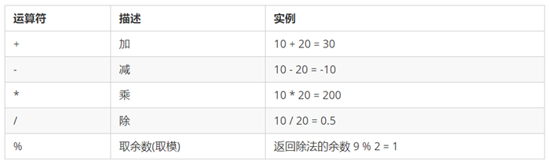

在JS中除数可以为0

```js
alert(10 / 0); //Infinity 无穷大
alert(-10 / 0); //-Infinity 无穷小
```


### 5.2 **浮点数的精度问题**

浮点数值的最高精度是 17 位小数，但在进行算术计算时其精确度远远不如整数。

所以浮点数在算数运算里面会有问题

计算机是不会进行小数运算的。（天生有bug）

小彩蛋：金融账户，只存储整数，单位是分

```js
console.log(0.07 * 100);   // 结果不是 7，  而是：7.000000000000001
console.log(0.1 + 0.2);   // 结果不是 0.3，  而是：0.30000000000000004
```

### 5.3. **表达式和返回值**

**表达式：**是由数字、运算符、变量等以能求得数值的有意义排列方法所得的组合

简单理解：是由数字、运算符、变量等组成的式子

表达式最终都会有一个结果，返回给我们，我们成为返回值

### **5.4 前置递增**运算符

**++num** 前置递增，就是自加1，类似于 num = num + 1，但是 ++num 写起来更简单。

使用口诀：**先自加，后返回值**

```js
var  num = 10;
alert(++num + 10);   // 21
```

### 5.5 **后置递增**运算符

num++ 后置递增，就是自加1，类似于 num = num + 1 ，但是 num++ 写起来更简单。

使用口诀：**先返回原值，后自加** 

```js
var  num = 10;
alert(10 + num++);  // 20
```

### 5.6 前置和后置递增的小练习

```js
var e = 10;
var f = e++ + ++e; //1. e++=10 e=11 2.++e =12 所以结果为10+12
console.log(f); //22
```

### 5.7 比较运算符

概念：比较运算符（关系运算符）是两个数据进行比较时所使用的运算符，比较运算后，会返回一个**布尔值**（true / false）作为比较运算的结果。

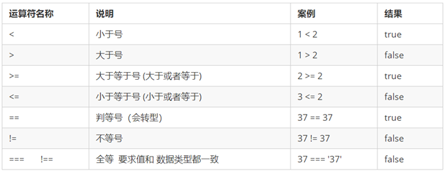

**注意：**

==判断时会有隐式转换

```js
 console.log(11=='11');// true
 console.log(11==='11'); // false
```

### 5.8 **逻辑运算**符

概念：逻辑运算符是用来进行布尔值运算的运算符，其返回值也是布尔值。后面开发中经常用于多个条件的判断

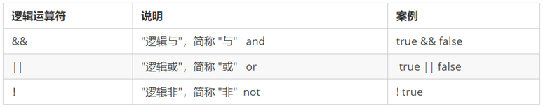

**逻辑与&&**:两边都是 true才返回 true，否则返回 false

**逻辑或** **||**:两边都为 false 才返回 false，否则都为true

**逻辑非 ！**:逻辑非（!）也叫作取反符，用来取一个布尔值相反的值，如 true 的相反值是 false

### 5.9 **短路运算（逻辑中断）**

#### 5.9.1 逻辑与短路运算

语法：表达式1 && 表达式2

 如果第一个表达式的值为真，则返回表达式2

 如果第一个表达式的值为假，则返回表达式1

```js
console.log( 10<5 && 123); //false
console.log( 0 && 123 &&456*789); //0
console.log( 456 && 123); //123
```

**空的否定的，还有0 ‘ ’ null undefined NaN 为假的，其余为真的**

#### 5.9.2逻辑或短路运算

语法： 表达式1 || 表达式2

 如果第一个表达式的值为真，则返回表达式1

 如果第一个表达式的值为假，则返回表达式2

```js
console.log( 0 ||  456 ); //  456
console.log( 10<5 || 123); //123
console.log( 10>5 || 123); //true
```

### 5.10**赋值运算**符

概念：用来把数据赋值给变量的运算符。

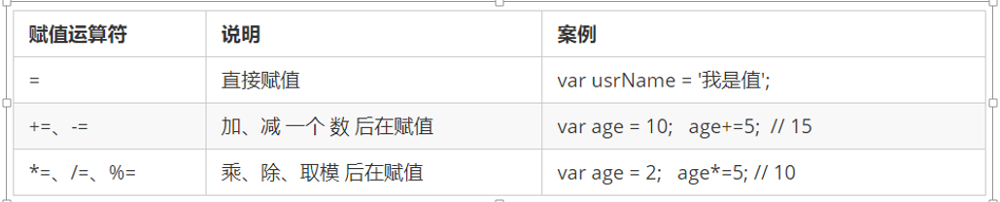

```js
var age = 10;
age += 5;  // 相当于 age = age + 5;
age -= 5;  // 相当于 age = age - 5;
age *= 10; // 相当于 age = age * 10;
```

### 5.11**运算**符优先级

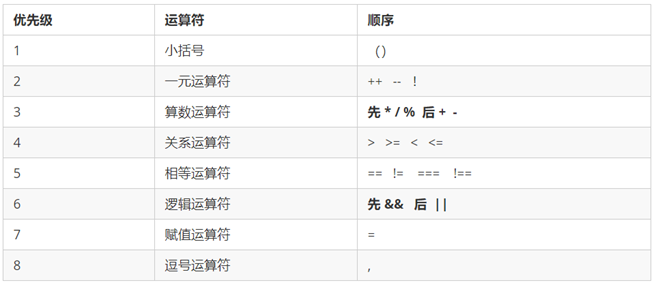

一元运算符里面的逻辑非优先级很高

逻辑与比逻辑或优先级高

## 6 流程控制——分支

在一个程序执行的过程中，各条代码的执行顺序对程序的结果是有直接影响的。很多时候我们要通过控制代码的执行顺序来实现我们要完成的功能。

简单理解： 流程控制就是来控制我们的代码按照什么结构顺序来执行

流程控制主要有三种结构，分别是顺序结构、分支结构和循环结构，这三种结构代表三种代码执行的顺序。


### 6.1**顺序**流程控制

顺序结构是程序中最简单、最基本的流程控制，它没有特定的语法结构，程序会按照代码的先后顺序，依次执行，程序中大多数的代码都是这样执行的。

### 6.2分支流程控制 if 语句

**语法结构** ：

有else就是双分支语句，没有else就是单分支语句

```js
if (条件表达式) {
    // 条件成立执行的代码语句
}else{
    // 条件不成立时执行的语句可不写 
}
```

### 6.3三元表达式

三元表达式也能做一些简单的条件选择。 有三元运算符组成的式子称为三元表达式

```js
表达式1 ? 表达式2 : 表达式3;
```

**执行思路：**

如果表达式1为真，则执行表达式2，如果表达式1为假，则执行表达式3

**简单案例：**

**用户输入数字，如果数字小于10，则在前面补 0 ，比如01，09 ，如果数字大于10，则不需要补，比如 20。**

```js
var resule = num<10? '0'+num:num
```

### 6.4分支流程控制 switch 语句

switch 语句也是多分支语句，它用于基于不同的条件来执行不同的代码。当要针对变量设置一系列的特定值的选项时，就可以使用 switch。

**用来匹配多个确定的值**的

**语法结构：**

```js
switch( 表达式一般是一个确定的值 ){ 
    case value1:
        // 表达式 等于 value1 时要执行的代码
        break;
    case value2:
        // 表达式 等于 value2 时要执行的代码
        break;
    default:
        // 表达式 不等于任何一个 value 时要执行的代码
}
```

**break的作用：是跳出switch结构，如果没有break，则继续执行下面的分支语句（而不进行判断）**

**注意：**

1.注意switch的应用场景

2.注意case穿透，要加break语句

3.每一个switch语句都要加default语句

#### 6.4.1 省略break去简化代码

判断某年，某月份有几天

```js
var month =4 //假设4月
var year =2000; // 假设2000年
switch(month){
	case 1:
	case 3:
	case 5:
	case 7:
	case 8:
	case 10:
	case 12:
		alert("31天") // 因为前面这些选项执行的结果都一样，所以省略break
	case 2:
		if(year%4 == 0 && year%100 != 0 || year%400==0){
			alert("29天")
		}else{
			alert("28天")
		}
		break;
	default :
		alert("30天")
		break;
}

```


### 6.5**switch** **语句和** **if** **else if** **语句的区别**

①一般情况下，它们两个语句可以相互替换

②switch...case 语句通常处理 case为比较确定值的情况， 而 if…else…语句更加灵活，常用于范围判断(大于、等于某个范围)

③switch 语句进行条件判断后直接执行到程序的条件语句，效率更高。而if…else 语句有几种条件，就得判断多少次。

④当分支比较少时，if… else语句的执行效率比 switch语句高。

⑤当分支比较多时，switch语句的执行效率比较高，而且结构更清晰。 

## 7 流程控制——循环

在程序中，一组被重复执行的语句被称之为循环体，能否继续重复执行，取决于循环的终止条件。由循环体及循环的终止条件组成的语句，被称之为**循环语句**

### **7.1for** **循环**

```js
for(初始化变量; 条件表达式; 操作表达式 ){
    //循环体
}
```

**初始化变量**：**通常被用于初始化一个计数器，该表达式可以使用 var 关键字声明新的变量，这个变量帮我们来记录次数。**

**条件表达式**：**用于确定每一次循环是否能被执行。如果结果是 true 就继续循环，否则退出循环。**

**操作表达式：每次循环的最后都要执行的表达式。通常被用于更新或者递增计数器变量。当然，递减变量也是可以的。**

### 7.2 **while** **循环**

while 语句可以在条件表达式为真的前提下，循环执行指定的一段代码，直到表达式不为真时结束循环。

while语句的语法结构如下

```js
while (条件表达式) {
    // 循环体代码 
}
```

**执行思路**：

①先执行条件表达式，如果结果为 true，则执行循环体代码；如果为 false，则退出循环，执行后面代码

②执行循环体代码

③循环体代码执行完毕后，程序会继续判断执行条件表达式，如条件仍为true，则会继续执行循环体，直到循环条件为 false 时，整个循环过程才会结束

**注意：**

①使用 while 循环时一定要注意，它必须要有退出条件，否则会成为死循环

②while 循环和 for 循环的不同之处在于 while 循环可以做较为复杂的条件判断，比如判断用户名和密码

### 7.3 **do while** **循环**

do... while 语句其实是 while 语句的一个变体。该循环会先执行一次代码块，然后对条件表达式进行判断，如果条件为真，就会重复执行循环体，否则退出循环。

do... while 语句的语法结构如下：

```js
do {
    // 循环体代码 
} while(条件表达式); //这个分号不能省略
```

**执行思路：**

①先执行一次循环体代码 

②再执行条件表达式，如果结果为 true，则继续执行循环体代码，如果为 false，则退出循环，继续执行后面代码

**注意：**

do…while 循环语句**至少**会执行一次循环体代码

### 7.4 循环嵌套

案例1：输出5x5的圆圈

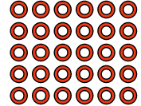

```js
 for(let i=0;i<5;i++){ //这是外层循环控制行数
        for(let j=0;j<5;j++){ //这是里层循环控制列数
            document.write("⭕")
        }
        document.write("<br>")
    }
```

案例2：直角三角形

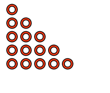

```js
    for(let i=0;i<5;i++){ //外层循环控制有5行
        for(let j=0;j<=i;j++){ //里层循环 每行打印的圆圈数等于行数
            document.write("⭕")
        }
        document.write("<br>")
    }
```

案例3 ：倒直角三角形

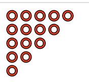

```js
  for(let i=0;i<5;i++){
        for(let j=0;j<5-i;j++){
            document.write("⭕")
        }
        document.write("<br>")
    }
```

案例4：打印99乘法表

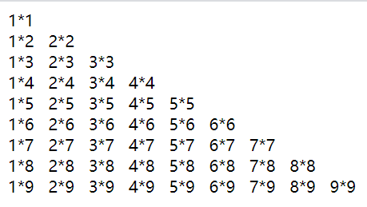

```js
 for(let i=1;i<=9;i++){ //i是行
        for(let j=1;j<=i;j++){ // j是列
            document.write(j+'*'+i)
            document.write("&nbsp&nbsp&nbsp")
        }
        document.write("<br>")
    }
```

案例5 打印靠右的三角形

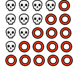

```js
   for(let i=0;i<5;i++){
       for(let j=1;j<5-i;j++){
           document.write("😡")
       }
       for(let k =0;k<=i;k++){
           document.write("⭕")
       }
       document.write("<br>")
   }
```

### 7.5 **continue** **关键字**

**continue关键字用于立即跳出本次循环，继续下一次循环（本次循环体中 continue 之后的代码就会少执行一次）。**

例如，吃5个包子，第3个有虫子，就扔掉第3个，继续吃第4个第5个包子，其代码实现如下：

```js
 for (var i = 1; i <= 5; i++) {
     if (i == 3) {
         console.log('这个包子有虫子，扔掉');
         continue; // 跳出本次循环，跳出的是第3次循环 
      }
      console.log('我正在吃第' + i + '个包子呢');
 }
```

### 7.6 break 关键字

**break** **关键字用于**立即**跳出整个循环**（循环结束）。

例如，吃5个包子，吃到第3个发现里面有半个虫子，其余的不吃了，其代码实现如下

```js
for (var i = 1; i <= 5; i++) {
   if (i == 3) {
       break; // 直接退出整个for 循环，跳到整个for下面的语句
   }
   console.log('我正在吃第' + i + '个包子呢');
 }
```

## 8 数组

数组是指一组数据的集合，其中的每个数据被称作元素，在数组中可以存放任意类型的元素。数组是一种将一组数据存储在单个变量名下的优雅方式。

### 8.1 创建数组

**利用** **new** **创建数组** ：

```js
var arr = new Array(1,2,3); //创建数组为：[1,2,3]
```

**利用数组字面量创建数组** :

```js
var arr = [1,2,3];//创建数组为：[1,2,3]
var arrStus = ['小白',12,true,28.9]; //数组中可以存放任意类型的数据
```

### 8.2 **数组的索引**

**索引 (下标) ：**用来访问数组元素的序号( 数组下标从 0 开始 )

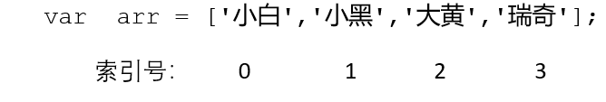

数组可以通过**索引**来访问、设置、修改对应的数组元素，我们可以通过“**数组名[索引]**”的形式来获取数组中的元素。

这里的**访问**就是获取得到的意思

```js
// 定义数组
var arrStus = [1,2,3];
// 获取数组中的第2个元素
alert(arrStus[1]);    //输出2
```

### 8.3数组的遍历

遍历就是把数组中的每个元素从头到尾都访问一次（类似我们每天早上学生的点名）。

通过 for 循环索引遍历数组中的每一项：

```js
var arr = ['red','green', 'blue'];
for(var i = 0; i < arr.length; i++){
    console.log(arrStus[i]);
}
```

通过 for ....in遍历数组中的每一项：

```js
var arr = ['red','green', 'blue'];
for( var k in arr){
	console.log(arr[k]) //k是数组索引
}
```

通过 forEach遍历数组：

```js
//要遍历的数组.forEach(回调函数)
var arr = ['red','green', 'blue'];
arr.forEach((value)=>{
	console.log(value)
})
```

案例1：求数组中最大值

```js
 var arr = [2,6,1,7,4,10];
  var max = 0
    for(let i =0;i<arr.length;i++){
      if(max<arr[i]){
          max = arr[i]
      }
    }
   console.log(max);
```

案例2：通过修改length长度来新增数组元素

**length 属性是可读写的**

先修改length长度，再根据索引号添加值

```js
var arr = ['red', 'green', 'blue', 'pink'];
arr.length=5 //可省略
arr[4] = 'hotpink';
console.log(arr);
```


案例3：筛选数组中大于10的数放入新数组

```js
//方法1
var arr = [1,3,5,10,15,2,,15,78];
 var newArr=[]
 for(let i=0;i<arr.length;i++){
     if(arr[i]>10){
         newArr[newArr.length] =arr[i]
     }
 }
 console.log(newArr);
//方法2
for(k in arr){
    arr[k]>10?newArr.push(arr[k]):newArr
}
console.log(newArr);
```

案例4：翻转数组

```js
var arr = [1,3,5,10,15,2,15,78];
var newArr = []
for(i=arr.length-1;i>=0;i--){
    newArr[newArr.length] = arr[i]
}
console.log(newArr);
```

### 8.4 冒泡排序

两两比较如果符合条件就交换顺序

冒泡排序每一轮排序都能找出一个较大的数放在正确的位置

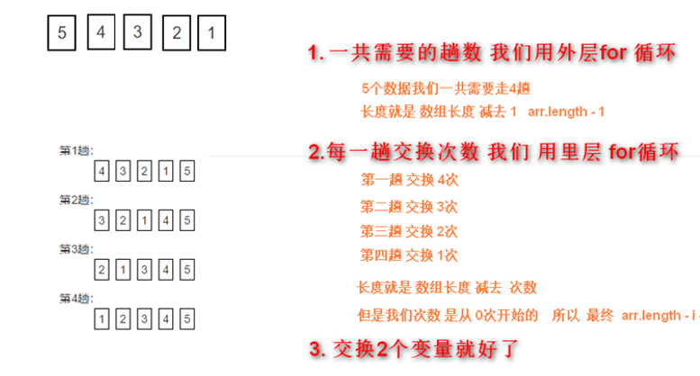

```js
for(var i =0;i<arr.length-1;i++){ //趟数
    for(var j=0;j<arr.length-i-1;j++){ //每趟交换的次数
        if(arr[j]>arr[j+1]){
            index =arr[j]
            arr[j] =arr[j+1]
            arr[j+1] = index
        }
    }
}
```

比较的趟数=数组的长度-1；

每一趟比较的次数 = 数组的长度-当前的趟数（当前的躺数就是i+1，因为i从0开始）

### 8.5 选择排序(打擂台法)

规则：选出一个位置，这个位置上的数和后面所有的数进行比较，如果比较出大小就交换两个数的位置

规律：每一轮都能选出一个最小的数，放在正确的位置

比较流程：

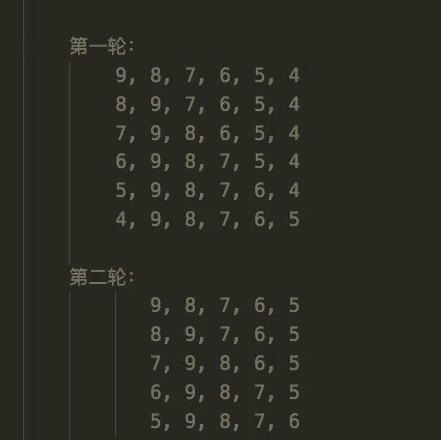

比较的轮数 = 数组长度-1；

每一轮比较的次数 = 数组长度-当前轮数

```js
var arr = [9,8,7,6,5,4];
var index =0
// 选择排序
for(var i =0;i<arr.length-1;i++){  //确定用的擂台下标，一共需要length-1个擂台
    for(var j =i+1;j<arr.length;j++){ //被比较数的下标i+1开始，一直到最后一个也就是arr.length
        if(arr[i]>arr[j]){
            index = arr[i]
            arr[i] = arr[j]
            arr[j] = index
        }
    }
}

console.log(arr);
```

### 8.6数组小练习

练习1：随机给一个5位以内的数，输出每位分别是什么

```js
var num = 51234
var arr =[]
function fn(num){
    while(num){
        arr.unshift(num%10) //num对10求余数能求出最后一个数，用unshiift从头插入数组
        num = parseInt(num/10)// 去出最后一位加入数组后，除以10会得到浮点数，再用parseInt取整，就能去掉最后一位数     
    }
    return arr
}

console.log(fn(num));
```

### 8.7 二维数组

数组中含有数组的结构叫做二维数组

通过for循环创建一个5x5 1-25的二维数组：

```js
 let arr=[]
    let arr2=[]
    let sum=1
    for(let i=0;i<5;i++){
        arr[i]=[]
        for(let j=0;j<5;j++){
            arr[i].push(arr2.push(sum))
            sum++
        }
    }
```


## 9 函数

在 JS 里面，可能会定义非常多的相同代码或者功能相似的代码，这些代码可能需要大量重复使用。

虽然 for循环语句也能实现一些简单的重复操作，但是比较具有局限性，此时我们就可以使用 JS 中的函数。

**函数：就是封装了一段可被重复调用执行的代码块。通过此代码块可以实现大量代码的重复使用。** 

### 9.1函数的使用

函数在使用时分为两步：声明函数和调用函数。

```js
// 声明函数
function 函数名() {
    //函数体代码
}
函数名(); // 调用函数
```

**function** 是声明函数的关键字,必须小写

**注意：**声明函数本身并不会执行代码，只有调用函数时才会执行函数体代码。

**函数的封装是把一个或者多个功能通过函数的方式封装起来，对外只提供一个简单的函数接口**

### 9.2 **函数的参数**

函数的参数分为**形参**和**实参**。

在声明函数时，可以在函数名称后面的小括号中添加一些参数，这些参数被称为**形参**，而在调用该函数时，同样也需要传递相应的参数，这些参数被称为**实参**。

```js
// 带参数的函数声明
function 函数名(形参1, 形参2 , 形参3...) { // 可以定义任意多的参数，用逗号分隔
  // 函数体
}
// 带参数的函数调用
函数名(实参1, 实参2, 实参3...); 
```

参数的作用 : 在函数内部某些值不能固定，我们可以通过参数在调用函数时传递不同的值进去。

**函数形参和实参个数不匹配问题**

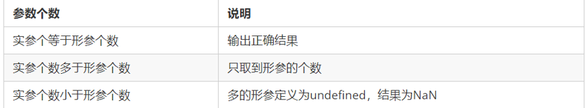

### 9.3 函数的返回值

有的时候，我们会希望函数将值返回给调用者，此时通过使用 return 语句就可以实现。

```js
// 声明函数
function 函数名（）{
    ...
    return  需要返回的值；
}
// 调用函数
函数名();    // 此时调用函数就可以得到函数体内return 后面的值
```

**如果函数没有 return ，返回的值是 undefined**

**在使用 return 语句时，函数会停止执行，并返回指定的值**

### 9.4 **arguments的使用**

当我们不确定有多少个参数传递的时候，可以用 arguments 来获取。在 JavaScript 中，**arguments 实际上它是当前函数的一个内置对象。所有函数都内置了一个 arguments 对象**，arguments 对象中存储了传递的所有实参。

arguments的用法：求任意个数的最大值

```js
function maxValue() {
      var max = arguments[0];
      for (var i = 0; i < arguments.length; i++) {
         if (max < arguments[i]) {
                    max = arguments[i];
         }
      }
      return max;
}
 console.log(maxValue(2, 4, 5, 9));
 console.log(maxValue(12, 4, 9));
```

**arguments展示形式是一个伪数组，因此可以进行遍历**。伪数组具有以下特点：

1.具有 length 属性

2.按索引方式储存数据

3.不具有数组的 push , pop 等方法

### 9.5**函数表达式方式**(匿名函数）

```js
// 这是函数表达式写法，匿名函数后面跟分号结束
var fn = function(){...}；
// 调用的方式，函数调用必须写到函数体下面
fn();
```

因为函数没有名字，所以也被称为匿名函数(fn是变量名)

 这个fn 里面存储的是一个函数 

 函数表达式方式原理跟声明变量方式是一致的

 函数调用的代码必须写到函数体后面

### 9.6垃圾回收机制

调用函数时系统会分配对应的内存空间给这个函数使用。当函数使用完毕以后，这个内存空间要释放，还给系统。

## 10 作用域

通常来说，一段程序代码中所用到的名字并不总是有效和可用的，而限定这个名字的可用性的代码范围就是这个名字的**作用域**。作用域的使用提高了程序逻辑的局部性，增强了程序的可靠性，减少了名字冲突。

JavaScript（es6前）中的作用域有两种：

**1全局作用域**：

作用于所有代码执行的环境(整个 script 标签内部)或者一个独立的 js 文件。

**2局部作用域（函数作用域）**：

作用于函数内的代码环境，就是局部作用域。 因为跟函数有关系，所以也称为函数作用域。

### 10.1全局变量

在全局作用域下声明的变量叫做**全局变量**（在函数外部定义的变量）。

全局变量在代码的任何位置都可以使用

在全局作用域下 var 声明的变量 是全局变量（在函数内用var声明的不是全局变量）

特殊情况下，在函数内不使用 var 声明的变量也是全局变量（不建议使用）

### 10.2 局部变量

在局部作用域下声明的变量叫做**局部变量**（在函数内部定义的变量）

局部变量只能在该函数**内部**使用

在函数内部 var 声明的变量是局部变量

函数的**形参**实际上就是局部变量

### 10.3**全局变量和**局部变量的区别

**全局变量：在任何一个地方都可以使用，只有在浏览器关闭时才会被销毁，因此比较占内存**

**局部变量：只在函数内部使用，当其所在的代码块被执行时，会被初始化；当代码块运行结束后，就会被销毁，因此更节省内存空间**

### 10.4 作用域链

**内部函数访问外部函数的变量，采取的是链式查找的方式来决定取哪个值，这种结构我们称为作用域链**

链式查找是遵循就近原则(离哪个作用域近，就使用哪个作用域的同名变量)的如下例子：

```js
var num = 10;
function fn(){
	var num =20;
	function fn1(){
		console.log(num) //输出的是20 根据作用域链，这层每num就向上一层查找
	}
	fn1()
}
fn()
```

## 11 **JavaScript** **预解析**

1.什么是预解析？

浏览器在执行JS代码的时候会分为两部分操作：预解析然后逐行执行代码，也就是说浏览器不会直接执行代码，而是加工处理之后再执行，这个加工处理的过程我们称之为预解析。

2.预解析的规则

* 将变量声明和函数声明提升到**当前作用域的最前面**(也就是默认把带有 var 和 function 声明的变量在内存中进行提前声明或者定义。)
* 将剩余代码按照书写顺序依次放到后面

```js
fn(); //6666 正常输出
funciton fn(){
	console.log("6666")
}
//预解析之后相当于
/*
funciton fn(){
	console.log("6666")
}
fn();
*/
```

**3.注意点**

**通过let定义的变量不会被解析**

**如果将函数赋值给一个var定义的变量，那么函数不会被预解析，只有变量会预解析**

```js
  fn(); //会报错因为将函数赋值给var定义的变量，只有变量声明会被预解析
    var fn = function(){
        console.log(666);
    }
    //预解析之后相当于
    /*
    var fn
    say()
    fn = function(){
        console.log(666);
    }  
    */
```

例子1：

```js
   //输出什么
   var num = 123
    fun()
    function fun() {
        console.log(num); //输出666
        var num = 666
    }
    //预解析之后相当于
    /*
    var num = 123
       function fun() {
       	var num = 666 变量声明提升到当前作用域的最前面
       	console.log(num); 
    }
     fun()
    */
```

例子2：

```
  //输出什么
  var a =666;
   test();
   function test(){
       var b =777;
       console.log(a); //undefined
       console.log(b); //777
       console.log(c); //报错 c未定义前不能访问
       var a =888;
       let c =999
   }
   //预解析后相当
   /*
   var a ;
 function test(){
    var b
    var a
    b=777
    console.log(a); //undefind
    console.log(b); //777
    console.log(c); //报错
    a=888
    let c =999
 }
 a =666;
 test()
   */
```

例子3面试题：

```js
if(true){
	function demo(){
		console.log(1111)
	}
	}
	else{
		function demo(){
			console.log(22233)
		}
	}
	demo() //高级浏览器输出1111，低级浏览器输出2222
	//低级浏览器的预解析过程
	/*
	function demo(){
		console.log(1111)
	};
	function demo(){
			console.log(22233)
		};
	if(true){}else{}
	demo() 后面的函数会覆盖前面的函数输出2222
	*/
```

**解析：**

**在ES6之前没有块级作用域，并且没有讲这两个函数定义到其他函数中，所以这两个函数属于全局作用域。**

**注意点：**

* **在高级浏览器中，不会对{}中定义的函数进行提升**
* **只有在低级浏览器中，才会按照正常的方式解析（IE10及以下浏览器）**

例子4 面试题

```js
 console.log(value); //输出函数的定义
 var value = 123;
 function value(){
     console.log("fn value");
 }
 console.log(value); //输出123
//预解析之后相当于
/*
   function value(){
     console.log("fn value");
 }
 var value
 console.log(value); //输出函数的定义
 value = 123;
 console.log(value); //输出123
*/
```

**注意点：**

**如果变量名称和函数名称同名，那么函数优先级高于变量**

例子5：

```js
// 案例4
f1();
console.log(c);
console.log(b);
console.log(a);
function f1() {
  var a = b = c = 9;
  //上一步相当于 var a =9; b=9;c=9
  console.log(a);
  console.log(b);
  console.log(c);
}
// 预解析之后相当于
function f1() {
  var a 
  a=9;
  b=9;
  c=9;
  console.log(a); //9
  console.log(b); // 9
  console.log(c); //9
}
f1();
console.log(c);  //9
console.log(b);	 //9
console.log(a); //a is not defined
```

**注意点**

 **var a = b = c = 9;相当于 var a =9; b=9;c=9** **b和c就为全局变量**

## 12 JavaScript 对象

### 12.1创建对象的三种方式

**1.利用字面量创建对象：**

对象字面量：就是花括号 { } 里面包含了表达这个具体事物（对象）的属性和方法。

{ } 里面采取键值对的形式表示 

```js
var star = {
    name : 'pink',
    age : 18,
    sex : '男',
    sayHi : function(){
        alert('大家好啊~');
    }
};
```

**2.利用new Object创建对象：**

```js
var andy = new Obect();
andy.name = 'pink';
andy.age = 18;
andy.sex = '男';
andy.sayHi = function(){
    alert('大家好啊~');
}
```

3.利用构造函数来创建对象

构造函数 ：是一种特殊的函数，主要用来初始化对象，即为对象成员变量赋初始值，它总与 new 运算符一起使用。我们可以把对象中一些公共的属性和方法抽取出来，然后封装到这个函数里面。

**为什么需要构造函数来创建对象？**

因为前面两种方式一次只能创建一个对象，当遇到属性和方法大量相同时，我们可以利用函数的方法重复这些相同的代码，我们就把这个函数叫做构造函数，构造函数就是把对象里面一些相同的属性和方法抽象出来封装到函数里面

构造函数的语法格式：

```js
function 构造函数名(属性1，属性2){
    this.属性1 = 值1；
    this.属性2 = 值2；
    this.方法 = function(){}
}
new 构造函数名(属性1的值，属性2的值);
```

### 12.2 new关键字的执行过程

1. 在内存中创建了一个空的对象
2. 让this指向刚才创建的空对象
3. 执行构造函数里面的代码 给这个构造函数添加属性和方法
4. 返回这个对象（所以构造函数里面不需要return）

### 12.3for...in遍历对象属性

```js
for (var k in obj) {
    console.log(k);      // 这里的 k 是属性名
    console.log(obj[k]); // 这里的 obj[k] 是属性值
}
```

### 12.4 js对象属性 通过点(.) 和 方括号([]) 的不同之处

```js
var author = book.author; //得到book的"author"属性
  var name = author.subname; //得到author的"surname"属性
  var title = book["main title"]; //得到book的"main title"属性
```

区别：
1.中括号运算符总是能代替点运算符。但点运算符却不一定能全部代替中括号运算符。

2.中括号运算符可以用字符串变量的内容作为属性名。点运算符不能。
（即：点号后加标识符（静态的）；
中括号可放字符串，字符串可以是动态的，obj[‘string’+variable]）

3.中括号运算符可以用纯数字为属性名。点运算符不能。

4.中括号运算符可以用js的关键字和保留字作为属性名。点运算符不能。

## 13 **JavaScript** 内置对象

 **JavaScript 中的对象分为3种：自定义对象 、内置对象、 浏览器对象**

### 13.1 Math 对象

**Math数学对象 不是一个构造函数，不需要new来调用，直接使用里面的属性和方法即可**

#### 13.1.1 一些常用的Math方法

```js
Math.floor() 	 // 向下取整 往小的取
Math.ceil()            // 向上取整 往大的取
Math.round()           // 四舍五入版 就近取整   注意 -3.5   结果是  -3 .5特殊它往大了取
Math.abs()		 // 绝对值
Math.max()/Math.min()	 // 求最大和最小值 
Math.pow(x,y)	//x的y次方
```

#### 13.1.2随机数方法random()

random() 方法可以随机返回一个小数，其取值范围是 [0，1)，左闭右开 0 <= x < 1 

得到两个数之间得随机整数，包括两个数在内

```js
function getRandom(min, max) {
  return Math.floor(Math.random() * (max - min + 1)) + min; 
}
```

其他的查阅文档：https://developer.mozilla.org/zh-CN/docs/Web/JavaScript/Reference/Global_Objects/Math/random


### 13.2**日期**对象

#### 13.2.1声明日期对象

Date 对象和 Math 对象不一样，他是一个构造函数，必须使用new来调用创建我们日期对象

日期对象声明

1.没有传入参数，默认当前系统时间

```
  let d = new Date()
    console.log(d); //Sun Aug 09 2020 19:10:04 GMT+0800 (中国标准时间)
```

2.传入参数有以下三种方式，返回括号里输入的时间,

```js
/*
"2000-01-01"
"2000/01/01"
按照顺序，分别传入参数 年 月 日 时 分 秒 毫秒
*/
let d = new Date(2020-01-01) //Sun Aug 09 2020 19:10:04 GMT+0800 (中国标准时间)
let d = new Date(2020/01/01) //Sun Aug 09 2020 19:10:04 GMT+0800 (中国标准时间)
let d = new Date(2020,1,1) //Sat Feb 01 2020 00:00:00 GMT+0800 (中国标准时间)
```

**注意：在国外月份是从0开始数的 0~11**

#### 13.2.2日期格式化

| 方法名        | 说明                       | 代码               |
| ------------- | -------------------------- | ------------------ |
| getFullYear() | 获取当前年份               | dObj.getFullYear() |
| getMonth()    | 获取当月（0-11）           | dObj.getMonth()    |
| getDate()     | 获取当天日期               | dObj.getDate()     |
| getDay()      | 获取星期几（周日0到周六6） | dObj.getDay()      |
| getHours()    | 获取当前小时               | dObj.getHours()    |
| getMinutes()  | 获取当前分钟               | dObj.getMinutes()  |
| getSeconds    | 获取当前秒钟               | dObj.getSeconds    |

```js
 let d2 =new Date()
 console.log(d2.getDate()); //获取当前日期
// 其他方法的用法都和上面这个一样
```

案例：请写出这个格式的日期：2019年8月8日 星期四 

```js
var d =new Date()
var arr=['星期天','星期一','星期二','星期三','星期四','星期五','星期六']
console.log(d.getFullYear()+'年'+(d.getMonth()+1)+'月'+d.getDate()+'日'+arr[d
```

案例2：写一个函数，格式化日期对象，成为 HH:mm:ss 的形式  比如 00:10:45

```js
function getTime(){
    let time = new Date()
    let h = time.getHours()
    h=h<10? '0'+h:h
    let m = time.getMinutes()
    m=m<10? '0'+m:m
    let s = time.getSeconds()
    s=s<10? '0'+s:s
    return h+':'+m+':'+s
} 
console.log(getTime());
```

#### 13.2.3**获取日期的总的毫秒形式**

获取Date总的毫秒数 不是当前时间的毫秒数，而是距离1970 1. 1过了多少毫秒数

```js
// 实例化Date对象
var now = new Date();
// 1. 用于获取对象的原始值
console.log(date.valueOf())	
console.log(date.getTime())	
// 2. 简单写可以这么做
var now = + new Date();	//+new Date()返回的就是总的毫秒数	
// 3. HTML5中提供的方法，有兼容性问题
var now = Date.now();
```

####  13.2.4倒计时案例

转换公式如下：

d = parseInt(总秒数/ 60/60 /24);   // 计算天数

h = parseInt(总秒数/ 60/60 %24)  //  计算小时

m = parseInt(总秒数 /60 %60 );   //  计算分数

s = parseInt(总秒数%60);        //  计算当前秒数

```js
  function coutDown(time){
        let now = +new Date() //返回时间总毫秒
        let inputTime = +new Date(time) //返回用户输入时间总毫秒数
        let times = (inputTime-now)/1000 //相减把毫秒数转为秒数
        let s = parseInt(times%60)
        let m = parseInt(times/60%60)
        let h = parseInt(times/60/60%24)
        let d = parseInt(times/60/60/24)
        return d+'天'+h+"小时"+m+"分钟"+s+"秒"
    }
   console.log(coutDown('2020-8-9 20:20:00'));
```

## 14 数组内置对象

#### 14.1 检测是否为数组

instanceof 运算符，可以判断一个对象是否属于某种类型

Array.isArray()用于判断一个对象是否为数组，isArray() 是 HTML5 中提供的方法 

```js
var arr = [1, 23];
var obj = {};
console.log(arr instanceof Array); // true
console.log(obj instanceof Array); // false
console.log(Array.isArray(arr));   // true
console.log(Array.isArray(obj));   // false
```

#### 14.2 添加删除元素的数组方法

| 方法名                | 说明                                         | 返回值             |
| --------------------- | -------------------------------------------- | ------------------ |
| push(参数1，参数2...) | 末尾添加一个或多个元素，会修改原数组         | 返回添加后的长度   |
| pop()                 | 删除数组最后一个元素，没有参数，会修改原数组 | 返回它删除元素的值 |
| unshift(参数1，参数2) | 向数组开头添加一个或多个元素，会修改原数组   | 返回添加后的长度   |
| shift()               | 删除数组第一个元素，没有参数，会修改原数组   | 返回它删除元素的值 |

#### 14.3数组排序

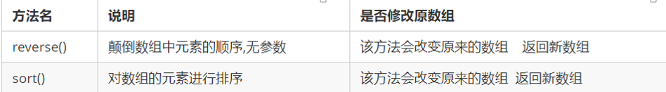

```js
var arr = [1,64,55,88]
// arr.sort() 这样排序有问题，看下面的写法
arr.sort(function(a, b) {
    return b - a;      // 降序
    // return a - b;   // 升序
});
console.log(arr);
```

#### 14.4数组查找索引

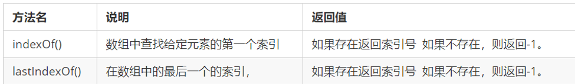

**indexOf()从前往后找**

**lastIndexOf()从后往前找**

案例1：数组去重

有一个数组[‘c’, ‘a’, ‘z’, ‘a’, ‘x’, ‘a’, ‘x’, ‘c’, ‘b’]，要求去除数组中重复的元素。

```js
/*
1.创建一个新空的数组准备接受元素
2.使用for...of遍历旧数组的元素
3.遍历的每个元素使用indexOf（）去查询新数组，如果元素没有出现就是indexOf（）返回-1，我们就在新数组中添加该元素
*/
   let arr =['c', 'a', 'z', 'a', 'x', 'a','x','c','b']    
    let newArr=[]
    for(let i of arr){
        if(newArr.indexOf(i)==-1){
           newArr.push(i)
        }
    }
console.log(newArr);
```

#### 14.5**数组转换为字符串**


```js
// toString()方法
 let arr =['c', 'a', 'z', 'a', 'x', 'a','x','c','b']
 console.log(arr.toString()); //c,a,z,a,x,a,x,c,b
// join('分隔符')方法
 console.log(arr.join('!')); //c!a!z!a!x!a!x!c!b
```

#### 14.6 splice()重点

splice() 方法用于添加或删除数组中的元素。

splice(start)第一个参数start表示从哪开始操作元素

如果你要删除元素，第二个参数传入你要删除几个元素,如果不写就从某个元素开始删除到末尾

```js
let arr = [1,2,3,4,5]
arr.splice(1) //从索引号为1的元素开始删到末尾 [1]
arr.splice(1,2) //从索引号为1开始删除2个元素 [1,4,5]
```

如果你要添加元素，第一个参数表示从哪开始插入元素，第二个参数为0，第三个参数为你要添加的元素

```js
let arr = ['a','b','c','d']
arr.splice(1,0,"m","n","l") //从索引号为1的元素开始插入最后结果为 [a,m,n,l,b,c,d]
```

如果你要替换元素，第一个参数表示从哪开始插入元素，第二个参数为你要替换几个，第三个参数为你要替换的元素

```js
let arr = ['a','b','c','d']
arr.splice(1,3,"m","n","l") //[a,m,n,l]
```

#### 14.7slice()截取数组，字符串

slice() 方法可从已有的数组中返回选定的元素。

slice()方法可提取字符串的某个部分，并以新的字符串返回被提取的部分。

slice(从哪开始截取（索引）,截取到哪个数组（索引）)

相当于slice[startindex,endindex)

```
let arr = ['a','b','c','d']
let newArr = arr.slice(1,2)
console.log(newArr) // [b]
let newArr2 = arr.slice(0,3)  
consloe.log(newArr2) // [a,b,c]
```

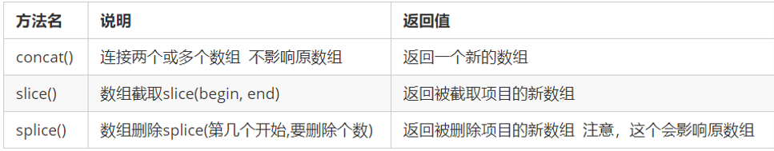

#### 14.8 concat() 连接数组

concat() 方法用于连接两个或多个数组。

该方法不会改变现有的数组，而仅仅会返回被连接数组的一个副本。

```js
// arrayObject.concat(该参数可以是具体的值，也可以是数组对象。可以是任意多个。)
var a =[1,2,3]
var b = a.concat(4,5)
console.log(b);// [1,2,3,4,5]
--------------------------------------------------------------------------------------
let arr1 = [1,2,3]
let arr2 = [4,5,6]
var arr3 = a.concat(arr2)
console.log(arr3);// [1,2,3,4,5,6]
```

## 15 字符串对象

### 15.1基本包装类型

为了方便操作基本数据类型，JavaScript 还提供了三个特殊的引用类型：String、Number和 Boolean。

**问题一：**

**对象才有属性和方法，复杂数据类型才有属性和方法，简单数据类型为什么会有length方法？**

基本包装类型就是把简单数据类型包装成为复杂数据类型，这样基本数据类型就有了属性和方法。

其执行过程如下：

```js
var str = 'andy';
// 1. 生成临时变量，把简单类型包装为复杂数据类型
var temp = new String('andy');
// 2. 赋值给我们声明的字符变量
str = temp;
// 3. 销毁临时变量
temp = null;
```

经过这样str就变为了复杂数据类型，就拥有了方法

### 15.2字符串的不可变

指的是里面的值不可变，虽然看上去可以改变内容，但其实是地址变了，内存中新开辟了一个内存空间。

```js
var str = 'abc';
str = 'hello';
// 当重新给 str 赋值的时候，常量'abc'不会被修改，依然在内存中
// 重新给字符串赋值，会重新在内存中开辟空间，这个特点就是字符串的不可变
// 由于字符串的不可变，在大量拼接字符串的时候会有效率问题
var str = '';
for (var i = 0; i < 100000; i++) {
    str += i;
}
console.log(str); // 这个结果需要花费大量时间来显示，因为需要不断的开辟新的空间
```

### 15.3**根据字符返回位置**


字符串所有的方法，都不会修改字符串本身(字符串是不可变的)，操作完成会返回一个新的字符串。

```js
let str = 'abcdefga'
console.log(str.indexOf('a')) //0
console.log(str.indexOf('x')) //-1
console.log(str.indexOf('a',1)) //7
```


### 15.4根据位置返回字符串

| 方法名            | 说明                                | 使用            |
| ----------------- | ----------------------------------- | --------------- |
| charAt(index)     | 返回指定位置的字符（index为索引号） | str.charAt(0)   |
| charCodeAt(index) | 返回指定位置的字符的ASCII码         | str.charCode(0) |
| str[index]        | 返回指定位置的字符                  | HTML5，IE8+支持 |

### 15.5字符串操作方法（重点）

| 方法名                 | 说明                                                         |
| ---------------------- | ------------------------------------------------------------ |
| concat(str1,str2,str3) | 拼接字符串                                                   |
| substr(start,length)   | 从start开始，往后截取length个（重点）                        |
| substring(start,end)   | 从start开始，截取到end，end取不到（start end都是索引号），不接受负值 |
| slice(start,end)       | 从start开始，截取到end，end取不到（start end都是索引号）     |

**replace()方法**

他只替换第一个字符

```js
replace(被替换的字符串， 要替换为的字符串)；
```

**split()方法**

字符串转为数组 split('分隔符')

```js
var str = 'a,b,c,d';
console.log(str.split(','));   // 返回的是一个数组 [a, b, c, d]
```

## 16简单数据类型和复杂数据类型

简单类型又叫做基本数据类型或者值类型，复杂类型又叫做引用类型。

1. 值类型：简单数据类型/基本数据类型，在存储时变量中存储的是值本身，因此叫做值类型

   string ，number，boolean，undefined，null

2. 引用类型：复杂数据类型，在存储时变量中存储的仅仅是地址（引用），因此叫做引用数据类型

    通过 new 关键字创建的对象（系统对象、自定义对象），如 Object、Array、Date等

其他的简单数据类型通过类型检测typeof返回都是他们自己本身，null返回的是一个空对象object

```js
let a = null
console.log(a) //object
```

### 16.1堆和栈

堆栈空间分配区别：

　　1、栈（操作系统）：由操作系统自动分配释放存放函数的参数值、局部变量的值等。其操作方式类似于数据结构中的栈；

**简单数据类型存放到栈里面，里面开开辟一个空间存放的值。**

　　2、堆（操作系统）：存储复杂类型(对象)，一般由程序员分配释放，若程序员不释放，由垃圾回收机制回收。

复杂数据类型存放到堆里面。

**复杂数据类型** **首先在栈里面存放地址 十六进制表示 然后这个地址指向堆里面的数据真正的对象实例存放在堆空间中**


**函数的形参也可以看做是一个变量，当我们把引用类型变量传给形参时，其实是把变量在栈空间里保存的堆地址复制给了形参，形参和实参其实保存的是同一个堆地址，所以操作的是同一个对象。**

```js
function Person(name) {
    this.name = name;
}
function f1(x) { // x = p
    console.log(x.name); // 2. 这个输出什么 ?    刘德华
    x.name = "张学友";
    console.log(x.name); // 3. 这个输出什么 ?    张学友
}
var p = new Person("刘德华");
console.log(p.name);    // 1. 这个输出什么 ?   刘德华
f1(p);
console.log(p.name);    // 4. 这个输出什么 ?  张学友
```

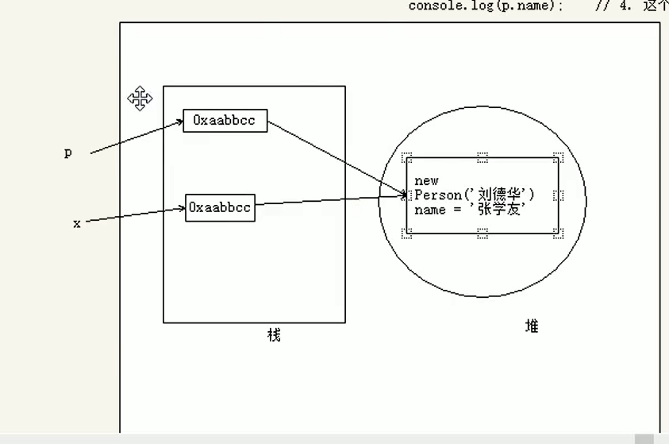

## 17 setTimeout第三个参数

第三个及以后的参数都可以作为定时器里面函数的参数。

```js
for(var i = 0; i<6; i++){
    setTimeout(function(i){
        console.log(i);
    },1000,i);
}
```

