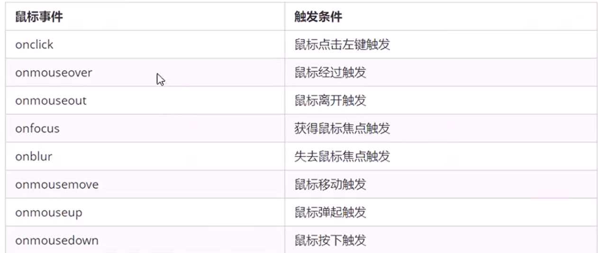

## 1. DOM简介

### 1.1什么是DOM

文档对象模型（Document Object Model，简称 DOM），是 W3C 组织推荐的处理可扩展标记语言（HTML或者XML）的标准编程接口。

W3C 已经定义了一系列的 DOM 接口，通过这些 DOM 接口可以改变网页的内容、结构和样式。

### 1.2DOM 树

* 文档：一个页面就是一个文档，DOM 中使用 document 表示
* 元素：页面中的所有标签都是元素，DOM 中使用 element 表示
* 节点：网页中的所有内容都是节点（标签、属性、文本、注释等），DOM 中使用 node 表示

DOM把以上内容都看做是对象

## 2. 获取元素

### `getElementById() `：使用 方法可以获取带有 ID 的元素对象

```html
<body>
    <div id="time"></div>
</body>
<script>
  document.getElementById('time');  
</script>
```

### `getElementsByTagName() :`方法可以返回带有指定标签名的对象的集合。

```html
<body>
    <li></li>
    <li></li>
    <li></li>
    <li></li>
</body>
<script>
  document.getElementsByTagName('li');  //以伪数组的形式存储
</script>
```

**还可以获取某个元素(父元素)内部所有指定标签名的子元素.**

```html
element.getElementsByTagName('标签名');
```

注意：父元素必须是单个对象(必须指明是哪一个元素对象). 获取的时候不包括父元素自己。

### `getElementsByClassName:`根据类名获得某些元素集合。

```html
<body>
    <div class="time"></div>
</body>
<script>
  document.getElementsByClassName('time');  //也是伪数组
</script>
```

### `document.querySelector(选择器')`： 根据指定选择器返回第一个元素对象

```html
<body>
    <li></li>
    <li id="list"></li>
    <li class="name"></li>
    <li></li>
</body>
<script>
    let li1 = document.querySelector("li") //获取第一个
 	let li2 = document.querySelector("#list") //获取id名为list
    let li3 = document.querySelector(".name") // 获取class名为name的
</script>
```

### `document.querySelectorAll(选择器')`： 根据指定选择器返回所有元素集合

```html
<body>
    <li></li>
    <li></li>
    <li></li>
    <li></li>
</body>
<script>
    let li = document.querySelectorAll("li") //也是得到一个伪数组
</script>
```

## 3.获取特殊元素（body，html）

**获取body元素**

```html
1. doucumnet.body  // 返回body元素对象
```

**获取html元素**

```html
1. document.documentElement  // 返回html元素对象
```

## 4.事件

**事件三要素**

1. 事件源 （谁）

2. 事件类型 （什么事件）

3. 事件处理程序 （做啥）

### 4.1执行事件的步骤

* 获取事件源  就是获取元素document.xxxx获取元素
* 注册事件
* 添加事件处理程序

### 4.2常见鼠标事件

### 4.3 innerText 和innerHtml

* innerText不能识别html标签 非标准 去除空格和换行

* innerHtml能识别html标签

* 这两个属性是可读写的 可以获取元素里面的内容

  ```html
  <body>
      <p>
          我是文字
          <span>123</span>
      </p>
  </body>
  <script>
     var p = document.getElementsByTagName('p')[0]
     console.log(p.innerText); //我是文字 123
     console.log(p.innerHTML); 
      /*
          我是文字
          <span>123</span>
      */
  </script>
  ```

### 4.4 修改元素属性

```css
img.src = 'image/01.jpg' //修改图片src
```

### 4.5修改元素样式

我们可以通过 JS 修改元素的大小、颜色、位置等样式。

```js
1. element.style     行内样式操作
2. element.className 类名样式操作
```

**注意**：

1.JS 里面的样式采取驼峰命名法 比如 fontSize、 backgroundColor

2.JS 修改 style 样式操作，产生的是行内样式，CSS 权重比较高

```js
  const div = document.getElementsByTagName('div')[0];
    div.addEventListener('click',function(){
        this.style.backgroundColor = "pink"
    })
```

### 4.6自定义属性值

#### 4.6.1获取属性值

* element.属性  获取属性值。
* element.getAttribute('属性');

**区别：**

* element.属性 获取内置属性值（元素本身自带的属性）
* element.getAttribute(‘属性’); 主要获得自定义的属性 （标准） 我们程序员自定义的属性

```html
<body>
 <div class="box" index="111">
 </div>
</body>
<script>
    const div = document.getElementsByTagName('div')[0];
    console.log(div.className); // box
    console.log(div.title);// 获取不到
    console.log(div.getAttribute('index')); //111
    console.log(div.getAttribute('class')); // box
</script>
```

#### 4.6.2设置属性值

* `element.属性` = ‘值’ 设置内置属性值。
* `element.setAttribute('属性', '值'); `

**区别：**

* `element.属性` 设置内置属性值
* `element.setAttribute(‘属性’)`; 主要设置自定义的属性 （标准）

#### 4.6.3**.** **移除**属性

`element.removeAttribute('属性');` 

### 4.7 H5自定义属性

**自定义属性目的：是为了保存并使用数据。有些数据可以保存到页面中而不用保存到数据库中。**

自定义属性获取是通过getAttribute(‘属性’) 获取。

但是有些自定义属性很容易引起歧义，不容易判断是元素的内置属性还是自定义属性。

H5给我们新增了自定义属性：

比如 `<div data-index="1"></div>`

或者使用 JS 设置 

`element.setAttribute(‘data-index’, 2)`

**获取H5自定义属性**

1.兼容性获取 ` element.getAttribute(‘data-index’);`

2.H5新增 `element.dataset.index `或者 `element.dataset[‘index’] ` ie 11才开始支持

**`dataset`是一个集合里面存放了所有以data开头的自定义属性**

如果自定义属性里面有多个-链接的单词我们获取的时候采取驼峰命名法。

```html
<div getTime="20" data-index="2" data-list-name="andy"></div>
   // 如果自定义属性里面有多个-链接的单词，我们获取的时候采取 驼峰命名法
console.log(div.dataset.listName);
console.log(div.dataset['listName']);
```

## 5. 节点操作

### 5.1 节点概述

网页中的所有内容都是节点（标签、属性、文本、注释等），在DOM 中，节点使用 node 来表示。

HTML DOM 树中的所有节点均可通过 JavaScript 进行访问，所有 HTML 元素（节点）均可被修改，也可以创建或删除。

一般地，节点至少拥有nodeType（节点类型）、nodeName（节点名称）和nodeValue（节点值）这三个基本属性。

* 元素节点  nodeType 为 1
* 属性节点 nodeType 为 2
* 文本节点 nodeType 为 3 （文本节点包含文字、空格、换行等）

### 5.2节点层级

**父级节点**

```js
node.parentNode  
```

`parentNode` 属性可返回某节点的父节点，注意是最近的一个父节点

如果指定的节点没有父节点则返回 null 

**子节点**

```js
parentNode.childNodes（标准） 
```

**注意：返回值里面包含了所有的子节点，包括元素节点，文本节点等。**

**如果只想要获得里面的元素节点，则需要专门处理。 所以我们一般不提倡使用childNodes**

```
parentNode.children（非标准）
```

