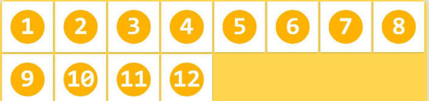

## flex布局

### 基本概念

采用 Flex 布局的元素，称为 Flex 容器（flex container），简称"容器"。它的所有子元素自动成为容器成员，子元素的`float`，`clear`和`vertical-align`属性都将失效。

容器默认存在两根轴：水平的主轴（main axis）和垂直的交叉轴（cross axis）。

### flex布局父项属性

以下6个属性设置在容器上。

> - flex-direction
> - flex-wrap
> - flex-flow
> - justify-content
> - align-items
> - align-content

### flex-direction

**direction**方位方向

**主轴和侧轴**

在flex布局中分为主轴和侧轴两个方向，同样的叫法：行和列，x轴和y轴

* 默认的主轴是x轴方向，水平向右
* 默认的侧轴方向就是y轴方向，水平向下


注意：主轴和侧轴是会变化的，看`flex-direction`设置谁为主轴，剩下的就是侧轴。我们子元素是跟着主轴来排列的。

`flex-direction`属性**决定主轴的方向**（即项目的排列方向）。

```css
.box {
  flex-direction: row | row-reverse | column | column-reverse;
}
```

**reverse**翻转

它可能有4个值。

> - `row`（默认值）：主轴为水平方向，起点在左端。从左到右
> - `row-reverse`：主轴为水平方向，起点在右端。从右到左
> - `column`：主轴为垂直方向，起点在上沿。从上到下
> - `column-reverse`：主轴为垂直方向，起点在下沿。从下到上

### flex-wrap

默认情况下，项目都排在一条线（又称"轴线"）上。`flex-wrap`属性定义，如果一条轴线排不下，如何换行。

```css
.box{
  flex-wrap: nowrap | wrap | wrap-reverse;
}
```

（1）`nowrap`（默认）：不换行。他会把所有子元素缩小到能在一行容下为止。


（2）`wrap`：换行，第一行在上方。多出的子元素会放到下一行显示



（3）`wrap-reverse`：换行且翻转，第一行在下方。


###  flex-flow

`flex-flow`属性是`flex-direction`属性和`flex-wrap`属性的简写形式，默认值为`row nowrap`。

```css
.box {
  flex-flow: <flex-direction> || <flex-wrap>;
}
```

```css
.box {
	/*flex-direction: column;
    flex-wrap: wrap;*/
    flex-flow:column , wrap /*这句代码等于上面两句代码*/
}
```

### justify-content

`justify-content`属性定义了项目在**主轴**上的对齐方式。

```css
.box {
  justify-content: flex-start | flex-end | center | space-between | space-around;
}
```


### align-items

`align-items`属性定义项目在侧轴（交叉轴）上如何对齐。

```css
.box {
  align-items: flex-start | flex-end | center | baseline | stretch;
}
```

- 它可能取5个值。具体的对齐方式与交叉轴的方向有关，下面假设交叉轴从上到下。

  > - `flex-start`：交叉轴的起点对齐。
  > - `flex-end`：交叉轴的终点对齐。
  > - `center`：交叉轴的中点对齐。
  > - `baseline`: 项目的第一行文字的基线对齐。
  > - `stretch`（默认值）：如果项目未设置高度或设为auto，将占满整个容器的高度。


### align-content多行

```css
.box {
  align-content: flex-start | flex-end | center | space-between | space-around | stretch;
}
```


- 该属性可能取6个值。

  > - `flex-start`：与交叉轴的起点对齐。
  > - `flex-end`：与交叉轴的终点对齐。
  > - `center`：与交叉轴的中点对齐。
  > - `space-between`：与交叉轴两端对齐，轴线之间的间隔平均分布。
  > - `space-around`：每根轴线两侧的间隔都相等。所以，轴线之间的间隔比轴线与边框的间隔大一倍。
  > - `stretch`（默认值）：轴线占满整个交叉轴。

### flex布局子项属性

以下6个属性设置在项目上。

> - `order`
> - `flex-grow`
> - `flex-shrink`
> - `flex-basis`
> - `flex`
> - `align-self`

### flex

flex属性定义子项目**分配剩余空间**，用flex来表示占多少份数

```css
div {
	flex:1
}
```

### align-self

**self**对齐

`align-self`属性允许单个项目有与其他项目不一样的对齐方式，可覆盖`align-items`属性。默认值为`auto`，表示继承父元素的

`align-items`属性，如果没有父元素，则等同于`stretch`。

```css
.item {
  align-self: auto | flex-start | flex-end | center | baseline | stretch;
}
```

该属性可能取6个值，除了auto，其他都与align-items属性完全一致。

### order属性定义项目的排列顺序

```css
.item {
  order: <integer>;
}
```

`order`属性定义项目的排列顺序。数值越小，排列越靠前，默认为0。

## rem布局

### em 单位

em相对于父元素的字体大小来说：

```css
    div {
            font-size: 12px;
        }
        p {
            width: 10em;
            height: 10em;
            background-color: blue;
        }
```

上面代码p的宽高都为120px。

### rem 单位

rem是一个相对单位，类似于em，em是父元素字体大小。不同的是rem的基准是相对于html元素的字体大小。

比如，根元素（html）设置font-size = 12px；非根元素设置width：2rem；则换成px表示是24px。

**优点**：可以通过修改html里面的文字大小来改变页面中元素的大小可以整体控制

### 媒体查询（Media Query）

@media可以针对不同的屏幕尺寸设置不同的样式。

```css
@media mediatype and|not|only (media feature) {
	CSS-Code;
}
```

* 用@media开头 注意@符号

* mediatype 媒体类型 ，可选择`all`用于所有设备，`screen`用于电脑屏幕，平板电脑，智能手机等。

* 关键字 and not only

  

* media feature 媒体特性 必须有小括号包含

  

```css
@media mediatype and (max-width:800px) {
	/*max-width:800px  小于等于800px*/
}
```

上面代码指的是：在我们屏幕上 并且最大宽度是800px，设置我们想要的样式。

## 属性选择器

E：为元素

attr：为属性名

value：为属性值

#### E[attr]：只使用属性名，但没有确定任何属性值

#### E[attr="value"]选择指定的属性对象

#### E[attr~="value"] 包含属性值

只要属性值中有一个value相匹配就可以选中该元素

#### E[attr^="value"] 选择attr属性值以“value”开头的所有元素

#### E[attr$="value"] 选择attr属性值以"value"结尾的所有元素

#### E[attr*="value"] 选择attr属性值中包含子串"value"的所有元素。

.demo a[title*="site"]{ background:black; color:white; }
选择的属性，其属性值中有这个"value"值都将被选中
选择了div.demo中a元素，而a元素的title属性中只要有"site"这个字符串就选中。

#### E[attr|="value"] 选择attr属性值等于value或以value-开头的所有元素