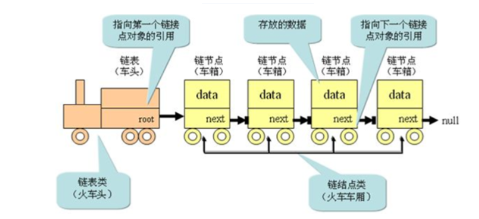
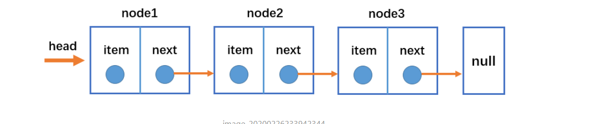
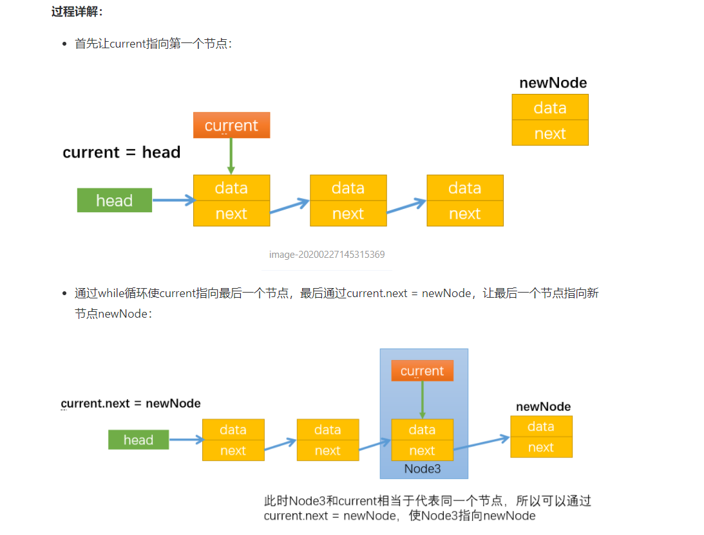
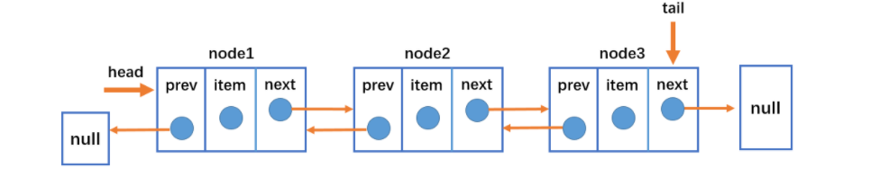
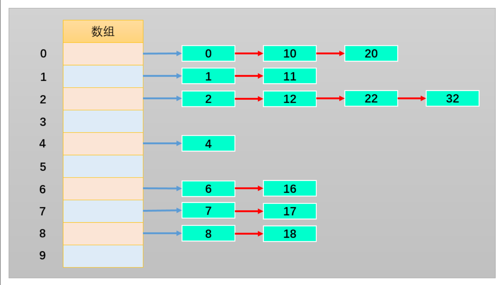
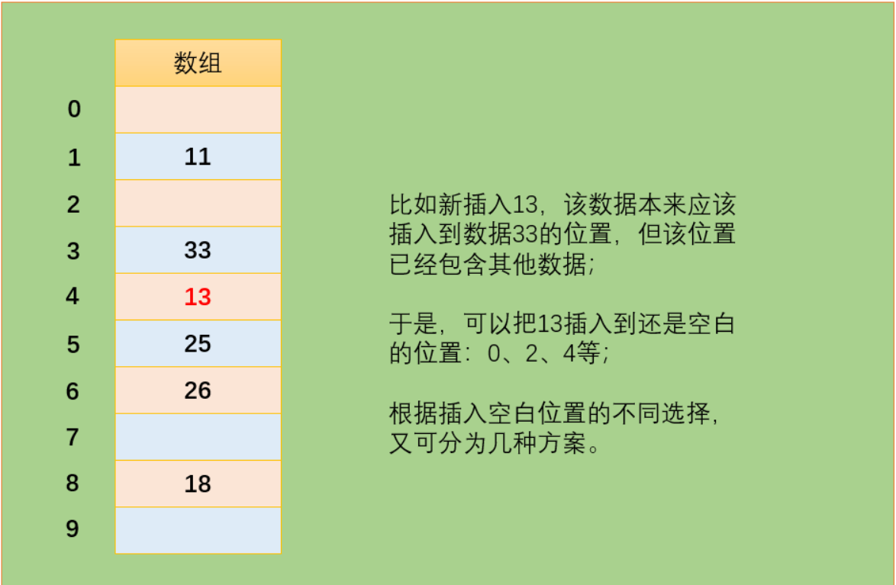
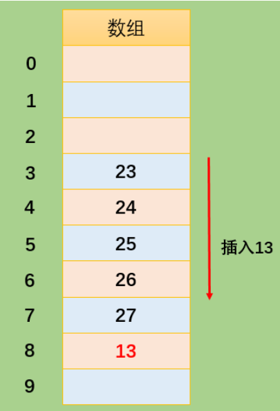
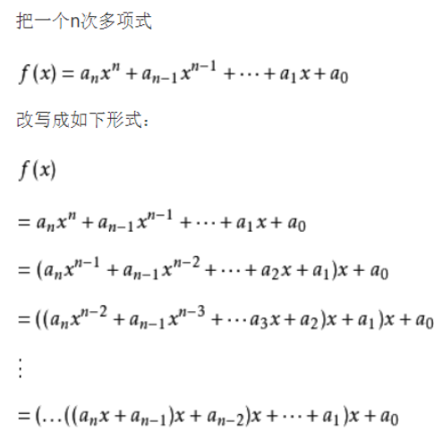
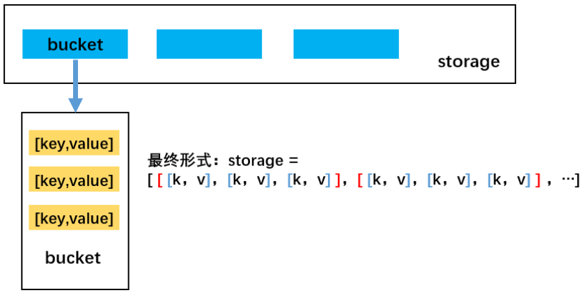

# 栈（Stack）

数组是一个线性结构，并且可以在数组的**任意位置**插入和删除元素。而**栈和队列**就是比较常见的**受限的线性结构**

栈的特点：

- 向一个栈插入新元素又称作进栈、入栈或压栈，它是把新元素放到栈顶元素的上面，使之成为新的栈顶元素；
- 从一个栈删除元素又称作出栈或退栈，它是把栈顶元素删除掉，使其相邻的元素成为新的栈顶元素。
- <font color=red>**`LIFO（last in first out）`表示后进先出，后面进来的元素优先出去**</font>


### 程序中的栈结构

**函数调用栈**：

```js
function a(){b()};
function b(){c()}
function c(){d()};
function d(){};
a()
```

A函数中调用B，B调用C，C调用D；在A执行的过程中会将A压入栈，随后B执行时B也被压入栈，函数C和D执行时也会被压入栈。所以当前栈的顺序为：A->B->C->D（栈顶）；函数D执行完之后，会弹出栈被释放，弹出栈的顺序为D->C->B->A;

### 面试题

题目：有 6 个元素 6，5，4，3，2，1 按顺序进栈，问下列哪一个不是合法的出栈顺序？

- A：5 4 3 6 1 2 
- B：4 5 3 2 1 6 
- C：3 4 6 5 2 1 
- D：2 3 4 1 5 6 

解析：

**题目只是说这6个元素按顺序进栈，没说要进完全部再出栈**

- A答案：65进栈，5出栈，4进栈出栈，3进栈出栈，6出栈，21进栈，1出栈，2出栈（整体入栈顺序符合654321）;
- B答案：654进栈，4出栈，5出栈，3进栈出栈，2进栈出栈，1进栈出栈，6出栈（整体的入栈顺序符合654321）;
- C答案：6543进栈，3出栈，4出栈，之后应该5出栈而不是6，所以错误；
- D答案：65432进栈，2出栈，3出栈，4出栈，1进栈出栈，5出栈，6出栈。符合入栈顺序；

### 数组封装栈

**栈常见的操作：**

- push（element）：添加一个新元素到栈顶位置；
- pop（）：移除栈顶的元素，同时返回被移除的元素；
- peek（）：返回栈顶的元素，不对栈做任何修改（该方法不会移除栈顶的元素，仅仅返回它）；
- isEmpty（）：如果栈里没有任何元素就返回true，否则返回false；
- size（）：返回栈里的元素个数。这个方法和数组的length属性类似；
- toString（）：将栈结构的内容以字符串的形式返回。

使用数组进行封装如下：

```js
/ 栈结构的封装
class Stack {

  constructor() {
    this.items = [];
  }

  // push(item) 压栈操作，往栈里面添加元素
  push(item) {
    this.items.push(item);
  }

  // pop() 出栈操作，从栈中取出元素，并返回取出的那个元素
  pop() {
    return this.items.pop();
  }

  // peek() 查看栈顶元素
  peek() {
    return this.items[this.items.length - 1];
  }

  // isEmpty() 判断栈是否为空
  isEmpty() {
    return this.items.length === 0;
  }

  // size() 获取栈中元素个数
  size() {
    return this.items.length;
  }

  // toString() 返回以字符串形式的栈内元素数据
  toString() {
    let result = '';
    for (let item of this.items) {
      result += item + ' ';
    }
    return result;
  }
}
```

进行测试：

```js
 //栈的使用
    let s = new Stack() 
    s.push(10)
    s.push(50)
    s.push(70)
    alert(s.peek())
    alert(s)
    s.pop()
    s.pop()
    alert(s)
    alert(s.size())
```

### 栈结构的特点封装实现十进制转换为二进制的方法

**默认已经封装好了栈结构**

```js
 // 函数将十进制转为二进制
    function dec2bin(deNumber) {
        // 1.定义栈对象
        let stack = new Stack()
        // 2.循环操作
        
        while(deNumber!==0){
            // 获取余数到栈中
            stack.push(deNumber%2)
            // 获取整除后的结果，作为下一次运行的数字
            deNumber = Math.floor(deNumber/2)
        }
        // 从栈中取出0和1
        let binaryString = ''
        while(!stack.isEmpty()){
            binaryString += stack.pop()
        }
        return binaryString
    }
```

测试：

```js
 console.log(dec2bin(100));
   console.log(dec2bin(1000));
   console.log(dec2bin(255));
```

# 队列（Queue）

队列（Queue）是一种运算受限的线性表，特点：先进先出。(FIFO：First In First Out)

**受限之处：**

- 只允许在表的前端（front）进行删除操作。
- 只允许在表的后端（rear）进行插入操作。

生活中类似队列结构的场景：

- 排队，比如在电影院，商场，甚至是厕所排队。

- 优先排队的人，优先处理。 (买票、结账、WC)。

  


## 数组封装队列

### 队列常见的操作

- `enqueue(element)` 向队列尾部添加一个（或多个）新的项。
- `dequeue()` 移除队列的第一（即排在队列最前面的）项，并返回被移除的元素。
- `front()` 返回队列中的第一个元素——最先被添加，也将是最先被移除的元素。队列不做任何变动（不移除元素，只返回元素信息与 Map 类的 peek 方法非常类似）。
- `isEmpty()` 如果队列中不包含任何元素，返回 true，否则返回 false。
- `size()` 返回队列包含的元素个数，与数组的 length 属性类似。
- `toString()` 将队列中的内容，转成字符串形式。

**代码实现**

```js
class Queue{
        constructor(){
            this.items = []
        }
        // 1.向队列中加入元素
        enqueue(...element){
            // 解构传入就能一次接受多个值
            this.items.push(...element)          
        }
        // 2.从队列中删除前端元素
        dequeue(){
            return this.items.shift()
        }
        // 3.查看前端元素
        font(){
            return this.items[0]
        }
        // 4.查看队列是否为空
        isEmpty(){
            return this.items.length!=0
        }
        // 5.查看队列中元素个数
        size(){
            return this.items.length
        }
        // 6.toString方法
        toString(){
            let str = ''
            for(let i of this.items){
                str+=i+' '
            }
            return str
        }
    }
```

**测试**

```js
 let q = new Queue()
    q.enqueue(5,6,7)
    alert(q.size())
    alert(q.toString())
```

### 面试题击鼓传花

使用队列实现小游戏：击鼓传花，传入一组数据（**人名**）和设定的数字num，循环遍历数组内元素，遍历到的元素为指定数字num时将该元素删除，直至数组剩下一个元素。

```js
  function passGame(nameList,num){
        // 1.创建一个队列结构
        let queue = new Queue()
        // 2.将所有人依次加入到队列中
        queue.enqueue(...nameList)
        // 只要队列中人数大于1就继续循环淘汰
        while(queue.size()>1){
             // 3.开始数数字，不是num的时候重新加入到末尾，是num时从队列中删除
             // num数字前面的人加入队尾,因为从1开始数所以let i=1
        for(let i=1;i<num;i++){
            // 删除前端元素重新加入到队尾
            queue.enqueue(queue.dequeue())
        }
        // num这个数字的人直接淘汰
        queue.dequeue()
        }
        // 获取剩下的那个人
       let endName = queue.font()
       alert('获胜的的是：'+endName)
       //获取那个人的下标值

       return nameList.indexOf(endName)
    }

```

```js
 // 测试击鼓传花
    const names = ['张三','李四','王五','赵六','王八']
    console.log(passGame(names,3));
```

# 优先队列

生活中类似**优先队列**的场景：

- 优先排队的人，优先处理。 (买票、结账、WC)。
- 排队中，有紧急情况（特殊情况）的人可优先处理。

优先级队列主要考虑的问题：

- 每个元素不再只是一个数据，还包含优先级。
- 在添加元素过程中，根据优先级放入到正确位置。

## 使用数组封装优先级队列

只有添加元素的方法和普通队列不一样，需要考虑优先级，别的和普通队列一样

添加元素相当于在数组中插入对象该对象有`element`属性（内容）和`priority`属性（优先级）

```js
 class QueueElement{
        constructor(element,priority){
            // 封装属性
            this.element = element
            this.priority = priority}
    }
  class PriorityQueue{
        
           constructor(){
            this.items = []
           }
        
        // 实现插入方法
        enqueue(element,priority){
            const queueElement = new QueueElement(element,priority)

            // 判断队列是否为空
            if(this.items.length ==0){
                this.items.push(queueElement)
            }else{
                let added = false;
                for(let i=0;i<this.items.length;i++){
                    if(queueElement.priority<this.items[i].priority){
                        this.items.splice(i,0,queueElement)
                        added =true
                        break                       
                    }
                }
                 // 如果遍历完所有元素，优先级都大于新插入的元素，就将新插入的元素插入到最后
                if(added==false){
                    this.items.push(queueElement)
                }
            }
        }      
```

**测试**

```js
  const pq = new PriorityQueue()
    pq.enqueue('abc',111)
    pq.enqueue('cba',200)
    pq.enqueue('nba',50)
    pq.enqueue('nba2',50)
    console.log(pq);
```

# 单向链表

链表和数组一样，可以用于存储一系列的元素，但是链表和数组的实现机制完全不同。

链表

- 存储多个元素，另外一个选择就是使用链表。

- 不同于数组，链表中的元素在内存中不必是连续的空间。

- 链表的每个元素由一个存储**元素本身的节点**和一个指**向下一个元素的引用**(有些语言称为指针)组成。类似于火车头，一节车厢载着乘客（数据），通过节点连接另一节车厢。

  

  

  **链表优点：**

  内存空间不必是连续的，可以充分利用计算机的内存，实现灵活的内存动态管理。

  链表不必在创建时就确定大小，并且大小可以无限延伸下去。

  链表在插入和删除数据时，时间复杂度可以达到 O(1)，相对数组效率高很多。

  **链表缺点：**

  访问任何一个位置的元素时，需要从头开始访问。(无法跳过第一个元素访问任何一个元素)

  无法通过下标值直接访问元素，需要从头开始一个个访问，直到找到对应的元素。

  虽然可以轻松地到达下一个节点，但是回到前一个节点是很难的。

## 单向链表的封装

**链表中的常见操作：**

- append（element）：向链表尾部添加一个新的项；
- insert（position，element）：向链表的特定位置插入一个新的项；
- get（position）：获取对应位置的元素；
- indexOf（element）：返回元素在链表中的索引。如果链表中没有该元素就返回-1；
- update（position，element）：修改某个位置的元素；
- removeAt（position）：从链表的特定位置移除一项；
- remove（element）：从链表中移除一项；
- isEmpty（）：如果链表中不包含任何元素，返回trun，如果链表长度大于0则返回false；
- size（）：返回链表包含的元素个数，与数组的length属性类似；
- toString（）：由于链表项使用了Node类，就需要重写继承自JavaScript对象默认的toString方法，让其只输出元素的值；

#### 封装链表类和链表节点

```js
  // 封装链表的节点
    class Node {
        constructor(data) {
            this.data = data
            this.next = null
        }
    }
    // 封装链表类
    class LinkedList {
        constructor() {
            this.head = null
            this.length = 0
        }
    }
```

#### append(data)



```js
 append(data) {
            // 判断添加的是否是第一个节点
            let newNode = new Node(data)
            if (this.length == 0) {//是第一个节点
                this.head = newNode
            } else { //不是第一个节点
                // 找到最后一个节点
                let current = this.head
                while (current.next) {
                    current = current.next
                }
                //最后节点的next指向新节点
                current.next = newNode
            }
            this.length += 1
        }
```

封装append方法需要考虑到的情况：

- 判断添加的是否是一个节点，是的话则让 **this.head=newNode**
- 若添加的不是第一个节点，则添加到最后面通过循环找到最后一个节点**current**，让**current=newNode**

#### toString() 

toString方法会自动调用的

```js
     toString() { //toString方法会自动调用的
            // 1.定义变量
            let current = this.head
            let listString = ''
            // 2.循环获取一个个节点
            while (current) {
                listString += current.data + " "
                current = current.next
            }
            return listString
        }
```

循环遍历出每一个节点的`data`属性，将其添加到`listString`中,return出去。

#### insert(postiton,data)

insert方法，在任意位置插入数据

```js
  insert(postiton,data){
            // 3.1.对position进行越界判断
            if(postiton<0||postiton>this.length) return false
            //3.2.创建节点
            let newNode = new Node(data)
            // 3.3判断插入的位置是否为第一个
            if(postiton==0){ //插入位置为第一个
                newNode.next = this.head
                this.head = newNode
            }else{ //插入的位置不是第一个
                let index = 0
                let current = this.head
                let previous = null
                while(index++ < postiton){
                    previous = current
                    current = current.next
                }
                previous.next = newNode
                newNode.next = current
            }
            // 3.4length+1
            this.length += 1
            return true
        }
```

封装insert方法需要考虑的情况：

- 插入的位置为第一个(`position=0`)，则让newNode.next=this.head,然后再把this.head=newNode
- 如果插入的位置不是第一个，循环找到需要插入的那个节点**current**，还得设置一个变量previous让他等于current的前一个节点，再让**previous.next = newNode**，然后**newNode.next = current**
- 最后别忘了长度加1

#### get(postiton)

给一个索引获取该位置的数据

```js
get(postiton){
            //4.1越界判断
            if(postiton<0||postiton>=this.length) return null
            let current = this.head
            for(let i=0;i<postiton;i++){
                current = current.next
            }
            
            return current.data
        }
```

#### indexOf(item)

indexOf() 返回元素在列表中的索引，若没有则返回-1

```js
  indexOf(item){
            let current = this.head
            let index = 0
            while(current!=null){
                if(current.data==item){
                    return index
                }
                index++
                current = current.next
            }
            // 没有找到返回-1
            return -1
        }
```

#### updata(postiton,item)

updata修改某个位置的元素

```js
updata(postiton,item){
            if(postiton<0||postiton>=this.length) return false
            let current = this.head
            for(let i=0;i<postiton;i++){
                current = current.next
            }
            current.data = item
            return true
        }
```

#### removeAt(postiton)

```js
removeAt(postiton){
           //7.1越界判断
           if(postiton<0||postiton>=this.length) return null  
           //7.2当删除第一个元素
           let current = this.head
           let previous = null
           if(postiton==0){
            this.head=current.next
           }else{
            for(let i=0;i<postiton;i++){
                previous = current
                current = current.next
            }
            previous.next = current.next
           
           }
           this.length--
        }
```

封装remove方法需要注意的情况：

- 如果删除的元素为第0个元素(position=0)，就让this.head = current.next
- 删除的元素不是第0个，则通过循环找到那个要删除的节点current，再找到current的上一个节点previous，让prvious.next指向要删除元素的下一个节点即current.next

####  remove(item)

根据元素删除对应节点

```js
 remove(item){
            // 8.1获取item在列表中的位置
            let index = this.indexOf(item)
            // 8.2根据位置信息删除节点
            this.removeAt(index)
        }
```

通过indexOf方法找到item所在位置，再调用removeAt方法将其删除

#### 其他方法和测试代码

```js
 isEmpty(){
            return this.length==0
        }

        // 10返回链表包含的元素个数
        size(){
            return this.length
        }
    
    }
```

**测试**

```js
 let list = new LinkedList()
    list.append('abc')
    list.append('cba')
    list.append('nba')
    // list.insert(1,'fff')
    // alert(list)
//     console.log(list.get(0));
//    list.updata(2,'fuck')
    list.remove('cba')
   alert(list)
   list.remove('nba')
   alert(list)
   console.log(list.size());
```

<font color=red>完整代码见文件夹day60</font>

# 双向链表

## 双向链表简介

**双向链表**：既可以**从头遍历到尾**，又可以**从尾遍历到头**。也就是说链表连接的过程是**双向**的，它的实现原理是：一个节点既有**向前连接的引用**，也有一个**向后连接的引用**。

**双向链表的缺点：**

- 每次在**插入或删除**某个节点时，都需要处理四个引用（该节点的prev，next，上一个节点的next，下一个节点的prev），而不是两个，实现起来会困难些；
- 相对于单向链表，所占**内存空间更大**一些；
- 但是，相对于双向链表的便利性而言，这些缺点微不足道。

**双向链表的结构：**



- 双向链表不仅有**head**指针指向第一个节点，而且有**tail**指针指向最后一个节点；
- 每一个节点由三部分组成：**item**储存数据、**prev**指向前一个节点、**next**指向后一个节点；
- 双向链表的第一个节点的prev指向**null**；
- 双向链表的最后一个节点的next指向**null**；

## 双向链表的封装

**双向链表常见的操作（方法）：**

- append（element）：向链表尾部添加一个新的项；
- inset（position，element）：向链表的特定位置插入一个新的项；
- get（element）：获取对应位置的元素；
- indexOf（element）：返回元素在链表中的索引，如果链表中没有元素就返回-1；
- update（position，element）：修改某个位置的元素；
- removeAt（position）：从链表的特定位置移除一项；
- isEmpty（）：如果链表中不包含任何元素，返回trun，如果链表长度大于0则返回false；
- size（）：返回链表包含的元素个数，与数组的length属性类似；
- toString（）：由于链表项使用了Node类，就需要重写继承自JavaScript对象默认的toString方法，让其只输出元素的值；
- forwardString（）：返回正向遍历节点字符串形式；
- backwordString（）：返回反向遍历的节点的字符串形式；

#### 封装链表类和链表节点

```js
class Node {
        constructor(data) {
            this.data = data
            this.next = null
            this.prev = null
        }
    }
class DoublyLinkedList {
        constructor() {
            this.length = 0
            this.head = null
            this.tail = null
        }
```

比单向链表多了两个属性：prev和tail

#### append(data)

```js
     append(data) {
            let newNode = new Node(data)
            // 情况1只有一个节点的时候
            if (this.length == 0) {
                this.head = newNode
                this.tail = newNode
            } else {
                // 让最后一个节点的next等于newNode
                this.tail.next = newNode
                // 让newNode的prev指向最后一个节点
                newNode.prev = this.tail
                // 让newNode成为最后一个节点
                this.tail = newNode
            }
            this.length++

        }
```

封装append方法需要考虑到的情况：

- 只有一个节点时，head和tail都指向新插入的那个节点所以**this.head = newNode**，**this.tail = newNode**
- 不止一个节点，则插在最末尾，让最后一个节点的next等于newNode **this.tail.next = newNode**，让newNode成为最后一个节点**this.tail = newNode**

#### insert(position, element)

insert方法，在任意位置插入数据

```js
 insert(position, element) {
            // 3.1越界判断
            if (position < 0 || position > this.length) return false
            // 3.2创建节点
            let newNode = new Node(element)

            // 3.3判断多种插入情况
            if (position == 0) { //插入位置为0
                if (this.length == 0) {
                    this.head = newNode
                    this.tail = newNode
                } else {
                    newNode.next = this.head
                    this.head.prev = newNode
                    this.head = newNode
                }
            } else if (position == this.length) { //插入位置等于长度，意味插在末尾
                this.tail.next = newNode
                newNode.prev = this.tail
                this.tail = newNode
            } else {
                let current = this.head
                let index = 0
                while (index++ < position) {
                    current = current.next
                }
                current.prev.next = newNode
                newNode.prev = current.prev
                newNode.next = current
                current.prev = newNode
            }
            this.length++
        }
```

封装insert方法需要考虑到的情况：

- 当插入的位置为0时候（position=0），又分为两种情况。
  - 链表中没有节点，所以`head`和`tail`都指向`newNode`
  - 链表中有其他节点，`newNode.next`指向`this.head`，`this.head.prve`指向`newNode`,最后再让`this.head `=` newNode`

- 当插入的位置为末尾时（position=this.length）`this.tail.next`指向`newNode`，`newNode.prev`指向`this.tail`,最后让`this.tail`=`newNode`
- 插入的位置在中间，设置变量`current`通过循环找到要插入的位置的元素，一共要处理4个引用，该节点（current）的`prev`，`next`，上一个节点的`next`，下一个节点的`prev`
- 最后别忘了长度加1

####  removeAt(position)

removeAt()获取一个位置，删除该位置的节点

```js
 removeAt(position) {
            // 判断情况
            if (position < 0 || position >= this.length) return false
            let current = this.head
            if (position == 0) {
                // 只有一个元素
                if (this.length == 1) {
                    this.head = null
                    this.tail = null
                } else {
                    this.head = this.head.next
                    this.head.prev = null
                }

            } else if (position == this.length - 1) {
                current = this.tail
                this.tail = this.tail.prev

                this.tail.next = null

            } else {
                let index = 0
                while (index++ < position) {
                    current = current.next
                }
                current.prev.next = current.next
                current.next.prev = current.prev
            }
            this.length--
            return current.data
        }
```

封装removeAt方法需要考虑到的情况：

- 要删除节点的位置为0（position=0）分为两种情况
  - 链表中只有一个节点，让`head`和`tail`都赋值为null
  - 链表中不止一个节点，让this.head.next=this.head，再让this.head.next.prve = null

- 要删除最后一个节点（position=this.length-1）让this.tail.prev = this.tail,再让this.tail.next = null
- 要删除中间的某个节点，循环找到要删除的节点current，然后current.prve.next = current.next，current.next.prve = current.prve
- 别忘了长度-1

####  remove(item)

remove()根据元素删除对应节点

```js
  remove(item) {
            // 8.1获取item在列表中的位置
            let index = this.indexOf(item)
            // 8.2根据位置信息删除节点
            this.removeAt(index)
        }
```

#### 其他方法和测试

**其他方法和单向链表差不了**

<font color=red>完整代码见文件夹day60</font>

```js
 let list = new DoublyLinkedList()
    list.append('abc')
    list.append('cba')
    list.append('nba')
    alert(list);
    list.remove('nba')
```

#### 单向和双向链表总结

在我看来，链表的本质无非就是，一个对象中有一个data属性，然后又有一个prve（单向链表中没有），next属性，而这两个属性的本质又是一个对象，依次套娃。

单向链表的本质：

```js
let list1 = {
        head:{
            data: abc,
            next: {
                data: cba,
                next: {
                    data: nba,
                    next: { }
                }
            }
        }
     }
```

# 哈希表

## 认识哈希表

哈希表的结构就是**数组**，但它**神奇之处在于对下标值的一种变换**，这种变换我们可以称之为**哈希函数**，通过哈希函数可以获取 HashCode

也就是获得数组的下标值。

**哈希表的一些概念：**

- **哈希化：**将**大数字**转化成**数组范围内下标**的过程，称之为**哈希化**；
- **哈希函数：**我们通常会将**单词**转化成**大数字**，把**大数字**进行**哈希化**的代码实现放在一个函数中，该函数就称为**哈希函数**；
- **哈希表：**对最终数据插入的**数组**进行整个**结构的封装**，得到的就是**哈希表**。

**哈希表的优势：**

- 哈希表可以非常快速的进行**插入-删除-查询操作**，即O(1)时间级
- 哈希表的速度比树还要快，几乎瞬间查找到想要的元素

**哈希表的劣势：**

* 哈希表中数据没有顺序，不能以一种固定的方式（如从小到大）遍历元素
* 通常情况下，哈希表中的`key`不允许重复。

**通过以下案例了解哈希表：**

- 案例一：公司想要存储 1000 个人的信息，每一个工号对应一个员工的信息。若使用数组，增删数据时比较麻烦；使用链表，获取数据时比较麻烦。有没有一种数据结构，能把某一员工的姓名转换为它对应的工号，再根据工号查找该员工的完整信息呢？没错此时就可以使用哈希表的哈希函数来实现。
- 案例二：存储联系人和对应的电话号码：当要查找张三（比如）的号码时，若使用数组：由于不知道存储张三数据对象的下标值，所以查找起来十分麻烦，使用链表时也同样麻烦。而使用哈希表就能通过哈希函数把张三这个名称转换为它对应的下标值，再通过下标值查找效率就非常高了。

**也就是说：哈希表最后还是基于数组来实现的，只不过哈希表能够通过哈希函数把字符串转化为对应的下标值，建立字符串和下标值的映射关系。**

## 哈希化的方式

为了把字符串转化为对应的下标值，需要有一套编码系统，为了方便理解我们创建这样一套编码系统：比如**a为1，b为2，c为3，以此类推z为26，空格为27（不考虑大写情况）**。

有了编码系统后，将字母转化为数字也有很多种方式：

- **方式一**：数字相加。例如**cats转化为数字**：3+1+20+19=43，那么就把43作为cats单词的下标值储存在数组中；

  但是这种方式会存在这样的问题：很多的单词按照该方式转化为数字后都是43，比如was。而在数组中**一个下标值**只能**储存一个数据**，所以该方式不合理。

- **方式二**：幂的连乘。我们平时使用的**大于10的数字**，就是用**幂的连乘**来表示它的唯一性的。比如： 6543=6 * 10^3^ + 5 * 10^2^ + 4 * 10 + 3；这样单词也可以用该种方式来表示：cats = 3 * 27^3^ + 1 * 27^2^ + 20 * 27 + 17 =60337;

**两种方案总结：**

- 第一种方案（让数字相加求和）产生的**数组下标太少**；
- 第二种方案（与27的幂相乘求和）产生的**数组下标又太多**；

现在需要一种**压缩方法**，把幂的连乘方案系统中得到的**巨大整数范围**压缩到**可接受的数组范围**中。可以通过取余操作来实现。虽然取余操作得到的结构也有可能重复，但是可以通过其他方式解决。

## 解决哈希冲突的方式

### 方案一：链地址法

如下图所示，我们将每一个数字都对 10 进行取余操作，则余数的范围 0~9 作为数组的下标值。数组对应的下标值存储的是一个数组或者是链表



这样可以根据下标值获取到整个数组或链表，之后继续在数组或链表中查找就可以了

**总结：链地址法解决冲突的办法是每个数组单元中存储的不再是单个数据，而是一条链条，这条链条常使用的数据结构为数组或链表，两种数据结构查找的效率相当（因为链条的元素一般不会太多）。**

### 方案二：开放地址法

开放地址法的主要工作方式是**寻找空白的单元格**来放置**冲突**的数据项。



根据探测空白单元格位置方式的不同，可分为三种方法：

- 线性探测
- 二次探测
- 再哈希法

#### 线性探测

**当插入13时：**

13经过哈希化，假设得到得下标值index= 3，但是该位置已经存在了一个数据33，就开始往下进行线性探测寻找下一个适合得位置进行存储，每次得步长为1，即index+1，假设如上图所示index = 4就是合适的位置。

**当查询13时**

假设13经过哈希化得到index = 3，就开始从index = 3开始进行查找，若存放得数据等于13，则直接返回；不相同时则会以步长为1往后进行查找，知道遇到空位置，就停止。

**当删除13时**

删除操作，则和上述的查找一样，先通过链式查找找到13，再将下标对应的内容赋值为-1。

**为什么不赋值为null？**

因为将该位置下标的内容设置为 null，会影响到之后其他的查询操作，因为一遇到为 null 的位置就会停止查找。

**线性探测存在的问题：**

- 线性探测存在一个比较严重的问题，就是**聚集**；
- 如哈希表中还没插入任何元素时，插入23、24、25、26、27，这就意味着下标值为3、4、5、6、7的位置都放置了数据，这种**一连串填充单元**就称为**聚集**；
- 聚集会影响哈希表的**性能**，无论是插入/查询/删除都会影响；
- 比如插入13时就会发现，连续的单元3~7都不允许插入数据，并且在插入的过程中需要经历多次这种情况。二次探测法可以解决该问题。
- 

#### 二次探测

上文所说的**线性探测存在的问题**：

- 如果之前的数据是**连续插入**的，那么新插入的一个数据可能需要**探测很长的距离**；

  二次探测是在线性探测的基础上进行了**优化**：

- **线性探测**：我们可以看成是**步长为1**的探测，比如从下表值x开始，那么线性探测就是按照下标值：x+1、x+2、x+3等依次探测；

- **二次探测**：对步长进行了优化，比如从下标值x开始探测：x+1²、x+2²、x+3² 。这样**一次性探测比较长的距离**，避免了数据聚集带来的影响。

**二次探测存在的问题**：

- 当插入数据分布性较大的一组数据时，比如：13-163-63-3-213，这种情况会造成**步长不一的一种聚集**（虽然这种情况出现的概率较线性探测的聚集要小），同样会影响性能。

#### 再哈希法

在开放地址法中寻找空白单元格的最好的解决方式为再哈希化。

**再哈希法的做法为：把关键字用另一个哈希函数，再做一次哈希化，用这次哈希化的结果作为该关键字的步长。**

**第二次哈希化需要满足以下两点：**

- 和第一个哈希函数不同，不然哈希化后的结果仍是原来位置；
- 不能输出为 0，否则每次探测都是原地踏步的死循环；

**别人设计好的步长哈希函数：**

stepSize是步长，constant为常量 ，key是关键字转为大数字

- stepSize = constant - （key % constant）；
- 其中 constant 是质数，且小于数组的容量；
- 例如：stepSize = 5 - （key % 5），满足需求，并且结果不可能为 0；

## 装填因子

- 装填因子表示当前哈希表中已经包含的数据项和整个哈希表长度的比值；
- 装填因子 = 总数据项 / 哈希表长度；
- 开放地址法的装填因子最大为 1，因为只有空白的单元才能放入元素；
- 链地址法的装填因子可以大于 1，因为只要愿意，拉链法可以无限延伸下去；

## 哈希函数

哈希表的优势在于它的速度，所以哈希函数不能采用消耗性能较高的复杂算法。提高速度的一个方法是在哈希函数中尽量减少乘法和除法。

性能高的哈希函数应具备以下两个优点：

- 快速的计算；
- 均匀的分布；

霍纳法则：在中国霍纳法则也叫做秦久韶算法，具体算法为：



**变换之前**：

- 乘法次数：n（n+1）/2次；
- 加法次数：n次；

**变换之后：**

- 乘法次数：n次；
- 加法次数：n次；

如果使用大O表示时间复杂度的话，直接从变换前的**O(N^2^)**降到了**O(N)**。

**均匀分布**

为了保证数据在哈希表中**均匀分布**，当我们需要**使用常量的地方**，尽量使用**质数**；比如：哈希表的长度、N次幂的底数等。

Java中的HashMap采用的是链地址法，哈希化采用的是公式为：**index = HashCode（key）&（Length-1）**

即将数据化为二进制进行**与**运算，而不是取余运算。这样计算机直接运算二进制数据，效率更高。但是JavaScript在进行叫大数据的**与**运算时会出现问题，所以以下使用JavaScript实现哈希化时还是采用取余运算。

## 封装哈希表

**哈希表的常见操作为：**

- put（key，value）：插入或修改操作；
- get（key）：获取哈希表中特定位置的元素；
- remove（key）：删除哈希表中特定位置的元素；
- isEmpty（）：如果哈希表中不包含任何元素，返回trun，如果哈希表长度大于0则返回false；
- size（）：返回哈希表包含的元素个数；
- resize（value）：对哈希表进行扩容操作；

### 封装哈希函数

  设计哈希函数

   1.将字符串转为较大的数字：hashCode

   2.将大的数字hashCode压缩到数组范围(大小)之内

```js
function hashFunc(str,size){
        // 1.定义hashCode
        let hashCode = 0
        // 2.使用霍纳法则来计算hashCode的值       
        for(let i=0;i<str.length;i++){
            // charCodeAt() 方法可返回指定位置的字符的 Unicode 编码
            hashCode = 31*hashCode+ str.charCodeAt(i)          
        }
        // 3.取余操作
        hashCode = hashCode % size
        return hashCode
    }
```

上面代码中常量取的是31，是个质数

### 封装哈希表的数组结构模型



这幅图总的理解就是有一个数组`storage`，`storage`中的元素又是一个数组`bucket`，`bucket`中的元素又是一个数组`tuple`,图上没有名字我自己加的，`tuple`中存放着`key`和`value`，tuple[0] = key，tuple[1] = value 。

**首先创建哈希表类 HashTable，添加判断质数和获取质数的方法，并添加必要的属性和上面实现的哈希函数，再进行其他方法的实现。**

```js
    const MAX_LOAD_FACTOR = 0.75
    const MIN_LOAD_FACTOR = 0.25
   class HashTable {
        constructor() {
            this.storeage = [] //数组存储元素
            this.count = 0  // 当前存放了多少个元素
            this.limit = 7  //哈希表长度（初始设为质数 7）
        }
        // 判断质数
        isPrime(num) {
            for(let i=2;i<num;i++){
                if(num%i==0) {
                    return false
                }
            }
            return true 
        }
        //获得质数
        getPrime(num) {
            while(!this.isPrime(num)){ //如果不为质数则+1
                num++
            }
            return num
        }
    }
```

### resize(newLimit)哈希表的扩容与压缩

为什么需要扩容？

- 随着数据量的增多，storage 中每一个 index 对应的 bucket 数组（链表）就会越来越长，这就会造成哈希表效率的降低

什么情况下需要扩容？

- 常见的情况是 装填因子 > 0.75 的时候进行扩容。

什么情况需要压缩？

* 常见的情况是装填因子 < 0.25 时候需要压缩

实现思路：

- 首先，定义一个变量，比如 oldStorage 保存旧数组 storage的内容。
- 然后，重置属性，让数组长度更长，通过一些列继续选择一个质数。
- 最后，将 oldStorage 里面的所有元素，重新通过put方法放入到storage中（通过for...of...循环）。

```js
     resize(newLimit) {
            // 7.1保存旧的数组中的内容
            let oldStorage = this.storeag
            //7.2重置属性
            this.limit = newLimit
            this.storeage = [];
            this.count = 0
            // 7.3取出oldStorage里面所有元素，重新放入到storage里面
            for( let bucket of oldStorage){
                if(bucket){
                    for(let tuple of bucket ){
                        this.put(tuple[0],tuple[1])
                    }
                }
            }

        }
```

**newList自己通过计算传入的一个新的数组长度，让原来的长度乘以2或者除以2，再往下找到最近的质数。**

### put(key,value)

哈希表的插入和修改操作是同一个函数：因为，当使用者传入一个 `[key，value]` 时，如果原来不存在该 key，那么就是插入操作，如果原来已经存在该 key，那么就是修改操作。

实现思路：

- 首先，根据 key使用哈希函数 获取索引值 index，目的为将数据插入到 storage 的对应位置；
- 然后，根据索引值取出 bucket，如果 bucket 不存在，先创建 bucket，随后放置在该索引值的位置；
- 接着，判断新增还是修改原来的值。如果已经有值了，就修改该值；如果没有，就执行后续操作。
- 最后，进行新增数据操作。

```js
put(key, value) {
            // 2.1根据key映射到index
            const index = this.hashFunc(key, this.limit)

            // 2.2取出数组
            let bucket = this.storeage[index]
            if (bucket == undefined) {
                bucket = []
                this.storeage[index] = bucket
            }
            //2.3判断是插入还是修改
            for (let i = 0; i < bucket.length; i++) {
                let tuple = bucket[i]
                if (tuple[0] === key) {
                    tuple[1] = value
                    return;
                }
            }
            //如果没有进行修改就执行插入
            bucket.push([key, value])
            this.count++
            // 判断填装因子是否大于0.75，大于则扩容
            if(this.count/this.limit>MAX_LOAD_FACTOR){
                let newLimit = this.limit*2
                newLimit = this.getPrime(newLimit)
                this.resize(newLimit)
            }

        }
```

### get(key)

**根据key获取value**

实现思路：

- 首先，根据 key 通过哈希函数获取它在 storage 中对应的索引值 index。
- 然后，根据索引值获取对应的 bucket。
- 接着，判断获取到的 bucket 是否为 null，如果为 null，直接返回 null。
- 随后，线性遍历 bucket 中每一个 key 是否等于传入的 key。如果等于，直接返回对应的 value。
- 最后，遍历完 bucket 后，仍然没有找到对应的 key，直接 return null 即可。

```js
     get(key) {
            // 1.根据key获取下标值
            const index = this.hashFunc(key, this.limit)
            //3.2根据下标值获取bucket
            const bucket = this.storeage[index]
            if (bucket == undefined) {
                return null;
            }
            // 3.3遍历桶进行一个个查找
            for (let i = 0; i < bucket.length; i++) {
                let tuple = bucket[i]    
                /*多维数组，其实最大的数组是storeage，storeage中的元素又
                是一个数组bucket，bucket中的元素又是一个数组，在	这里我们寻找的是bucket中的数组tuple */
                if (tuple[0] == key) { 
                    return tuple[1]
                }
            }
            return null
        }
```

### remove(key)

**根据key删除元素**

实现思路：

- 首先，根据 key 通过哈希函数获取它在 storage 中对应的索引值 index。
- 然后，根据索引值获取对应的 bucket。
- 接着，判断获取到的 bucket 是否为 null，如果为 null，直接返回 null。
- 随后，线性查找 bucket，寻找对应的数据，并且删除。
- 最后，依然没有找到，返回 null。

```js
   remove(key) {
            const index = this.hashFunc(key, this.limit)
            // 4.1获取bucket
            const bucket = this.storeage[index]
            if (bucket == undefined) return null
            // 4.2遍历bucket，找到元素，并将删除元素返回
            for (let i = 0; i < bucket.length; i++) {
                let tuple = bucket[i]
                if (tuple[0] == key) {
                    bucket.splice(i, 1)
                    this.count--
                    // 判断填装因子是否小于0.25则缩短
                    if(this.count/this.limit<MIN_LOAD_FACTOR && this.limit>8){
                        let newLimit = Math.floor(this.limit / 2)
                        newLimit = this.getPrime(newLimit)
                        this.resize(newLimit)
                    }   
                    return tuple[1]
                }
            }
        }
```

### isEmpty()

**判断是否为空**

```js
isEmpty() {
  return this.count === 0;
}
```

### size()

**返回个数**

```js
size() {
  return this.count;
}
```

### 完整代码

```js
  const MAX_LOAD_FACTOR = 0.75
    const MIN_LOAD_FACTOR = 0.25
    // 封装哈希表类
    class HashTable {
        constructor() {
            this.storeage = [] //数组存储元素
            this.count = 0  // 当前存放了多少个元素
            this.limit = 7  //总个数
        }
        // 哈希函数
        hashFunc(str, size) {
            // 1.定义hashCode
            let hashCode = 0
            // 2.使用霍纳法则来计算hashCode的值       
            for (let i = 0; i < str.length; i++) {
                // charCodeAt() 方法可返回指定位置的字符的 Unicode 编码
                hashCode = 31 * hashCode + str.charCodeAt(i)
            }
            // 3.取余操作
            hashCode = hashCode % size
            return hashCode
        }
        // 判断质数
        isPrime(num) {
            for(let i=2;i<num;i++){
                if(num%i==0) {
                    return false
                }
            }
            return true 
        }
        //获得质数
        getPrime(num) {
            while(!this.isPrime(num)){ //如果不为质数则+1
                num++
            }
            return num
        }
        


        //2.放入/修改元素
        put(key, value) {
            // 2.1根据key映射到index
            const index = this.hashFunc(key, this.limit)

            // 2.2取出数组
            let bucket = this.storeage[index]
            if (bucket == undefined) {
                bucket = []
                this.storeage[index] = bucket
            }
            //2.3判断是插入还是修改
            for (let i = 0; i < bucket.length; i++) {
                let tuple = bucket[i]
                if (tuple[0] === key) {
                    tuple[1] = value
                    return;
                }
            }
            //如果没有进行修改就执行插入
            bucket.push([key, value])
            this.count++
            // 判断填装因子是否大于0.75，大于则扩容
            if(this.count/this.limit>MAX_LOAD_FACTOR){
                let newLimit = this.limit*2
                newLimit = this.getPrime(newLimit)
                this.resize(newLimit)
            }

        }

        //3.根据key获取value
        get(key) {
            // 1.根据key获取下标值
            const index = this.hashFunc(key, this.limit)
            //3.2根据下标值获取bucket
            const bucket = this.storeage[index]
            if (bucket == undefined) {
                return null;
            }
            // 3.3遍历桶进行一个个查找
            for (let i = 0; i < bucket.length; i++) {
                let tuple = bucket[i]
                //多维数组，其实最大的数组是storeage，storeage中的元素又是一个数组bucket，bucket中的元素又是一个数组，在这里我们寻找的是bucket中的数组tuple
                if (tuple[0] == key) { 
                    return tuple[1]
                }
            }
            return null
        }

        // 4根据key删除元素
        remove(key) {
            const index = this.hashFunc(key, this.limit)
            // 4.1获取bucket
            const bucket = this.storeage[index]
            if (bucket == undefined) return null
            // 4.2遍历bucket，找到元素，并将删除元素返回
            for (let i = 0; i < bucket.length; i++) {
                let tuple = bucket[i]
                if (tuple[0] == key) {
                    bucket.splice(i, 1)
                    this.count--
                    // 判断填装因子是否小于0.25小于则缩短
                    if(this.count/this.limit<MIN_LOAD_FACTOR && this.limit>8){
                        let newLimit = Math.floor(this.limit / 2)
                        newLimit = this.getPrime(newLimit)
                        this.resize(newLimit)
                    }   
                    return tuple[1]
                }
            }
        }

        // 5.判断是否为空
        isEmpty() {
            return this.count === 0
        }

        // 6.返回个数
        size() {
            return this.count
        }


        // 7.扩容函数
        resize(newLimit) {
            // 7.1保存旧的数组中的内容
            let oldStorage = this.storeag
            //7.2重置属性
            this.limit = newLimit
            this.storeage = [];
            this.count = 0
            // 7.3取出oldStorage里面所有元素，重新放入到storage里面
            for( let bucket of oldStorage){
                if(bucket){
                    for(let tuple of bucket ){
                        this.put(tuple[0],tuple[1])
                    }
                }
            }

        }
    }
```

# 集合

