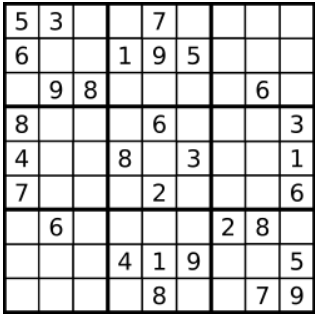
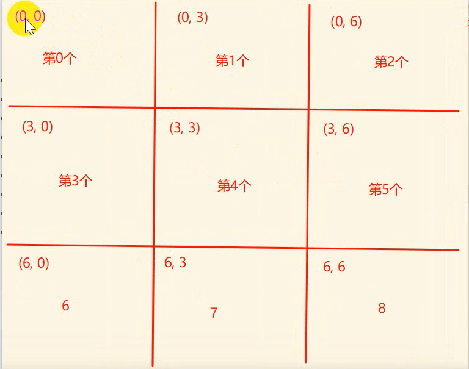

## 数组

## 删除排序数组中的重复项

给定一个排序数组，你需要在 原地 删除重复出现的元素，使得每个元素只出现一次，返回移除后数组的新长度。

不要使用额外的数组空间，你必须在 原地 修改输入数组 并在使用 O(1) 额外空间的条件下完成。 

示例 1:

```js
给定数组 nums = [1,1,2], 

函数应该返回新的长度 2, 并且原数组 nums 的前两个元素被修改为 1, 2。 

你不需要考虑数组中超出新长度后面的元素。
```


示例 2:

```js
给定 nums = [0,0,1,1,1,2,2,3,3,4],

函数应该返回新的长度 5, 并且原数组 nums 的前五个元素被修改为 0, 1, 2, 3, 4。

你不需要考虑数组中超出新长度后面的元素。
```

题目分析：这是一个排序数组，从小到大排序，不允许创建新数组，只能在原数组操作

**解答：**

```js
    var removeDuplicates = function (nums) {
        let i = 0;
        for(let j = 1;j<nums.length;j++){
            if(nums[i] != nums[j]){
                i++
                nums[i] = nums[j]              
            }      
        }
        nums.length = i+1
        return i+1
    };
```

**采用双指针法**：先设置一个指针`i=0`；数组从`j=1`开始，如果第`i`项目和第`j`项相等那就`j++`,i不变，如果相等则第`i++`项，等于`j`,当遍历完所有元素之后，再把length长度设为i+1，则达到去重效果。

## 旋转数组

给定一个数组，将数组中的元素向右移动 k 个位置，其中 k 是非负数。

示例 1:

```
输入: [1,2,3,4,5,6,7] 和 k = 3
输出: [5,6,7,1,2,3,4]
解释:
向右旋转 1 步: [7,1,2,3,4,5,6]
向右旋转 2 步: [6,7,1,2,3,4,5]
向右旋转 3 步: [5,6,7,1,2,3,4]
```


示例 2:

```
输入: [-1,-100,3,99] 和 k = 2
输出: [3,99,-1,-100]
解释: 
向右旋转 1 步: [99,-1,-100,3]
向右旋转 2 步: [3,99,-1,-100]
```

**解答1：**

```js
    var rotate = function (nums, k) {
        for (let i = 0; i < k; i++) {
            nums.splice(0,0,nums.pop())
            // nums.unshift(nums.pop())
            console.log(nums);
        }      
        return nums
    };
```

根据k来判断执行多少次for循环，每执行依次都先向数组末尾的数删除，然后加到数组前面。

## 存在重复元素

给定一个整数数组，判断是否存在重复元素。

如果任意一值在数组中出现至少两次，函数返回 true 。如果数组中每个元素都不相同，则返回 false 。 

示例 1:

```js
输入: [1,2,3,1]
输出: true
```


示例 2:

```js
输入: [1,2,3,4]
输出: false
```

**解答:**

```js
  var containsDuplicate = function(nums) {
        const s = new Set(nums)
        return s.size === nums.length?false:true
    };
```

使用ES6新增的数据结构set，它类似于数组，但是成员的值都是唯一的，没有重复的值。他可以接收数组且自动去重，所以用他来接收数组，再判断他的长度（`size`）和原数组的长度（`length`）比较，若相等则证明数组中没有重复值，返回`false`，反之返回`true`

## 只出现一次的数字

给定一个非空整数数组，除了某个元素只出现一次以外，其余每个元素均出现两次。找出那个只出现了一次的元素。

说明：

你的算法应该具有线性时间复杂度。 你可以不使用额外空间来实现吗？

示例 1:

```
输入: [2,2,1]
输出: 1
```


示例 2:

```
输入: [4,1,2,1,2]
输出: 4
```

解答：

```js
  var singleNumber = function(nums) {
        let temp = 0
      for(let item of nums){
        temp = temp ^item
      }
      return temp
    };
```

使用异或来计算，因为

* 所有数和0异或都等于本身 a⊕0 = a
* 两个相等的数异或等于0 a⊕a = 0
* 异或满足交换律 a⊕b⊕a = (a⊕a)⊕b = 0⊕b = b

## 两个数组的交集 II

给定两个数组，编写一个函数来计算它们的交集。

示例 1：

```
输入：nums1 = [1,2,2,1], nums2 = [2,2]
输出：[2,2]
```


示例 2:

```
输入：nums1 = [4,9,5], nums2 = [9,4,9,8,4]
输出：[4,9]
```

**说明：**

- **输出结果中每个元素出现的次数，应与元素在两个数组中出现次数的最小值一致。（重点注意）**
- 我们可以不考虑输出结果的顺序。

**解答1：**

```js
var intersect = function(nums1, nums2) {    
    nums1.sort((a,b)=>{return a-b})
    nums2.sort((a,b)=>{return a-b})
    let p1 =0
    let p2 =0
    let newArr = []
    while(p1<nums1.length&&p2<nums2.length){
        if(nums1[p1] == nums2[p2]){// 遇到相同的，推入res数组，两个指针同时移动考察下一个
            newArr.push(nums1[p1]);
            p1++;
            p2++;
        }else if(nums1[p1] < nums2[p2]){ //遇到不同，小的那个数指针加1。
            p1++
        }else{
            p2++
        }
    }
    return newArr

};
```

采用双指针法，先把数组按从小到大顺序排序，这样就能让相同的元素相邻，分别给两个数组都设置指针，设置循环两个数组都没有越界时就接着循环，遇到相同的，推入newArr数组，两个指针同时移动考察下一个，遇到不同，小的那个数指针加1。

## 加一

给定一个由整数组成的非空数组所表示的非负整数，在该数的基础上加一。

最高位数字存放在数组的首位， 数组中每个元素只存储单个数字。

你可以假设除了整数 0 之外，这个整数不会以零开头。

示例 1:

```
输入: [4,9,9]
输出: [5,0,0]
解释: 输入数组表示数字 500。
```


示例 2:

```
输入: [4,3,2,1]
输出: [4,3,2,2]
解释: 输入数组表示数字 4321。
```

示例 3：

```
输入: [9，9，9]
输出: [1,0,0,0]
解释: 输入数组表示数字 1000。
```

**三种情况分析：**

1.末位无进位，则末位加一即可，因为末位无进位，前面也不可能产生进位，比如 45 => 46
2.末位有进位，在中间位置进位停止，则需要找到进位的典型标志，即为当前位 %10后为 0，则前一位加 1，直到不为 0 为止，比如 499 => 500
3.末位有进位，并且一直进位到最前方导致结果多出一位，对于这种情况，需要在第 2 种情况遍历结束的基础上，进行单独处理，比如 999 => 1000

**解答：**

```js
var plusOne = function(digits) {
     for(let i=digits.length-1;i>=0;i--){
         digits[i]++; //最后一位数加1
         digits[i] = digits[i] % 10 // 确保最后一个元素是个位数
         if(digits[i]!=0){
             return digits
         }  
    }
    digits.unshift(1)
    return digits
};
```

对数组从后往前遍历，让最后一位数加1，再对10**求余**这样能保证该数字为个位数，进行判断该数字结果，若不为0，则返回数组结束循环。如果等于0则需要进位，那么它的前一位也要执行一遍这个流程直到不等于0，如果执行完了所有位数都等于0，则需要给数组头添加一个1。

## 移动零

给定一个数组 `nums`，编写一个函数将所有 `0` 移动到数组的末尾，同时保持非零元素的相对顺序。

**示例:**

```
输入: [0,1,0,3,12]
输出: [1,3,12,0,0]
```

**解答1：**

```js
    var moveZeroes = function (nums) {
        let j =0 // j是用来做下标的
        let i = 0 //定义两指针，i是用来循环用的
        while(i<nums.length){ // 遍历数组
            if(nums[j] == 0){ // 如果遍历到的数组等于0
                nums.splice(i,1) //则删除该位置数组，删除该位置数组后，元素原本的下一位就顶上来了所以j不用加1
                nums.push(0) //在末尾添加0，
            }else{
                j++ // 数组等于0则需要对 j++往后寻找
            }
            i++;
        }               
    };
```

## 两数之和

定义两个指针是为了避免错过某些元素，因为当删除元素时，删除元素的前一位会掉下来，所以下标`j`不需要加1

给定一个整数数组 nums 和一个目标值 target，请你在该数组中找出和为目标值的那 两个 整数，并返回他们的数组下标。

你可以假设每种输入只会对应一个答案。但是，数组中同一个元素不能使用两遍。

示例:

```
给定 nums = [2, 7, 11, 15], target = 9

因为 nums[0] + nums[1] = 2 + 7 = 9
所以返回 [0, 1]
```

**解答1：**暴力法

```js
  for(let i =0 ;i<nums.length;i++){
        let temp = target - nums[i]  
        if(nums.indexOf(temp,i+1)!=-1) { //indexOf第二个参数选择i+1，为了避免选到重复的数字
            return [i,nums.indexOf(temp,i+1)]
        }
    }
```

首先知道一个数组常用方法`数组.indexOf('要检测的数字'，从哪开始检测)`返回的是一个下标，如果每找到就返回-1。遍历每个元素并查找是否存在一个值与 target - x 相等的目标元素。

for...in...一个坑

```js
for(let i in arr) {
	console.log(i) //这是一个字符串
}
```

**解答2：**

```js
var twoSum = function(nums, target) {
    let obj = {} //将所有出现过的数字索引保存到对象上，key是值，value是下标
    for(let i =0;i<nums.length;i++){
        let curNum = nums[i]
        let temp  = target-curNum;
        //判断对象中是否有temp的索引值
        if(obj[temp] === undefined) {
            obj[curNum] = i //如果没有，就将数据存到对象中
        }else{
            //如果找到了就返回
            return [obj[temp],i]
        }
    }
};
```

## 买卖股票的最佳时机 II

给定一个数组，它的第 i 个元素是一支给定股票第 i 天的价格。

设计一个算法来计算你所能获取的最大利润。你可以尽可能地完成更多的交易（多次买卖一支股票）。

注意：你不能同时参与多笔交易（你必须在再次购买前出售掉之前的股票）。 

示例 1:

```js
输入: [7,1,5,3,6,4]
输出: 7
解释: 在第 2 天（股票价格 = 1）的时候买入，在第 3 天（股票价格 = 5）的时候卖出, 这笔交易所能获得利润 = 5-1 = 4 。
     随后，在第 4 天（股票价格 = 3）的时候买入，在第 5 天（股票价格 = 6）的时候卖出, 这笔交易所能获得利润 = 6-3 = 3 。
```


示例 2:

```
输入: [1,2,3,4,5]
输出: 4
解释: 在第 1 天（股票价格 = 1）的时候买入，在第 5 天 （股票价格 = 5）的时候卖出, 这笔交易所能获得利润 = 5-1 = 4 。
     注意你不能在第 1 天和第 2 天接连购买股票，之后再将它们卖出。
     因为这样属于同时参与了多笔交易，你必须在再次购买前出售掉之前的股票。
```


示例 3:

```
输入: [7,6,4,3,1]
输出: 0
```

解答1：

```js
var maxProfit = function(prices) {
    let total = 0
    for(let i =0;i<prices.length;i++) {
        if(prices[i]<prices[i+1]){ //只要第二天价格比第一个高就买
            total=total+prices[i+1] - prices[i]
        }
    }
    return total
};
```


## 链表

给出两个 非空 的链表用来表示两个非负的整数。其中，它们各自的位数是按照 逆序 的方式存储的，并且它们的每个节点只能存储 一位 数字。

如果，我们将这两个数相加起来，则会返回一个新的链表来表示它们的和。

您可以假设除了数字 0 之外，这两个数都不会以 0 开头。

示例：

```
输入：(2 -> 4 -> 3) + (5 -> 6 -> 4)
输出：7 -> 0 -> 8
原因：342 + 465 = 807
```

2+5 = 7 第一位是7

4+6 =10 所以进位取0 

3+4 = 7 因为上一位有进位所以取8

解答：

```js
/**
 * Definition for singly-linked list.
 * function ListNode(val) {
 *     this.val = val;
 *     this.next = null;
 * }
 */
/**
 * @param {ListNode} l1
 * @param {ListNode} l2
 * @return {ListNode}
 */
var addTwoNumbers = function(l1, l2) {
    let node = new ListNode('head') //创建一个头节点
    let lianbiao = node //创建一个链表
    let temp = 0 //用来标记是否需要进位
    while(l1||l2) { //只有当这两个链表都为空才停止循环
        let sum = (l1?l1.val:0) + (l2?l2.val:0)+temp // 相加  
        node.next = new ListNode(sum%10) //对10求余保证是个位数
        if(sum>=10){temp = 1}else{temp = 0} //判断是否需要进位
        node = node.next //前往下一个节点
        if(l1!=undefined) l1 = l1.next //前往下一个节点
        if(l2!=undefined) l2 = l2.next //前往下一个节点
    }
    if(temp == 1){node.next = new ListNode(1)} //循环最后一个还有进位的话，则添加一个节点让其val = 1
    return lianbiao.next //返回链表.next ,为什么不直接返回因为链表头是字符串head
};
```

## 有效的数独

判断一个 9x9 的数独是否有效。只需要根据以下规则，验证已经填入的数字是否有效即可。

**数字 1-9 在每一行只能出现一次。**
**数字 1-9 在每一列只能出现一次。**
**数字 1-9 在每一个以粗实线分隔的 3x3 宫内只能出现一次。**



示例 1:

```
输入:
[
  ["5","3",".",".","7",".",".",".","."],
  ["6",".",".","1","9","5",".",".","."],
  [".","9","8",".",".",".",".","6","."],
  ["8",".",".",".","6",".",".",".","3"],
  ["4",".",".","8",".","3",".",".","1"],
  ["7",".",".",".","2",".",".",".","6"],
  [".","6",".",".",".",".","2","8","."],
  [".",".",".","4","1","9",".",".","5"],
  [".",".",".",".","8",".",".","7","9"]
]
输出: true
```


示例 2:

```
输入:
[
  ["8","3",".",".","7",".",".",".","."],
  ["6",".",".","1","9","5",".",".","."],
  [".","9","8",".",".",".",".","6","."],
  ["8",".",".",".","6",".",".",".","3"],
  ["4",".",".","8",".","3",".",".","1"],
  ["7",".",".",".","2",".",".",".","6"],
  [".","6",".",".",".",".","2","8","."],
  [".",".",".","4","1","9",".",".","5"],
  [".",".",".",".","8",".",".","7","9"]
]
输出: false
```

一个有效的数独（部分已被填充）不一定是可解的。
只需要根据以上规则，验证已经填入的数字是否有效即可。
给定数独序列只包含数字 1-9 和字符 '.' 。
给定数独永远是 9x9 形式的。

**题目分析：**

可以分别对行，列，相邻的3x3的格子进行比较有没有重复的数字

```js
 var isValidSudoku = function (board) {       
        for (let i = 0; i < 9; i++) {
            let row = new Set()
            let columns = new Set()
            for (let j = 0; j < 9; j++) {
                //    判断行   
                if (board[i][j] != '.') {
                    if (row.has(board[i][j])) { //(0,0),(0,1),(0,2)...
                        return false
                    } else {
                        row.add(board[i][j])
                    }
                }
                //    判断列       
                if (board[j][i] != '.') {           
                    if (columns.has(board[j][i])) {//(0,0),(1,0),(2,0)...
                        return false
                    } else {
                        columns.add(board[j][i])
                    }
                }
            }
            // 判断块
            let x = (i / 3 >> 0) * 3
            let y = i % 3 * 3
            let flag = 0
            let block = new Set()
            for (let j = 0; j < 9; j++) {   
                if (board[x][y] != '.') {
                    if (block.has(board[x][y])) {
                        return false
                    } else {
                        block.add(board[x][y])
                    }
                }
                y++ //每次循环 y+1
                if (y % 3 == 0) { //每循环三次就要换行了
                    x++, y = i % 3 * 3 //x需要+1，y要恢复为起始位置
                }
            }
        }
        return true
    };
```

代码解读：

`>>`这个符号表示向下取整（去尾法）。

`set`是ES6新增的数据结构，和数组类型，但是不能存在重复的元素，该代码中用到了`Set.prototype.add(value)`和`Set.prototype.has(value)`

题目难点在于怎么获取相邻的3x3的块中的元素。可通过下图找出规律



可以得出他们起始坐标的规律。

`i`为第几个

`x = (i / 3 >> 0) * 3 `    `y = i % 3 * 3`

## 旋转图像

给定一个 n × n 的二维矩阵表示一个图像。

将图像顺时针旋转 90 度。

说明：

你必须在原地旋转图像，这意味着你需要直接修改输入的二维矩阵。**请不要使用另一个矩阵来旋转图像**。

示例 1:

```
给定 matrix = 
[
  [1,2,3],
  [4,5,6],
  [7,8,9]
],

原地旋转输入矩阵，使其变为:
[
  [7,4,1],
  [8,5,2],
  [9,6,3]
]
```

示例 2:

```
给定 matrix =
[
  [ 5, 1, 9,11],
  [ 2, 4, 8,10],
  [13, 3, 6, 7],
  [15,14,12,16]
], 

原地旋转输入矩阵，使其变为:
[
  [15,13, 2, 5],
  [14, 3, 4, 1],
  [12, 6, 8, 9],
  [16, 7,10,11]
]
```

这题重点就是找规律，首先将二维数组进行转置，再对每一行数组取反则得到结果。转置只的是坐标为(1,2)的元素和坐标为(2,1)的元素进行交换，依次类推。

```js
let matrix = 
[
  [1,2,3],
  [4,5,6],
  [7,8,9]
];
var rotate = function(matrix) {
    for(let i=0;i<matrix.length;i++){ //进行转置就
        for(let j = i;j<matrix.length;j++){
            if(i!=j){ //相等就没必要交换了
                let temp = matrix[i][j]
                matrix[i][j] =  matrix[j][i]
                matrix[j][i] = temp
            }      
        }
    }
    matrix.map(item=>{
        return item.reverse() //再进行取反
    })
    return matrix
};
console.log(rotate(matrix));
```

## 反转字符串

编写一个函数，其作用是将输入的字符串反转过来。输入字符串以字符数组 char[] 的形式给出。

不要给另外的数组分配额外的空间，你必须原地修改输入数组、使用 O(1) 的额外空间解决这一问题。

你可以假设数组中的所有字符都是 ASCII 码表中的可打印字符。

示例 1：

```
输入：["h","e","l","l","o"]
输出：["o","l","l","e","h"]
```


示例 2：

```
输入：["H","a","n","n","a","h"]
输出：["h","a","n","n","a","H"]
```

**题目分析：**这题可以采用双指针的方式进行解决。设置一个指针在数组头，一个指针在数组尾部。两个指针向中间靠拢。运动过程中将指针对应的元素进行交换。

```js
  let arr = ["H","a","n","a","h"]
    var reverseString = function (s) {
        let i=0
        let j= s.length-1
        while(i<j){
        [s[i], s[j]] = [s[j], s[i]] //采用了数组解构
            i++;
            j--          
        }
        return s
    };
   console.log( reverseString(arr));
```

该题解用到了ES6中的数组的解构对两个元素进行交换。

```js
let a = 1;
let b = 2;
let c = 3;
let [a, b, c] = [1, 2, 3]; //等同于上面的操作
```

```js
var a = 3;
var b = 5;
console.log(a+"-"+b); // 3-5
[a,b] = [b,a];
console.log(a+"-"+b); // 5-3
```

这是ES6数组解构快速实现值的交换。

## 整数翻转

给出一个 32 位的有符号整数，你需要将这个整数中每位上的数字进行反转。

示例 1:

```
输入: 123
输出: 321
```


 示例 2:

```
输入: -123
输出: -321
```


示例 3:

```
输入: 120
输出: 21
```

**注意:**

假设我们的环境只能存储得下 32 位的有符号整数，则其数值范围为[−2^31, 2^31 − 1]。请根据这个假设，如果反转后整数溢出那么就返回 0。

**题目分析**：这题可以先将整数转为字符串，再转为数组然后调用数组的`reverse`方法如果该整数小于0，则去掉数组的第一项再反转，之后再转回字符串，再转回数字，如果超出范围则返回0

```js
  var reverse = function (x) { 
        let arr = x.toString().split('') //将整数转为字符串后转为数组
        let num =0
        if (x < 0) { //如果带负号开头
            arr.shift() //去掉数组第一项
            arr.reverse() // 然后反转
            num= arr.join('') * -1 //最后隐式转换变回整数并把负号还回去
        }else {
            arr.reverse() //反之直接反转
            num= arr.join('') * 1 
        }
        if(num>=Math.pow(2,31)-1||num<=Math.pow(-2,31)){ //如果超出范围则返回0
            return 0
        }
        return num
    };
```

## 有效的字母异位词

给定两个字符串 s 和 t ，编写一个函数来判断 t 是否是 s 的字母异位词。

示例 1:

```
输入: s = "anagram", t = "nagaram"
输出: true
```


示例 2:

```
输入: s = "rat", t = "car"
输出: false
```

题目分析

方法1：可将字符串`s`和`t`转为数组，然后再将数组用`sort`进行排序，排序完后再转回字符串比较这两个字符串是否相等

```js
 var isAnagram = function (s, t) {
        s=s.split('')
        t=t.split('')
        if(s.length == t.length){
            s.sort()
            t.sort()
            s=s.join('')
            t=t.join('')
            if(s==t){
                return true
            }
        }
        return false
    };
```

方法2：定义一个对象`obj`用来存储出现的字符和字符串出现的字数，key对应字符串，value对应出现的次数。对字符串`s`和`t`遍历然后计数。

```js
 var isAnagram = function (s, t) {
        if(s.length!==t.length){return false}
        let obj={}
        for(let i=0;i<s.length;i++){
            if(!obj[s[i]]){ //obj中的key没有包含s遍历得到的字符
                obj[s[i]]=0 
            }
            obj[s[i]]++
            if(!obj[t[i]]){//obj中的key没有包含t遍历得到的字符
                obj[t[i]]=0
            }
                obj[t[i]]--
        }
        for(let i in obj){ // 遍历obj
            if(obj[i]!=0){return false}
        }
        return true
    };
```

## 字符串中的第一个唯一字符

给定一个字符串，找到它的第一个不重复的字符，并返回它的索引。如果不存在，则返回 -1。 

示例：

```
s = "leetcode"
返回 0

s = "loveleetcode"
返回 2
```

题目分析

创建一个对象`obj`，用来存储遍历字符串得到的字符和出现的次数，然后再遍历该字符串，当遇到第一个出现的次数为1的字符时，返回该字符在字符串中的位置。若没·找到返回`-1`

```js
    var firstUniqChar = function (s) {
        let obj = {}
        for (let i = 0; i < s.length; i++) {
            if (!obj[s[i]]) {
                obj[s[i]] = 1
            } else {
                obj[s[i]]++
            }
        }
        for (let i in obj) {
            if (obj[i] == 1) {
                return s.indexOf(i)
            }
        }
        return -1
    };
```

## 验证回文串

给定一个字符串，验证它是否是回文串，只考虑字母和数字字符，可以忽略字母的大小写。

说明：本题中，我们将空字符串定义为有效的回文串。

示例 1:

```
输入: "A man, a plan, a canal: Panama"
输出: true
```


示例 2:

```
输入: "race a car"
输出: false
```

题目分析：首先明确什么叫做回文串，回文串指的时，从头遍历和从尾遍历得到得结果是一样的。我们先将字符串全部转为小写，再用正则替换掉所有的特殊字符和空格，只保留字母和数字字符。设置两个指针，一个从头遍历，一个从尾遍历。

```js
    var isPalindrome = function(s) {  
    s=s.toLowerCase().replace(/[\W|_]/g,'') //转小写，再用正则替换特殊符号和空格
    let i=0
    let j =s.length-1
    while(i<j){ //循环遍历，当i<j时候结束遍历
        if(s[i]!=s[j]){
            return false
        }
        i++;
        j--
    }
    return true
    };
```

## 字符串转换整数 (atoi)

请你来实现一个 atoi 函数，使其能将字符串转换成整数。

首先，该函数会根据需要丢弃无用的开头空格字符，直到寻找到第一个非空格的字符为止。接下来的转化规则如下：

如果第一个非空字符为正或者负号时，则将该符号与之后面尽可能多的连续数字字符组合起来，形成一个有符号整数。
假如第一个非空字符是数字，则直接将其与之后连续的数字字符组合起来，形成一个整数。
该字符串在有效的整数部分之后也可能会存在多余的字符，那么这些字符可以被忽略，它们对函数不应该造成影响。
注意：假如该字符串中的第一个非空格字符不是一个有效整数字符、字符串为空或字符串仅包含空白字符时，则你的函数不需要进行转换，即无法进行有效转换。

在任何情况下，若函数不能进行有效的转换时，请返回 0 。

提示：

本题中的空白字符只包括空格字符 ' ' 。
假设我们的环境只能存储 32 位大小的有符号整数，那么其数值范围为 [−2^31,  2^31 − 1]。如果数值超过这个范围，请返回  INT_MAX (231 − 1) 或 INT_MIN (−231) 。


示例 1:

输入: "42"
输出: 42
示例 2:

```
输入: "   -42"
输出: -42
解释: 第一个非空白字符为 '-', 它是一个负号。
     我们尽可能将负号与后面所有连续出现的数字组合起来，最后得到 -42 。
```


示例 3:

```
输入: "4193 with words"
输出: 4193
解释: 转换截止于数字 '3' ，因为它的下一个字符不为数字。
```


示例 4:

```
输入: "words and 987"
输出: 0
解释: 第一个非空字符是 'w', 但它不是数字或正、负号。
     因此无法执行有效的转换。
```


示例 5:

```
输入: "-91283472332"
输出: -2147483648
解释: 数字 "-91283472332" 超过 32 位有符号整数范围。 
     因此返回 INT_MIN (−231) 。
```

题目分析：

官方的主要规则可以概况为：

- 无视开头空格
- 返回有符号整数
- 无视整数部分后的字符
- 范围在`32`位内（含）
- 其他情况返回`0`

和`parseInt()`这一API的转换规则一样，只要判断以下API的返回值如果是`NaN`，则返回`0`,再判断一下范围即可。

```js
    var myAtoi = function (s) {
       s=parseInt(s)
       if(isNaN(s)){return 0}
       if (s>= Math.pow(2, 31) - 1) {
            return (Math.pow(2, 31) - 1) 
        }
        if (s <= Math.pow(-2, 31)) {
            return (Math.pow(-2, 31)) 
        }
        return s
    };
```

## 外观数列

给定一个正整数 n ，输出外观数列的第 n 项。

「外观数列」是一个整数序列，从数字 1 开始，序列中的每一项都是对前一项的描述。

你可以将其视作是由递归公式定义的数字字符串序列：

`countAndSay(1) = "1"`
`countAndSay(n)` 是对` countAndSay(n-1) `的描述，然后转换成另一个数字字符串。
前五项如下：

```
1.     1
2.     11
3.     21
4.     1211
5.     111221
       第一项是数字 1 
       描述前一项，这个数是 1 即 “ 一 个 1 ”，记作 "11"
       描述前一项，这个数是 11 即 “ 二 个 1 ” ，记作 "21"
       描述前一项，这个数是 21 即 “ 一 个 2 + 一 个 1 ” ，记作 "1211"
       描述前一项，这个数是 1211 即 “ 一 个 1 + 一 个 2 + 二 个 1 ” ，记作 "111221"
       要 描述 一个数字字符串，首先要将字符串分割为 最小 数量的组，每个组都由连续的最多 相同字符 组成。然后对于每个组，先描述字		 符的数量，然后描述字符，形成一个描述组。要将描述转换为数字字符串，先将每组中的字符数量用数字替换，再将所有描述组连接起来。
```

示例 1：

```
输入：n = 1
输出："1"
解释：这是一个基本样例。
```


示例 2：

```
输入：n = 4
输出："1211"
解释：
countAndSay(1) = "1"
countAndSay(2) = 读 "1" = 一 个 1 = "11"
countAndSay(3) = 读 "11" = 二 个 1 = "21"
countAndSay(4) = 读 "21" = 一 个 2 + 一 个 1 = "12" + "11" = "1211"
```

通过replace + 正则来进行解答

首先熟悉以下正则

```js
// \d表示匹配数字,g表示全局匹配,
"1aa11aa111".replace(/\d/g,6) //6aa66aa666

//  \1表示匹配的是 所获取的第1个()匹配的引用,就是出现次数在一次以上就匹配
"1a11aa221".replace(/(\d)\1/g,6) //"1a6aa61"

// \1*就是表示\1可以出现0次或者更多次
"1a11aa221".replace(/(\d)\1*/g,6) //"6a6aa66"
```

然后熟悉一下`replace`，replace 这个方法可以接受两个参数，第一个可以接收一个正则，第二个可以接受一个函数，函数又可以接受参数，如下：

```js
 let str = "1a11a55a22221".replace(/(\d)\1*/g,item=>{
         console.log(item); //item是满足这个正则的字符串
         return 6
     })
 /*
 这是consloe.log输出的
 1
11
55
2222
1
 */
```

所以就可以引出下面解答的代码了

```js
var countAndSay = function(n) {
    let str = '1'
    for(let i =1;i<n;i++){
        str = str.replace(/(\d)\1*/g,item=>{
            return `${item.length}${item[0]}`
        })
    }
    return str
};
```

