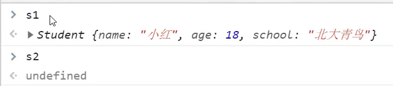
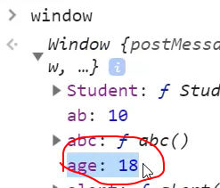
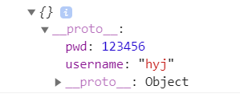
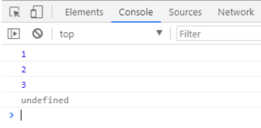

## 1 ES5中的严格模式

### 1.1概念

**理解**：除了正常运行模式(混杂模式)，ES5添加了第二种运行模式："严格模式"（strict mode）。

顾名思义，这种模式使得Javascript在更严格的语法条件下运行。

**目的**：

- 消除Javascript语法的一些不合理、不严谨之处，减少一些怪异行为
- 消除代码运行的一些不安全之处，为代码的安全运行保驾护航
- 为未来新版本的Javascript做好铺垫

### 1.2使用

- 针对整个脚本文件：将`use strict`放在脚本文件的第一行，则整个脚本文件将以严格模式运行。
- 针对单个函数：将`use strict`放在函数体的第一行，则整个函数以严格模式运行。

### 1.3语法和行为改变

- 必须用var声明变量
- 禁止自定义的函数中的this指向window
- 对象不能有重名的属性

### 1.4 严格模式和普通模式的区别

> 下面列举几条严格模式的内容。

**全局变量显式声明**

在正常模式中，如果一个变量没有声明就赋值，默认是全局变量。严格模式禁止这种用法，全局变量必须显式声明。

**禁止this关键字指向全局对象**

```js
var foo = function () {
	console.log(this);
	}
foo();
```

上面代码`this`在严格模式下指向undefined，非严格模式下指向window

**构造函数必须通过new实例化对象**

构造函数必须通过new实例化对象，否则报错。因为this为undefined，此时无法设置属性。

比如说：

```js
var Cat = function (name) {
            this.name = name;
        }
        Cat('haha');
```

上方代码中，如果在严格模式下，则会报错。

```
function Student(){
	this.name="小红";
	this.age=18;
	this.scool = "北大"
}
var s1 = new Student()
var s2 = Student
```

在普通模式下不会报错，但是s2为undefined。因为s2执行函数没有返回值导致了引入了三个全局变量，在非严格模式下函数中的`this`指向window，所以引入了三个全局变量。





在严格模式下则会报错，因为在严格模式下`this`指向undefined，所以会报错

**属性相关**

普通模式下，如果对象有多个重名属性，最后赋值的那个属性会覆盖前面的值。严格模式下，这属于语法错误。

比如下面这样的代码：

```js
var obj = {
		username: 'smyh';
		username: 'vae'
	}
```

普通模式下，如果函数有多个重名的参数，可以用arguments[i]读取。严格模式下，多个重名的参数属于语法错误。

比如下面这样的代码：

```js
    	 function fn(name,name){
            console.log(arguments[0]);
            console.log(arguments[1]);
        }
        fn('张三','王五')
```

严格模式下报错：<font color='red'>Duplicate parameter name not allowed in this context</font>（此上下文中不允许有重复的参数名）

**函数必须声明在顶层**

将来Javascript的新版本会引入"块级作用域"。为了与新版本接轨，严格模式只允许在全局作用域或函数作用域的顶层声明函数。也就是说，不允许在非函数的代码块内声明函数。

**新增关键字**

为了向将来Javascript的新版本过渡，严格模式新增了一些保留字：implements, interface, let, package, private, protected, public, static, yield。

## 2 Object的扩展 （一）

ES5给Object扩展了一些静态方法，常用的有2个，我们接下来讲解。

### 2.1 方法一Object.create

```
	Object.create(prototype, [descriptors])
```

作用: 以指定对象为原型，创建新的对象。同时，第二个参数可以为为新的对象添加新的属性，并对此属性进行描述。

**举例1**：（没有第二个参数时）

```js
 const a = {
        username:"hyj",
        pwd:123456
    }
    // 不传第二个参数
    let b= Object.create(a)
    // b的原型就是a
    console.log(a)
```



我们发现，a成为了b的原型。

**举例2**：（有第二个参数时）

```js
  let c = Object.create(a,{
        mobile:{
            value:13877971022,
            writable:false, //是否可写，就是能不能修改的意思
            configurable:true, //是否能被删除
            enumerable:true, //对象属性的可枚举性
        }
    })
```

上方代码中，我们给c设置了一个新的属性`mobile`，但是要通过`value`来设置属性值。

设置完属性值后，这个属性值默认是不可修改的，要通过`writable`来设置。总而言之，这几个关键字的解释如下：

- `value`：设置属性值。
- `writable`：标识当前属性值是否可修改。如果不写的话，默认为false，不可修改。
- `configurable`：标识当前属性是否可以被删除。默认为false，不可删除。
- `enumerable`：标识当前属性是否能用 for in 枚举。 默认为false，不可。

如果`enumerable`为false下面四个操作不会取到该属性。

* for..in循环 ：只遍历对象自身的和继承的可枚举的属性

* Object.keys方法 ：返回对象自身的所有可枚举的属性的键名

* JSON.stringify方法：只串行化对象自身的可枚举的属性

* Object.assign()(ES6）:只拷贝对象自身的可枚举的属性

<a href="https://developer.mozilla.org/zh-CN/docs/Web/JavaScript/Reference/Global_Objects/Object/assign">Object.assign()(ES6)</a>

### 2.2 方法二 Object.defineProperty

**单独设置属性**

```js
Object.defineProperty(c, 'mobile', {
        value: '110',
        writable: true,
        configurable: true,
        enumerable: true,
      });
```

就是可以修改单独c中的mobile属性

### 2.3方法三 Object.defineProperties

> 这个方法有点难理解。

```js
	Object.defineProperties(object, descriptors)
```

```js
let user = {
        firstname:"何",
        lastname:"二",        
    }
        Object.defineProperties(user,{
        fullname:{
            // 获取属性值时候调用的函数
            get:function(){
                return this.firstname+'-'+this.lastname
            },
            // 设置属性值时候调用的函数
            set:function(data){ //监听扩展属性，当扩展属性发生变化的时候自动调用，自动调用后将变化的值作为实参注入到set函数
                console.log("赋值的时候调用");
               let arr = data.split("-")
               console.log(arr);
               this.firstname=arr[0];
               this.lastname=arr[1]
            },
         
        },
        say:{
                get:function(){
                    return '我叫'+this.firstname+this.lastname
                }
            }
    })
```

- get ：用来获取当前属性值的回调函数
- set ：修改当前属性值得触发的回调函数，并且实参即为修改后的值

## 3.Object的扩展（二）

obj对象本身就自带了两个方法。格式如下：

```js
get 属性名(){} 用来得到当前属性值的回调函数

set 属性名(){} 用来监视当前属性值变化的回调函数
```

举例如下：

```js
   let teach = {
        firstname:"蔡",
        lastname:"徐坤",
        get fullname(){
            return this.firstname+this.lastname
        },
        set fullname(data){
            let arr = data.split("-")
            console.log(arr);
            this.firstname=arr[0];
            this.lastname=arr[1]
        },
        get brief(){
            return '我叫'+this.firstname+this.lastname
        }
    }
```

## 4.函数function的扩展：bind() call() apply()

> ES5中新增了`bind()`函数来改变this的指向。

```
	Function.prototype.bind(obj)
```

作用：将函数内的this绑定为obj, 并将函数返回。

```js
function fn(num1,num2){
	console.log(555)
}
var o ={
	name:"hyj"
}
fn.call(o,1,2) //调用函数并改变this指向，让其指向o,将1，2作为参数传过去
fn.bind(o,1,2) //改变this指向，不会立即调用当前函数
fn.apply(o,[1,2]) // 调用函数并改变this指向，apply能接收两个参数，调用的函数需要多个参数时用数组的方式
```

**面试题**: call()、apply()和bind()的区别：

- 都能改变this的指向
- call()/apply()是**立即调用函数**，区别在于接受参数的方式不同
- bind()：绑定完this后，不会立即调用当前函数，而是**将函数返回**，因此后面还需要再加`()`才能调用。

PS：bind()传参的方式和call()一样。

**分析**：

为什么ES5中要加入bind()方法来改变this的指向呢？因为bind()不会立即调用当前函数。

bind()通常使用在回调函数中，因为回调函数并不会立即调用。如果你希望在回调函数中改变this，不妨使用bind()。

## 5.ES6 的变量声明

ES6 中新增了 let 和 const 来定义变量：

- `let`：定义**局部变量**，替代 var。
- `const`：定义**常量**（定义后，不可修改）。
- `	var`：ES5 和 ES6中，定义**全局变量**（是variable的简写）。

### 5.1 var：全局变量

看下面的代码：

```js
	{
	    var a = 1;
	}

	console.log(a);   //这里的 a，指的是 区块 里的 a
```

上方代码是可以输出结果的，输出结果为 1。因为 var 是全局声明的，所以，即使是在区块里声明，但仍然在全局起作用。

再来看下面这段代码：

```js
	var a = 1;
	{
	    var a = 2;
	}

	console.log(a);   //这里的 a，指的是 区块 里的 a
```

上方代码的输出结果为 2 ，因为 var 是全局声明的。

**总结：**

用 var 定义的全部变量，有时候会污染整个 js 的作用域。

### 5.2 let：定义局部变量

```js
	var a = 2;
	{
	    let a = 3;
	}

	console.log(a);
```

上方代码的输出结果为 2。用 let 声明的变量，只在局部（**块级作用域内**）起作用。

let是防止数据污染，我们来看下面这个 **for 循环**的例子，很经典。

1、用 var 声明变量：（）

```js
for (var i = 0; i < 10; i++) {
    console.log('循环体中:' + i); // 每循环一次，就会在 { } 所在的块级作用域中，重新定义一个新的 i
}

console.log('循环体外:' + i);
```

上方代码可以正常打印结果，且最后一行的打印结果是10。说明循环体外定义的变量 i，是在全局起作用的。

2、用let声明变量：

```js
for (let i = 0; i < 10; i++) {
    console.log('循环体中:' + i);
}

console.log('循环体外:' + i);
```

上方代码的最后一行无法打印结果，也就是说打印会报错。因为用 let 定义的变量 i，只在`{ }`这个**块级作用域**里生效。

我们要习惯用 let 声明，减少var声明带来的污染全局空间。**

为了进一步说明 let 不会带来污染，需要说明的是：当我们定义了`let a = 1`时，如果我们在同一个作用域内继续定义`let a = 2`，是会报错的。

**总结：**

- **let关键字不存在变量提升,所以下面代码会报错**

```js
console.log(a); //a is not defind
let a = 20;
```

- **暂时性锁区**

使用let关键字声明的变量，会被整体绑定在这个块级区域，不受外部代码影响

看下面代码：

```js
var tmp = 123;
if(true) {
	console.log(tmp); //会报错，tmp没有被定义，因为暂时性锁区他不会向上一层查找tmp
	let tmp = 20;
}
```

```js
var num = 123;
if(true) {
	console.log(num); // 输出123，这样不会对num形成暂时性锁区
	let tmp = 20;
}
```

### 5.3 const：定义常量

在程序开发中，有些变量是希望声明后，在业务层就不再发生变化，此时可以用 const 来定义。

举例：

```js
const name = 'smyhvae';  //定义常量
```

用 const 声明的变量，只在局部（块级作用域内）起作用。

重点：

- **const声明常量必须赋值**
- **const并不是真正意思上的不能修改，常量指的是（内存地址）不能变化的量**
- **对于复杂数据结构(数组，对象)来讲，不能重新赋值，但是可以更改数据结构内部的值**

```js
const arr = ['a','b'];
arr[0] = 1;
arr[1] = 2;
console.log(arr) //[1,2]
```

### 5.4 let 和 const 的作用【重要】

let 和 const 的作用如下：

- 禁止重复声明
- 支持块级作用域
- 控制修改

相反， 用`var`声明的变量：可以重复声明、**没有块级作用域**、不能限制。

### 5.5for循环举例【经典案例】

**假设定义了10个按钮，希望点哪个就输出哪个的索引值**

```js
var myBtn = document.querySelectorAll('button')
for(var i = 0;i<btns.length;i++){
     myBtn[i].addEventListener('click',function(){
         console.log(i)
     })
}
```

以上代码会出现一个问题，无论按哪个按钮都只会输出11，这是因为我们用 var 定义的变量 i，是在全局作用域声明的。整个代码中，自始至终只有一个变量。因为点击事件是一个异步任务，当我们还没点击按钮之前，变量 i 已经循环到11了。

也就是说，上面的 for 循环，相当于如下代码：

```js
var i = 0;
	myBtn[0].onclick = function() {
	alert(i);
	};
	i++;

	myBtn[1].onclick = function() {
	alert(i);
	};
	i++;

	myBtn[2].onclick = function() {
	alert(i);
	};
	i++;
	。。。。。。//一直到达11
```

面对这种问题我们有两种方法：

**1.采用闭包解决**

闭包方式1：

```js
 var btns = document.querySelectorAll('button')
  for(var i =0;i<btns.length;i++){
   btns[i].addEventListener('click',(function(index){
           return function(){
               console.log(index);
           }      
        })(i)           
        )
  }
```

因为里面的函数引用了外部的index变量，使得index调用完之后不会被立即销毁掉

闭包方式2：

```js
    var btns = document.querySelectorAll('button')
    for(var i =0;i<btns.length;i++){
        (function(i){
            btns[i].addEventListener('click',()=>{
                console.log(i);
            })
        })(i)
    }
```

利用for循环创建10个立即执行函数

**2.采用let关键字来解决**

```js
var myBtn = document.querySelectorAll('button')
for(let i = 0;i<btns.length;i++){
     myBtn[i].addEventListener('click',function(){
         console.log(i)
     })
}
```

我们用 let 定义变量 i，在循环的过程中，每执行一次循环体，就会诞生一个新的 i

## 6 变量的解构赋值

ES6允许我们，通过数组或者对象的方式，对一组变量进行赋值，这被称为解构。

解构赋值在实际开发中可以大量减少我们的代码量，并且让程序结构更清晰。

### 6.1 数组的解构赋值

**举例：**

通常情况下，我们在为一组变量赋值时，一般是这样写：

```
	let a = 0;
	let b = 1;
	let c = 2;
```

现在我们可以通过数组解构的方式进行赋值：

```
	let [a, b, c] = [1, 2, 3];
```

二者的效果是一样的。

**解构的默认值：**

在解构赋值时，是允许使用默认值的。举例如下：

```js
{
    //一个变量时
    let [foo = true] = [];
    console.log(foo); //输出结果：true
}

{
    //两个变量时
    let [a, b] = ['生命壹号']   //a 赋值为：生命壹号。b没有赋值
    console.log(a + ',' + b); //输出结果：生命壹号,undefined
}


{
    //两个变量时
    let [a, b = 'smyhvae'] = ['生命壹号']   //a 赋值为：生命壹号。b 采用默认值 smyhvae
    console.log(a + ',' + b); //输出结果：生命壹号,smyhvae
}
```

`undefined`和`null`的区别：

如果我们在赋值时，采用的是 `undefined`或者`null`，那会有什么区别呢？

```js
{
    let [a, b = 'smyhvae'] = ['生命壹号', undefined]; //b 虽然被赋值为 undefined，但是 b 会采用默认值
    console.log(a + ',' + b); //输出结果：生命壹号,smyhvae
}

{
    let [a, b = 'smyhvae'] = ['生命壹号', null];  //b 被赋值为 null
    console.log(a + ',' + b); //输出结果：生命壹号,null
}
```

上方代码分析：

- undefined：相当于什么都没有，此时 b 采用默认值。
- null：相当于有值，但值为 null。

### 6.2 对象的解构赋值

通常情况下，我们从接口拿到json数据后，一般这么赋值：

```js
 let user = {
        name:"蔡徐坤",
        like:"ball",
        age:18
        
    }
    // let里面的名字要和属性名一致
    let{name,like,age} = user
```

上方代码可以看出，对象的解构与数组的结构，有一个重要的区别：**数组**的元素是按次序排列的，变量的取值由它的**位置**决定；而**对象的属性没有次序**，是**根据键来取值**的。

**圆括号的使用**：

如果变量 foo 在解构之前就已经定义了，此时你再去解构，就会出现问题。下面是错误的代码，编译会报错：

```js
	let foo = 'haha';
	{ foo } = { foo: 'smyhvae' };
	console.log(foo);
```

要解决报错，只要在解构的语句外边，加一个圆括号即可：

```js
	let foo = 'haha';
	({ foo } = { foo: 'smyhvae' });
	console.log(foo); //输出结果：smyhvae
```

### 6.3 字符串解构

字符串也可以解构，这是因为，此时字符串被转换成了一个类似数组的对象。举例如下：

```js
const [a, b, c, d] = 'smyhvae';
console.log(a); //s
console.log(b); //m
console.log(c); //y
console.log(d); //h
```

## 7 模板字符串

我们以前让字符串进行拼接的时候，是这样做的：（传统写法的字符串拼接）

```
    var name = 'smyhvae';
    var age = '26';
    console.log('name:'+name+',age:'+age);   //传统写法
```

这种写法，比较繁琐，而且容易出错。

现在有了 ES6 语法，字符串拼接可以这样写：

```
    var name = 'smyhvae';
    var age = '26';

    console.log('name:'+name+',age:'+age);   //传统写法

    console.log(`name:${name},age:${age}`);  //ES6 写法
```

**注意**: 字符串模板不仅可以插加减乘除，还可以插函数调用。

```js
  function fn (){
        return 666
    }
  console.log(`今天真是：${fn()}`); //今天真是：666
```

## 8 ES6 函数扩展

ES6在**函数扩展**方面，新增了很多特性。例如：

- 箭头函数
- 参数默认值
- 参数结构赋值
- 扩展运算符
- rest参数
- this绑定
- 尾调用

### 8.1 箭头函数

定义和调用函数：（箭头函数的写法）

```js
	var fn2 = (a, b) => a + b;

	console.log(fn2(1, 2));  //输出结果：3
```

写法规范：

1. 当箭头函数的参数只有一个时，（）小括号可以省略。
2. 函数体中只有一句代码，且代码的执行结果就是返回值，可以省略花括号{}和return

**this的指向**

> 箭头函数只是为了让函数写起来更优雅吗？当然不是，还有一个很大的作用是与this的指向有关。

ES5 中，this指向的是函数被调用的对象；而 ES6 的箭头函数中，this指向的是函数被定义时。

简单来说，箭头函数中的this，是不会变的，是永远绑定在当前的环境下。

```js
 let div = document.querySelector('#d1')
    div.addEventListener('click',function(){
         setTimeout(function(){
            consloe.log(this) //window
         },1000)
       
    })
```

```js
let div = document.querySelector('#d1')
    div.addEventListener('click',function(){
        setTimeout(()=>{
            console.log(this); //指向div
        },1000)
    })
```

**箭头函数的this指向和它上一层的this指向一样，因为箭头函数不绑定this，没有this关键字**

**如果在箭头函数中使用this，this指向箭头函数定义位置中的this**

### 8.2参数默认值

**ES6 写法**：（参数默认值的写法，很简洁）

```js
    function fn(param = 'hello') {
        console.log(param);
    }
```

在 ES6 中定义方法时，我们可以给方法里的参数加一个**默认值**（缺省值）：

- 方法被调用时，如果没有给参数赋值，那就是用默认值；
- 方法被调用时，如果给参数赋值了新的值，那就用新的值。

如下：

```js
	var fn2 = (a, b = 5) => {
	    console.log('haha');
	    return a + b;
	};
	console.log(fn2(1));     //第二个参数使用默认值 5。输出结果：6

	console.log(fn2(1, 8));  //输出结果：9
```


### 8.3 扩展运算符

注意区分：

- 扩展运算符的格式为`...`
- rest运算符的格式为`...变量名`

有了ES6，当我们在定义一个方法，但是不确定其参数的个数时，我们就可以用**扩展运算符**作为参数。

```js
function fn(...arg) {   //当不确定方法的参数时，可以使用扩展运算符
    console.log(arg[0]);
    console.log(arg[1]);
    console.log(arg[2]);
    console.log(arg[3]);
}

fn(1, 2, 3); //方法中定义了四个参数，但只引用了三个参数，ES6 中并不会报错。
```



上方代码中注意，arg参数之后，不能再加别的参数，否则编译报错。

**使用扩展运算符来复制数组**

```js
 var arr1 = [1,2,3,4,5]
    // 使用扩展运算符来复制数组
    var arr2 =[...arr1]
    console.log(arr2);
    console.log(arr2==arr1);//false 值一样但内存地址不一样
```

如果使用下面这种方式复制数组，会导致 arr2 指向 arr1 的内存地址,当修改arr2中的值也会影响到arr1

```js
var arr1 = [1,2,3,4,5]
var	arr2 = arr1
```

**在函数调用时使用扩展运算符**

```js
    var arr1 = [1,2,3,4,5]
    function getnum(a,b,c,d,e){
        console.log(a);
        console.log(b);
        console.log(c);
        console.log(d);
        console.log(e);
    }
    getnum(...arr1) //函数调用的时候使用
```

**`rest` 运算符**

`rest` 在英文中指的是**剩余部分**

也叫剩余参数，在函数声明时使用

```js
 function fn(a,b,...args){
        console.log(a);
        console.log(b);
        console.log(args); // [3,4,5,6]
    }
    fn(1,2,3,4,5,6)
```

调用`fn()`时，里面有六个参数，而`arg`指的是剩下的部分

从上方例子中可以看出，`rest`运算符适用于：知道前面的一部分参数的数量，但对于后面剩余的参数数量未知的情况。

## 9 promise

Promise是异步编程的一种解决方案

### 9.1promise的三种状态

（1）对象的状态不受外界影响。`Promise`对象代表一个异步操作，有三种状态：`pending`（进行中）、`fulfilled`（已成功）和`rejected`（已失败）。只有异步操作的结果，可以决定当前是哪一种状态，任何其他操作都无法改变这个状态。

（2）一旦状态改变，就不会再变，任何时候都可以得到这个结果

### 9.2基本用法

下面代码创造了一个`Promise`实例。

```js
const promise = new Promise(function(resolve, reject) {
  // ... some code

  if (/* 异步操作成功 */){
    resolve(value);
  } else {
    reject(error);
  }
});
```

`Promise`接受一个函数作为参数，该函数的两个参数分别是`resolve`和`reject`

`resolve`函数的作用是在异步操作**成功**时调用(即从` pending `变为 `resolved`），并将异步操作的结果，作为参数传递出去

`reject`函数的作用是在异步操作**失败**时调用(即从`pending`变为`rejected`)，并将异步操作报出的错误，作为参数传递出去。

`Promise`实例生成以后，可以用`then`方法分别指定`resolved`状态和`rejected`状态的回调函数。如下所示：

```javascript
promise.then(function(res) {
  // success
}, function(error) {
  // failure
});
```

`then`方法可以接受两个回调函数作为参数。第一个回调函数是`Promise`对象的状态变为`resolved`时调用，第二个回调函数是`Promise`对象的状态变为`rejected`时调用。其中，第二个函数是可选的，不一定要提供

**下面是一个用函数封装`Promise`对象的简单例子。**

```javascript
 function timeout() {
  return new Promise((resolve, reject) => {
    setTimeout(resolve('回调成功'), 500);
  });
}
timeout().then((res) => {
  console.log(res);
});
```

**Promise 新建后就会立即执行。**

```javascript
let promise = new Promise(function(resolve, reject) {
  console.log('Promise');
  resolve();
});
promise.then(function() {
  console.log('resolved.');
});
console.log('Hi!');
// Promise
// Hi!
// resolved
```

**Promise 新建后立即执行，所以首先输出的是`Promise`。然后，`then`方法指定的回调函数，将在当前脚本所有同步任务执行完才会执行，所以`resolved`最后输出。**

### 9.3resolve函数是一个promise对象

`resolve`函数的参数除了正常的值以外，还可能是另一个 Promise 实例，比如像下面这样。

```js
const p1 = new Promise(function (resolve, reject) {
  // ...
});
const p2 = new Promise(function (resolve, reject) {
  // ...
  resolve(p1);
})
```

`p2`的`resolve`方法将`p1`作为参数，即一个异步操作的结果是返回另一个异步操作。

**注意，这时`p1`的状态就会传递给`p2`，也就是说，`p1`的状态决定了`p2`的状态**

如果`p1`的状态是`pending`，那么`p2`的回调函数就会等待`p1`的状态改变；如果`p1`的状态已经是`resolved`或者`rejected`，那么`p2`的回调函数将会立刻执行。

```javascript
const p1 = new Promise(function (resolve, reject) {
  setTimeout(() => reject(new Error('fail')), 3000)
})
const p2 = new Promise(function (resolve, reject) {
  setTimeout(() => resolve(p1), 1000)
})
p2
  .then(result => console.log(result))
  .catch(error => console.log(error))
// Error: fail
```

在上面代码中由于`p2`resolve方法返回的是`p1`所以`p2`自己的状态无效了，由`p1`的状态决定`p2`的状态。`p1`的状态是reject所以触发的是catch方法

一般来说，调用`resolve`或`reject`以后，Promise 的使命就完成了，后继操作应该放到`then`方法里面，而不应该直接写在`resolve`或`reject`的后面。所以，最好在它们前面加上`return`语句，这样就不会有意外。

```
new Promise((resolve, reject) => {
  return resolve(1);
  // 后面的语句不会执行
  console.log(2);
})
```

### 9.4 promise的链式调用

`then`方法返回的是一个新的`Promise`对象（注意，不是原来那个`Promise`对象）。因此可以采用链式写法，即`then`方法后面再调用另一个`then`方法。

```js
 new Promise((resolve,reject)=>{
       setTimeout(()=>{
        resolve('aaa')
       },1000)
    }).then(res=>{
        console.log(res);
        return new Promise(resolve=>{
            resolve(res+"111")
        })
    }).then(res=>{
        console.log(res);
        return new Promise(resolve=>{
            resolve(res+"222")
        })
    }).then(res=>{
        console.log(res);
    })
```

上面的代码第一个回调函数完成后，把返回的结果拼接上111(也就是aaa)作为参数，传入第二个回调函数，第二个回调函数完成后，把返回的结果拼接上222作为参数传给第三个回调函数.

上一个代码的简写：

```js
 new Promise((resolve,reject)=>{
       setTimeout(()=>{
        resolve('aaa')
       },1000)
    }).then(res=>{
        console.log(res);
        return Promise.resolve(res+'111')
            
    }).then(res=>{
        console.log(res);
      return Promise.resolve(res+'222')
    }).then(res=>{
        console.log(res);
    })
```


### 9.5 Promise.prototype.catch()

`Promise.prototype.catch()`方法用于指定发生错误时的回调函数。

```javascript
getJSON('/posts.json').then(function(posts) {
  // ...
}).catch(function(error) {
  // 处理 getJSON 和 前一个回调函数运行时发生的错误
  console.log('发生错误！', error);
});
```

`getJSON()`方法返回一个 Promise 对象，如果该对象状态变为`resolved`，则会调用`then()`方法指定的回调函数；如果异步操作抛出错误，状态就会变为`rejected`，就会调用`catch()`方法指定的回调函数

**除了可以用reject抛出错误如下：**

```js
const promise = new Promise(function(resolve, reject) {
  reject(new Error('test'));
});
promise.catch(function(error) {
  console.log(error);
});
```

**也可以用throw抛出错误如下：**

```js
const promise = new Promise(function(resolve, reject) {
  throw new Error('test');
});
promise.catch(function(error) {
  console.log(error);
});
// Error: test
```

**Promise 对象的错误具有“冒泡”性质，会一直向后传递，直到被捕获为止。也就是说，错误总是会被下一个`catch`语句捕获。**

```javascript
getJSON('/post/1.json').then(function(post) {
  return getJSON(post.commentURL);
}).then(function(comments) {
  // some code
}).catch(function(error) {
  // 处理前面三个Promise产生的错误
});
```

上面代码中，一共有三个 Promise 对象：一个由`getJSON()`产生，两个由`then()`产生。它们之中任何一个抛出的错误，都会被最后一个`catch()`捕获。

一般来说，不要在`then()`方法里面定义 Reject 状态的回调函数（即`then`的第二个参数），总是使用`catch`方法。

```javascript
// 这种写法不好
promise
  .then(function(data) {
    // success
  }, function(err) {
    // error
  });
// 这种写法好
promise
  .then(function(data) { //cb
    // success
  })
  .catch(function(err) {
    // error
  });
```

第二种写法可以捕获前面`then`方法执行中的错误，因此，建议总是使用`catch()`方法，而不使用`then()`方法的第二个参数。

**Promise 内部的错误不会影响到 Promise 外部的代码，通俗的说法就是“Promise 会吃掉错误”**

```javascript
const someAsyncThing = function() {
  return new Promise(function(resolve, reject) {
    // 下面一行会报错，因为x没有声明
    resolve(x + 2);
  });
};

someAsyncThing().then(function() {
  console.log('everything is great');
});

setTimeout(() => { console.log(123) }, 2000);
// Uncaught (in promise) ReferenceError: x is not defined
// 123
```

上面代码会打印出错误提示`ReferenceError: x is not defined`，但是不会退出进程、终止脚本执行，2 秒之后还是会输出`123`

### 9.6 Promise.prototype.finally()

`finally()`方法用于指定不管 Promise 对象最后状态如何，都会执行的操作

```javascript
promise
.then(result => {···})
.catch(error => {···})
.finally(() => {···});
```

上面代码中，不管`promise`最后的状态，在执行完`then`或`catch`指定的回调函数以后，都会执行`finally`方法指定的回调函数。

### 9.7 Promise.all()

`Promise.all()`方法用于将多个 Promise 实例，包装成一个新的 Promise 实例。

```javascript
const p = Promise.all([p1, p2, p3]);
p.then(results=>{
    results[0]
    results[1]
    results[3]
})
```

`Promise.all()`方法接受一个数组作为参数，`p1`、`p2`、`p3`都是 Promise 实例

`results`是一个数组，`results[0]`存放的是`p1`返回的结果，`results[2]`存放的是`p2`返回的结果，`results[3]`存放的是`p3`返回的结果

`p`的状态由`p1`、`p2`、`p3`决定，分成两种情况。

（1）只有`p1`、`p2`、`p3`的状态都变成`fulfilled`，`p`的状态才会变成`fulfilled`，此时`p1`、`p2`、`p3`的返回值组成一个数组，传递给`p`的回调函数。

（2）只要`p1`、`p2`、`p3`之中有一个被`rejected`，`p`的状态就变成`rejected`，此时第一个被`reject`的实例的返回值，会传递给`p`的回调函数。

### 9.8 Promise.race()

`Promise.race()`方法同样是将多个 Promise 实例，包装成一个新的 Promise 实例。

```javascript
const p = Promise.race([p1, p2, p3]);
 p.then(res=>{
        console.log(res);
})
```

**有多个异步操作，只有一个返回结果就立即执行**,`p1`、`p2`、`p3`之中有一个实例率先改变状态，`p`的状态就跟着改变。那个率先改变的 Promise 实例的返回值，就传递给`p`的回调函数。

## 10 async 函数

### 10.1基本用法

`async`函数返回一个 Promise 对象，可以使用`then`方法添加回调函数。当函数执行的时候，一旦遇到`await`就会先返回，等到异步操作完成，再接着执行函数体内后面的语句。

```javascript
function timeout(ms) {
  return new Promise((resolve) => {
    setTimeout(resolve, ms);
  });
}

async function asyncPrint(value, ms) {
  await timeout(ms);
  console.log(value);
}

asyncPrint('hello world', 50);
```

上面代码指定 50 毫秒以后，输出`hello world`

## 11 Class 的基本语法

```js
class Star{
        constructor(uname){
            // this指向你创建的实例（ldh）
            this.uname = uname
        }
    }
    var ldh = new Star('刘德华')
```

上面代码定义了一个“类”，可以看到里面有一个`constructor`方法，这就是构造方法，而`this`关键字则代表实例对象。 ` this`指向你创建的实例这里指向的是**ldh**

<font color=red>注意： 类必须使用 new 实例化对象</font>

**constructor 方法**

`constructor`方法是类的默认方法，通过`new`命令生成对象实例时，自动调用该方法。一个类必须有`constructor`方法，如果没有显式定义，一个空的`constructor`方法会被默认添加。

```javascript
class Point {
}

// 等同于
class Point {
  constructor() {}
}
```

### 11.1 **类添加方法**

**语法：**

```js
class Person {
  constructor(name,age) {   // constructor 构造器或者构造函数
      this.name = name;
      this.age = age;
    }
   say() {
      console.log(this.name + '你好');
   }
}       
```

**创建实例：**

```
var ldh = new Person('刘德华', 18); 
ldh.say()   
```

<font color=red>注意： 方法之间不能加逗号分隔，同时方法不需要添加 function 关键字。</font>

### 11.2 类的继承

Class 可以通过`extends`关键字实现继承

```js
class Father{
        constructor(){}
        money(){
            console.log(100);
        }
    }
    class Son extends Father{

    }
    let son = new Son()
    son.money()
```

### 11.3super

```js
 class Father{
        constructor(x,y){
            this.x = x
            this.y =y
        }
        sum(){
            console.log(this.x+this.y);
        }
        
    }
    class Son extends Father{
        constructor(x,y){
            this.x = x
            this.y =y
        }
    }
    let son = new Son(1,2)
    son.sum()
```

上面这个代码会报错，父类中的`sum`方法中的`this.x`和`this.y`指向的是父类中的`constructor`， 子类确实可以使用父类中的`sum`方法，但是 `new Son(1,2)`中的1和2是传给了子类中的`constructor`父类并没有得到这两个数值，所以不能直接相加。

**所以引出了super关键字**

**super 关键字用于访问和调用对象父类上的函数。可以调用父类的构造函数，也可以调用父类的普通函数**

```js
 class Father{
        constructor(x,y){
            this.x = x
            this.y =y
        }
        sum(){
            console.log(this.x+this.y);
        }
        
    }
    class Son extends Father{
        constructor(x,y){
            super(x,y) //调用了父类中的constructor构造函数把数值传了过去
        }
    }
    let son = new Son(1,2)
    son.sum() //3
```

<font color=red>**注意: 子类在构造函数中使用super, 必须放到 this 前面 (必须先调用父类的构造方法,在使用子类构造方法)**</font>

```js
 class Father{
        say(){
            console.log("father");
        }
    }
    class Son extends Father{
        say(){
            console.log('son');
        }
    }
    let son = new Son()
    son.say() //son
```

- 继承中，如果实例化子类输出一个方法，先看子类有没有这个方法，有就先执行子类的
- 继承中，如果子类没有，就去父类中查找这个方法，如果有，就执行父类中的这个方法（就近原则）

**使用super关键字调用父类中的普通方法**

```js
 class Father{
        say(){
            return 'father'
        }
    }
    class Son extends Father{
        say(){
            console.log(super.say()+' and son');
        }
    }
    let son = new Son()
    son.say() //father and son
```

**四个注意点**

1.在 ES6 中类没有变量提升，所以必须先定义类，才能通过类实例化对象.

2.类里面的共有属性和方法一定要加this使用.

3.类里面的this指向问题. 

4.constructor 里面的this指向实例对象, 方法里面的this 指向这个方法的调用者

## 12 Symbol

ES6 引入了一种新的原始数据类型`Symbol`，表示独一无二的值。它是 JavaScript 语言的第七种数据类型，前六种是：`undefined`、`null`、布尔值（Boolean）、字符串（String）、数值（Number）、对象（Object）。

**凡是属性名属于 Symbol 类型，就都是独一无二的，可以保证不会与其他属性名产生冲突。**

### 12.1 定义方式

方式一

```js
 let hd = Symbol('hello');
 let hddd = Symbol('hello');
 console.log(hd==hddd); //false
```

方式二

它接受一个字符串作为参数，然后搜索有没有以该参数作为名称的 Symbol 值。如果有，就返回这个 Symbol 值，否则就新建一个以该字符串为名称的 Symbol 值，并将其注册到全局。

```js
  let s1 = Symbol.for("hello")
  let s2 = Symbol.for("hello")
  console.log(s1 == s2); //true
```

上面代码中，`s1`和`s2`都是 Symbol 值，但是它们都是由同样参数的`Symbol.for`方法生成的，所以实际上是同一个值。

**`symbol.for()`和`symbol()`的区别**

前者会被登记在全局环境中供搜索，后者不会。`Symbol.for()`不会每次调用就返回一个新的 Symbol 类型的值，而是会先检查给定的`key`是否已经存在，如果不存在才会新建一个值。比如，如果你调用`Symbol.for("cat")`30 次，每次都会返回同一个 Symbol 值，但是调用`Symbol("cat")`30 次，会返回 30 个不同的 Symbol 值。

### 12.2Symbol.keyFor()

`Symbol.keyFor()`方法返回一个已登记的 Symbol 类型值的`key`。

```js
let s1 = Symbol.for("foo");
Symbol.keyFor(s1) // "foo"

let s2 = Symbol("foo");
Symbol.keyFor(s2) // undefined
```

上面代码中，变量`s2`属于未登记的 Symbol 值，所以返回`undefined`。

注意，`Symbol.for()`为 Symbol 值登记的名字，是全局环境的，**不管有没有在全局环境运行**。

## 13 Proxy

Proxy 可以理解成，在目标对象之前架设一层“拦截”，外界对该对象的访问，都必须先通过这层拦截，因此提供了一种机制，可以对外界的访问进行过滤和改写。

### 13.1 get()

`get`方法用于拦截某个属性的读取操作，可以接受三个参数，依次为目标对象、属性名和 proxy 实例本身

```js
obj = new Proxy(obj,{
	get(target,prop){
		
	}
})
```


### 13.2 set()

`set`方法用来拦截某个属性的赋值操作，可以接受四个参数，依次为目标对象、属性名、属性值和 Proxy 实例本身，其中最后一个参数可选。

```js
obj = new Proxy(obj,{
	set(target,prop,val){
		
	}
})
```

## 14.数组新增方法

### 14.1 reduce

reduce 为数组中的每一个元素依次执行回调函数，不包括数组中被删除或从未被赋值的元素，接受四个参数：初始值（或者上一次回调函数的返回值），当前元素值，当前索引，调用 reduce 的数组。

```js
arr.reduce(callback,[initialValue]) //initialValue 回调函数中一个参数的初始值
```

```js
callback （执行数组中每个值的函数，包含四个参数）

    1、previousValue （上一次调用回调返回的值，或者是提供的初始值（initialValue））
    2、currentValue （数组中当前被处理的元素）
    3、index （当前元素在数组中的索引）
    4、array （调用 reduce 的数组）

initialValue （作为第一次调用 callback 的第一个参数。）
```

