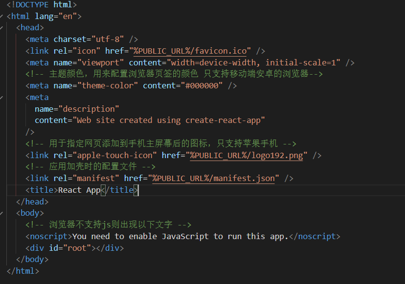

# React

## jsx语法

引入的顺序不能错

1. react.js：React核心库。

2. react-dom.js：提供操作DOM的react扩展库。**（必须在react.js的后面）**

3. babel.min.js：解析JSX语法代码转为JS代码的库。

```jsx
<script src="../依赖包/旧版本/react.development.js"></script>
<script src="../依赖包/旧版本/react-dom.development.js"></script>
<script src="../依赖包/旧版本/babel.min.js"></script>
<!-- 此处要写babel -->
<script type="text/babel">
// 1.创建虚拟dom
  const VD = <h1>你好</h1>
// 2.渲染虚拟dom到页面
  ReactDOM.render(VD,document.getElementById('test'))
```

**jsx语法的规则：**

- jsx里面使用变量或者使用表达式时候{}包着

  ```jsx
  const myData = 'hi hi'
  const VD = <h1>{myData}</h1>
  ReactDOM.render(VD,document.getElementById('test'))
  ```

- jsx里面使用类名需要用className

  ```jsx
  const myData = 'hi hi'
  const VD = <h1 className="red">{myData}</h1>
  ReactDOM.render(VD,document.getElementById('test'))
  ```

- 内联样式要用style={{key:value,key:value}}的形式写

  ```jsx
  const myData = 'hi hi'
  const VD = <h1 style={{color:'white',fontSize:'100px'}}>{myData}</h1>
  ReactDOM.render(VD,document.getElementById('test'))
  ```

- jsx只能有一个根标签

- 标签必须闭合

- 若大写字母开头react就去渲染对应的组件，若组件没有定义，则报错

## 组件

### 函数式组件（简单组件）

- 函数式组件必须大写开头
- 渲染组件到页面,发现组件是使用函数定义的随后调用该函数，将返回的虚拟DOM转为真实DOM，随后呈现在页面中。
- **函数式组件中的`this`为`undefined`，这是因为`babel`翻译完之后会转为严格模式导致的。**

```jsx
// 1.创建函数式组件
// 必须大写开头
function Demo(){
// babel翻译完之后开启严格模式之后导致this为undefined
  console.log(this);// undefined
  return <h2>函数式组件</h2>
}
// 2.渲染组件到页面,发现组件是使用函数定义的随后调用该函数，将返回的虚拟DOM转为真实DOM，随后呈现在页面中。
ReactDOM.render(<Demo/>,document.getElementById('test'))
```

### 类组件（复杂组件-有状态`state`）

- 创建的类组件必须继承自`React.Component`
- 类组件中要有`render`函数，返回你要展示的内容
- `render`中的`this`指向，类创建出来的实例对象

```jsx
let text = '类组件'
// 1.创建类组件
class MyComponent extends React.Component{
  // render 放在类的原型对象上，供实例使用。  
  render(){
    console.log(this);
    return(
      <h2>{text}</h2>
    )
  }
}
//2. 
/*
执行ReactDOM.render(<MyComponent/>,document.getElementById('test'))，发生了什么？
	1.React解析组件标签，找到MyComponent组件
	2.发现组件是类定义的，然后new出一个实例，并通过该实例调用到原型的render方法
	3.将render返回的虚拟dom转为真实dom，随后呈现在页面上。
*/
ReactDOM.render(<MyComponent/>,document.getElementById('test'))
```

## 组件实例的三大属性

### state

- 只有类组件当中才有`state`（状态）属性，所以类组件为复杂组件。
- 组件实例的数据放在`state`（状态）里面，数据的改变再驱动的页面的展示。


- `state`是放在组件实例上的

#### **初始化组件实例的两个方法**

- 方式一：放在`constructor`里面，因为里面的`this`指向组件实例。

```jsx
class MyComponent extends React.Component{
  constructor(prop){
    super(prop)
    this.state = {isHot:true,wind:true}
  }
  render(){
    return(
      <h2>今天天气{isHot?'炎热':'凉爽'}</h2>
    )
  }
}
```

- 方式二：定义在`constructor`外边

  **类当中直接写赋值语句，意思是给MyComponent的实例对象上添加一个属性**

```jsx
class MyComponent extends React.Component{
  constructor(prop){
    super(prop)
    // 初始化状态
  }
  state = {isHot:true,wind:true}
  render(){
    const {isHot} = this.state
    return(
      <h2>今天天气{isHot?'炎热':'凉爽'}</h2>
    )
  }
}
```

#### React中绑定事件

- 绑定事件的函数里面的`this`,指向`undefined`，这是因为这个函数不是实例调用的，而是直接调用的。
- 正常直接调用`this`指向`window`，但是这里`babel`解析的时候会变为严格模式，所以指向`undefined`

```jsx
class MyComponent extends React.Component{
  constructor(prop){
    super(prop)
    // 初始化状态
    this.state = {isHot:true,wind:true}
  }
  render(){
    // render是实例调用的
    // render 会调用1+n次，n是状态更新的次数。
    const {isHot} = this.state
    return(
      <h2 onClick={this.changeWether}>今天天气{isHot?'炎热':'凉爽'}</h2>
    )
  }
  changeWether(){
    // 为什么这里的this是undefined？
    // 只有通过Weather实例调用changeWeather的时候，changeWeather中的this才是Weather实例
    // 因为这个函数不是实例调用的，是直接调用的
    console.log(this);
  }
}
```

- **解决this指向问题方式一：**

在`constructor` ，里面增加绑定事件的函数，并且用`bind`改变`this`指向。

```jsx
class MyComponent extends React.Component{
  constructor(prop){
    super(prop)
    this.state = {isHot:true,wind:true}
    // 将类的原型对象上的方法改变this指向，再绑定到实例上面
    this.changeWether = this.changeWether.bind(this)
  }
  render(){
    const {isHot} = this.state
    return(
      <h2 onClick={this.changeWether}>今天天气{isHot?'炎热':'凉爽'}</h2>
    )
  }
    //这个是绑定在类的原型对象上，供组件实例使用
  changeWether(){
    console.log(this);
  }
}
```


- **解决this指向问题方式二：**

事件绑定函数使用箭头函数的方式。

```jsx
class MyComponent extends React.Component{
  constructor(prop){
    super(prop)
    // 初始化状态
  }
  state = {isHot:true,wind:true}
  render(){
    const {isHot} = this.state
    return(
      <h2 onClick={this.changeWether}>今天天气{isHot?'炎热':'凉爽'}</h2>
    )
  }
  // 自定义方法-要用赋值语句+箭头函数
  changeWether=()=>{
    console.log(this); // 指向组件实例
    // 箭头函数的this向外层查找。
    const isHot = this.state.isHot
    // 状态必须通过setState进行修改
    this.setState({isHot:!isHot})
  }
}
```

#### 使用`setState`改变`state`中的值

**注意不能直接修改state中的值，否则页面不能进行相应的响应，需要使用setState进行修改**

setState有两种方式，函数式的setState和对象式的setState

```jsx
// 只动了你要修改的属性，别的不会动,是一个合并动作
this.setState({'你要修改的属性'：'修改之后的值'},状态更新完后执行的回调函数)
```

**对象式：**

```js
this.setState({count:count+1})
```

**函数式：**

```js
// 函数式的setState,可接收两个参数state和props
this.setState((state,props)=>{
  console.log('state',state);
  console.log('props',props);
  return{
    count:state.count+1
  }
})
```

- 注意setState的渲染是一个异步的，想要获取最新的状态在setState第二个参数里获取

- setState第二个参数是一个函数，在页面更新完成之后的回调函数

```js
this.setState({count:count+1},()=>{
 console.log('在这里面才能获取到更新完的state',this.state.count);
})
```

**每次setState，render都会重新执行一次**

### props

- **`props`是一个只读属性，不能修改**

- 每个组件实例都会有props属性
- 组件标签的所有属性都保存在props中

#### 基本使用和批量处理

- 基本使用

```jsx
class Person extends React.Component {
  render(){
    const {name,age} = this.props
    return(
      <ul>
        <li>name:{this.props.name}</li>
        <li>age:{this.props.age}</li>
      </ul>
    )
  }
}
// 以下这种方式可以传值给props
ReactDOM.render(<Person name="hyj" age="15"/>,document.getElementById('test1'))
ReactDOM.render(<Person name="xxx" age="11"/>,document.getElementById('test2'))
```

- 批量传递

```jsx
const p = {name:'zzz',age:111}
// ReactDOM.render(<Person name={p.name} age={p.age}/>,document.getElementById('test3'))
// props的批处理 和上面代码效果一样
// React里面的{...p}和原生的展开运算符不是一个意思
ReactDOM.render(<Person {...p}/>,document.getElementById('test3'))
```

#### props的传递校验

需要引用新的依赖包，用于对标签属性进行限制

```jsx
<!-- 引入prop-types，用于对标签属性进行限制 -->
<script src="../依赖包/旧版本/prop-types.js"></script>
```

`propTypes`限制类型和必要性

`defaultProps`指定标签的默认属性

**脚手架中使用需要手动安装**

```jsx
// 安装 
yarn add prop-types
```

```jsx
// 引入
import PropTypes from 'prop-types'
```


- **方式一**

```jsx
class Person extends React.Component {
  render(){
    const {name,age,sex} = this.props 
    return(
      <ul>
        <li>name:{name}</li>
        <li>sex:{sex}</li>
        <li>age:{age}</li>
      </ul>
    )
  }
}
// 对props里面的属性进行限制和校验
Person.propTypes = {
  // 名字必须是string类型，是必须传
  name:PropTypes.string.isRequired,
  sex:PropTypes.string,
  // 限制函数 使用func 是为了不与原生的进行冲突
  speak:PropTypes.func
}
// 设置默认值
Person.defaultProps = {
  sex:"fff"
}
```

- **方式二**

  **本质上是给类自身添加两个属性propTypes和defaultProps，所以可以使用static在类里面加，效果一样**

  类里面直接加属性，就是加在实例上，使用static加就是加在类上面

```jsx
class Person extends React.Component {
    constructor(props){
      super(props)
      // 构造器可以省略，如过不省略的话必须传props
      console.log('constructor',this.props); // 不调用super传props的话，则为undefined
    }
    // 给类自身加的属性
  static propTypes = {
    // 名字必须是string类型，是必须传
    name:PropTypes.string.isRequired,
    sex:PropTypes.string,
    // 限制函数 使用func 是为了不与原生的进行冲突
    speak:PropTypes.func
  }
  // 设置默认值
  static defaultProps = {
    sex:"fff"
  }
  render(){
    const {age,sex,name} = this.props
    return (
      <ul>
        <li>name:{name}</li>
        <li>age:{age}</li>
        <li>sex:{sex}</li>
      </ul>
    )
  }
}
```

### ref

**组件内的标签可以定义`ref`来标识自己**

#### 字符串形式的ref（不被推荐）

```jsx
class MyComponent extends React.Component{
  render(){ 
    return (
      // 字符串型的ref不被推荐使用
      <div>
      <input type="text" placeholder='点击按钮提示' ref='input1'/>
    </div>
    )
  }
  showData=()=>{
    alert(this.refs.input1.value)
  }
```

- 通过`this.refs.名字`去获取该组件


#### 回调函数形式的ref

- **函数内联的编写方式**

```jsx
class MyComponent extends React.Component{
  render(){ 
    return (
      // 字符串型的ref不被推荐使用
      <div>
      <input type="text" placeholder='点击按钮提示' 
          ref={(currentNode)=>{this.input1 = currentNode;}}
       />
      &nbsp;
      <button onClick={this.showData}>按钮点击</button>
    </div>
    )
  }
  showData=()=>{
    alert(this.input1.value)
  }
}
```

**相当于把组件挂载到了实例的`input1`上面**

- 如果 ref 回调函数是以内联函数的方式定义的，在更新过程中它会被执行两次，

- 第一次传入参数 null，然后第二次会传入参数 DOM 元素。

- 使用类绑定函数的方式可以避免这个问题

- **类绑定函数的方式**

```jsx
class MyComponent extends React.Component{
  state={ishot:true}

  render(){
    return(
      <div>
        <input type="text" ref={this.saveInput}/>
        <button onClick={this.showData}>点击点击</button>
      </div>
    )
  }
  showData=()=>{
    alert(this.input1.value)
  }
  // 这样绑定ref该函数只会调用一次
  saveInput=(curN)=>{
    this.input1 = curN
    console.log('执行了',curN)
  }
}
```

#### createRef的方式

**React.createRef调用后可以返回一个容器，该容器可以存储被ref所标志的节点,该容器是专人专用的,需要多个ref则需要多次创建**

- 取到该元素的时候需要通过`this.你的名字.current`

```jsx
class MyComponent extends React.Component{
  myRef = React.createRef()
  render(){ 
    return (
      // 字符串型的ref不被推荐使用
      <div>
      <input type="text" placeholder='点击按钮提示' ref={this.myRef}/>
      &nbsp;
      <button onClick={this.showData}>按钮点击</button>
    </div>
    )
  }
  showData=()=>{
    alert(this.myRef.current.value)
  }
}
```

## React中的事件处理

1. 通过onXxx属性指定事件处理函数(注意大小写)

 \-  React使用的是自定义(合成)事件, 而不是使用的原生DOM事件

2.React中的事件是通过事件委托方式处理的(委托给组件最外层的元素)

 \-  通过**`event.target`**得到发生事件的DOM元素对象

```jsx
class MyComponent extends React.Component {
  myInput1 = React.createRef()
  render(){
    return(
      <div>
        <input type="text" onBlur={this.showData2} />
      </div>
    )
  }
  // 不要滥用ref，这里可以使用event.target获取发生事件的dom对象
  showData2=(event)=>{
    alert(event.target.value);
  }
}
```

## 受控组件和非受控组件

### 受控组件

**表单元素依赖于状态`state`，表单元素需要默认值实时映射到状态的时候，就是受控组件**

- 随着你的输入维护状态就是受控组件

- 受控组件必须要在表单上使用onChange事件来绑定对应的事件.

```jsx
class MyComponent extends React.Component {
    // 初始化状态
    state={
      name:'',
      psw:''
    }
  myInput1 = React.createRef()
  render(){
    return(
      <div>
        <form action="" onSubmit={this.callBack}>
          账号：<input type="text" name="username" onChange={this.saveName}/>&nbsp;
          密码：<input type="password" name="password"  onChange={this.savePsw}/>&nbsp;
          <button  onClick={this.showData1}>登录</button>
        </form>
      </div>
    )
  }
  callBack=()=>{
    const {name,psw} = this.state
    console.log(this.state);
    event.preventDefault() //阻止表单提交
    alert(`账号：${name}   密码：${psw}`)
  }
  saveName=()=>{
    this.setState({name:event.target.value})
  }
  savePsw=()=>{
    this.setState({psw:event.target.value})
  }
}
```

### 非受控组件

- 非受控组件即不受状态的控制，获取数据就是相当于操作DOM。
- 现用现取就是非受控

```jsx
class MyComponent extends React.Component {
  myInput1 = React.createRef()
  render(){
    return(
      <div>
        <form action="" onSubmit={this.callBack}>
          账号：<input type="text" name="username" ref={e=>this.name = e}/>&nbsp;
          密码：<input type="password" name="password" ref={e=>this.psw = e}/>&nbsp;
          <button  onClick={this.showData1}>登录</button>
        </form>
      </div>
    )
  }
  callBack=()=>{
    const {name,psw} = this
    event.preventDefault() //阻止表单提交
    alert(`账号：${name.value}   密码：${psw.value}`)
  }
}
```

## 高阶函数和函数的柯里化

 高阶函数（满足下列条件之一即可）：

- 若A函数接收的参数是一个函数，那么A为高阶函数

- 若A函数调用之后返回值仍然是一个函数，那么A可以称为高阶函数

 函数的柯里化：**通过函数调用后继续返回函数的方式，实现多次接收参数最后统一处理的函数编码形式。**

**函数柯里化的演示代码：**

```js
  // 函数的柯里化：通过函数调用后继续返回函数的方式，实现多次接收参数最后统一处理的函数编码形式。
  function sum(a){
    return (b)=>{
      return (c)=>{
        return a+b+c
      }
    }
  }
  let result = sum(1)(2)(3)
  console.log(result);
```

**使用高阶函数和函数柯里化，优化受控组件修改state的例子：**

```jsx
class MyComponent extends React.Component {
    // 初始化状态
    state={
      name:'',
      psw:''
    }
  myInput1 = React.createRef()
  render(){
    return(
      <div>
        <form action="" onSubmit={this.callBack}>
          账号：<input type="text" name="username" onChange={this.saveData('name')}/>&nbsp;
          密码：<input type="password" name="password"  onChange={this.saveData('psw')}/>&nbsp;
          <button  onClick={this.showData1}>登录</button>
        </form>
      </div>
    )
  }
  callBack=()=>{
    const {name,psw} = this.state
    event.preventDefault() //阻止表单提交
    alert(`账号：${name}   密码：${psw}`)
  }
  saveData=(dataType)=>{
    return (event)=>{
      this.setState({[dataType]:event.target.value})
    }
  }
}
```

## React的生命周期(旧)

.png)

- 组件将要挂载时候调用-----`componentWillMount`

- 初始化渲染，状态更新之后-----`render`

- 组件完成挂载后调用-----`componentDidMount`

- 组件将要被卸载调用-----`componentWillUnmount`

  ```jsx
  ReactDOM.unmountComponentAtNode(你要卸载的组件)
  ```

- 控制组件更新的阀门-----`shouldComponentUpdate`

  **shouldComponentUpdate:该钩子相当于一个阀门，如果你调用了，需要手动返回false或者true**

  ```jsx
  shouldComponentUpdate(nextProps,nextState){
   // 能接收到两个参数，下一个state和下一个props  
    }
  ```

- 组件将要更新-----`componentWillUpdate`

- 组件更新完成-----`componentDidUpdate`

`forceUpdate` 函数强制更新，不需要经过阀门（`shouldComponentUpdate`）的生命周期钩子

```jsx
this.forceUpdate() //强制更新 	
```

- 组件将要新的props钩子-----`componentWillReceiveProps`

  **初次的时候不会调用，以后更新props的时候才会调用**


## React的生命周期(新)

.png)

**即将废弃的勾子需要加上UNSAFE_前缀才能使用**

1. componentWillMount

2. componentWillReceiveProps

3. componentWillUpdate

### getDerivedStateFromProps

- 使用的时候需要加上static，需要定义为静态方法
- 必须有返回值，可以为状态对象或者null
- 如果返回值是状态对象，且该对象的key和state中的key有相等的，那么会以状态对象中的值为准且不能更改。

```jsx
  static getDerivedStateFromProps(props,state){
    // 可以接收props和state 参数
    console.log('getDerivedStateFromProps',props,state);
    return null
  }
```

### getSnapshotBeforeUpdate

**组件更新之前来一个快照**

-  必须有返回值，返回一个快照（可以为任意数据类型）或者null，componentDidUpdate第三个参数可接收该快照属性

```jsx
 getSnapshotBeforeUpdate(){
    console.log('组件更新之前来一个快照-----getSnapshotBeforeUpdate');
    // 必须有返回值，返回一个快照，componentDidUpdate第三个参数可接收该快照属性
    return '我是快照'
  }
```

- **componentDidUpdate的第一个参数是先前的`props`第二个参数是先去的`state`第三个参数来接收快照**

```jsx
 componentDidUpdate(preProps,preState,snapshotValue){
    console.log('组建更新完成-----componentDidUpdate');
    console.log(snapshotValue); // 我是快照
  }
```

### 总结


## DOM的Diffing算法

当状态中的数据发生变化时，react会根据【新数据】生成【新的虚拟DOM】，随后就会将【新虚拟DOM】和【旧虚拟DOM】进行diff比较：

- 旧虚拟DOM中找到了与新虚拟DOM相同的key
  - 若是虚拟DOM中内容没变，则直接用之前的真是DOM
  - 若虚拟DOM中内容变了，则生成新的真是DOM，替换页面中之前的真实DOM

- 旧虚拟DOM中没有找到与新虚拟DOM相同的key
  - 根据数据创建新的真是DOM，随后渲染到页面

**用index作为key可能会引发的问题：**

- 若对数据进行：逆序添加、逆序删除等破坏顺序操作:
  - 会产生没有必要的真实DOM更新 ==> 界面效果没问题, 但效率低。

- 如果结构中还包含输入类的DOM：
  - 会产生错误DOM更新 ==> 界面有问题。

```jsx
// 使用index作为key会导致input中会错乱
class Person extends React.Component{
		state = {
			persons:[
				{id:1,name:'小张',age:18},
				{id:2,name:'小李',age:19},
			]
		}
		add = ()=>{
			const {persons} = this.state
			const p = {id:persons.length+1,name:'小王',age:20}
			this.setState({persons:[p,...persons]})
		}
		render(){
			return (
				<div>
					<h2>展示人员信息</h2>
					<button onClick={this.add}>添加一个小王</button>
					<h3>使用index（索引值）作为key</h3>
					<ul>
						{
							this.state.persons.map((personObj,index)=>{
								return <li key={index}>{personObj.name}---{personObj.age}<input type="text"/></li>
							})
						}
					</ul>
					<hr/>
					<hr/>
					<h3>使用id（数据的唯一标识）作为key</h3>
					<ul>
						{
							this.state.persons.map((personObj)=>{
								return <li key={personObj.id}>{personObj.name}---{personObj.age}<input type="text"/></li>
							})
						}
					</ul>
				</div>
			)
		}
	}
	ReactDOM.render(<Person/>,document.getElementById('test'))
```

- **注意！如果不存在对数据的逆序添加、逆序删除等破坏顺序操作，仅用于渲染列表用于展示，使用index作为key是没有问题的。**

- 开发中如何选择key?
  - 最好使用每条数据的唯一标识作为key, 比如id、手机号、身份证号、学号等唯一值。
  - 如果确定只是简单的展示数据，用index也是可以的。

## React脚手架

```
// 创建项目
create-react-app hello-react
```

**目录结构**


**index.html中代码解析**



### 样式模块化处理

**为了防止出现在不同组件中出现同样类名导致样式冲突的问题**

- 先给css文件命名中加一个`module`，如`index.module.css`
- 在需要引用css文件的组件中使用`import hello from './index.module.css'`这种方式引入样式

```jsx
import React,{Component} from 'react';
// 使用样式的模块化方防止样式冲突 
// 用一个变量来接收样式文件
import hello from './index.module.css'
class Hello extends Component{
  render(){
    return(
      <h2 className={hello.title}>Hello</h2>
    )
  }
}
export default Hello;
```


### 配置代理

配置代理可以解决跨域问题。

- 首先建立一个`setupProxy.js`文件


```js
const proxy = require('http-proxy-middleware')
module.exports=function(app){
  app.use(
    proxy('/api1',{ //遇见/api1前缀的请求，就会触发该代理
      target:'http://localhost:5000', // 请求转发给谁
      changeOrigin:true, // 控制服务器收到的请求头中Host值
      pathRewrite:{'^/api1':''} // 重写请求路径(必须)
    }),
    proxy('/api2',{
      target:'http://localhost:5001',
      changeOrigin:true,
      pathRewrite:{'^/api2':''}
    })
  )
}
```

- 使用代理	

```js
 getStudentData=()=>{
    axios.get('http://localhost:3000/api1/students').then(res=>{
      console.log(res);
    }).catch(err=>{
      console.log(err);
    })
  }
  getCarData=()=>{
    axios.get('http://localhost:3000/api2/cars').then(res=>{
      console.log(res);
    }).catch(err=>{
      console.log(err);
    })
  }
```

### fetch发送请求

发送请求的方式有两种：xhr（Jquery，axios）和fetch

**特点：**

- 是原生函数，不使用XmlHttpRequest对象来提交ajax请求
- 老版本浏览器可能不支持

```jsx
    //使用fetch发送网络请求
    fetch(`api1/search/users2?q=${value}`).then(response=> {
      // 只能代表联系服务器成功，不代表能获取数据
      console.log('联系服务器成功了');
      //response.json() 是一个promise
      return response.json()
    }).then(res=>{
      console.log('获取数据成功',res);
    }).catch(err=>{
      console.log(err);
    })
```

优化版：

```jsx
    try {
      const response = await fetch(`api1/search/users2?q=${value}`)
      const data = await response.json()
      PubSub.publish('update',{users:data.items,isLoading:false})
    } catch (err) {
      PubSub.publish('update',{err:err.message,isLoading:false})
    }
```


## React的通信方式

### 父子间的通信方式

- 【父组件】给【子组件】传递数据：通过`props`传递
- 【子组件】给【父组件】传递数据：通过`props`传递，要求父组件给子组件传递一个函数，子组件调用这个函数并传递一个参数就达到了父子通信。

例如：

```jsx
// 父组件里面
export default class App extends Component {
  state={todos:[
    {id:0,name:'吃饭1',done:true},
    {id:1,name:'吃饭2',done:true},
    {id:2,name:'吃饭3',done:false},
  ]}
  render() {
    const {todos} = this.state
    return (
      <div className="todo-container">
        <div className="todo-wrap">
          <Header addTodo={this.addTodo}/>
      </div>
    </div>
    )
  }
  addTodo=(todoObj)=>{
    const {todos} = this.state
    const newTodos = [todoObj,...todos]
    this.setState({todos:newTodos})
  }  
}

// 子组件里面
class Header extends Component{
  render(){
    return(
      <div className="todo-header">
        <input onKeyUp={this.addList} type="text" placeholder="请输入你的任务名称，按回车键确认"/>
      </div>
    )
  }
  addList=(event)=>{
    const {keyCode,target} = event
    const {addTodo} = this.props
    if(keyCode!==13 || target.value.trim() ===''){return}
    const todoObj = {id:nanoid(),name:target.value,done:false}
    addTodo(todoObj)
    target.value = ''
  }
  static propTypes = {
    addTodo:PropTypes.func.isRequired,
  }
}

```

### 兄弟组件之间的通信

**PubSubJS**

利用消息订阅-发布机制来达成通信

```js
// 安装第三方库
npm install pubsub-js --save
// 或者
yarn add pubsub-js
```

```js
// 引入库
import PubSub from 'pubsub-js'
```

- 订阅消息` PubSub.subscribe('消息名'，回调函数)`

```jsx
  componentDidMount(){
    // 订阅消息
    // 接收两个参数，一个是事件名，一个是传递的函数
    this.token = PubSub.subscribe('update',(mes,stateObj)=>{
      // msg 是消息名，stateObj是别人传递的参数
      this.setState(stateObj)
    })
  }
  componentWillUnmount(){
    // 取消订阅
    PubSub.unsubscribe(this.token)
  }
```

- 发布消息`PubSub.publish('消息名'，‘参数’)`

```jsx
  search=()=>{
    // 连续解构赋值写法
    const {keyWordElement:{value}} = this
    // 发送请求前通知List更新状态
    PubSub.publish('update',{isLoading:true,isFirst:false})
    axios.get(`http://localhost:3000/api1/search/users?q=${value}`).then(res=>{
      PubSub.publish('update',{users:res.data.items,isLoading:false})
    }).catch(err=>{
      PubSub.publish('update',{err:err.message,isLoading:false})
    })
  }
```

## React中的路由

### 路由的理解

- **什么是路由？**

一个路由就是一个映射关系，key为路径，value可能是component或者function

- **前端路由和后端路由的区别**

前端路由的value是component，用于展示用户页面，后端路由的value是function，用来处理客户端提交的请求。

### 路由的基本使用

1. 路由的安装`yarn add react-router-dom`
2. 明确好界面中的导航区、展示区
3. 导航区的a标签改为Link标签

​     ` <Link to="/xxxxx">Demo</Link>`

3. 展示区写Route标签进行路径的匹配

​      `<Route path='/xxxx' component={Demo}/>`

4. `<App>`的最外侧包裹了一个`<BrowserRouter>`或`<HashRouter>`

```jsx
import {BrowserRouter} from 'react-router-dom'

ReactDOM.render(
  <BrowserRouter><App /></BrowserRouter> ,
  document.getElementById('root')
);
```

### 路由组件和一般组件

```jsx
//一般组件
<Demo/>
// 路由组件
<Route path="/demo" component={Demo}/>
```

**路由组件和一般组件最大的区别就是接收到的`props`信息不一样**

一般组件：写组件标签时传递了什么，就能收到什么

路由组件：接收到三个固定的属性


​        

### NavLink和switch的使用

#### NavLink

- **NavLink可以实现路由链接的高亮，通过activeClassName指定样式名**

```jsx
  {/* activeClassName 当点击的时候添加哪个类名,默认添加的类目是active */}    
 <NavLink activeClassName='active' className="list-group-item" to="/about">about</NavLink>
```

- **对NavLink进行封装**

```jsx
import React, { Component } from 'react'
import {NavLink} from 'react-router-dom'
export default class MyNavLink extends Component {
  render() {
    // const {children} = this.props
    // 在标签体里面的值，存在props的children里面
    return (
      <div>
        {/* <NavLink className="list-group-item" {...this.props}>{children}</NavLink>  */}
        {/* 上下效果一样，相当于配在 <NavLink children='标签体内容'/>*/}
          <NavLink className="list-group-item" {...this.props}></NavLink> 
      </div>
    )
  }
}
```

**注意：标签体里面的值，会存在props的children里面**

#### Switch

- **使用switch和不使用的区别：**
  - 使用switch，路由匹配到一个后就不会往下继续匹配
  - 不使用的话就会一直匹配到结束，有多个匹配上就展示多个

```jsx
<Switch>
	<Route path='/about' component={About}></Route>
	<Route path='/home' component={Home}></Route>  
</Switch>
```

### 路由的严格匹配和模糊匹配

 1.默认使用的是模糊匹配（简单记：【输入的路径】必须包含要【匹配的路径】，且顺序要一致）

 2.开启严格匹配：`<Route exact={true} path="/about" component={About}/>`或者`<Route exact path="/about" component={About}/>`

 3.严格匹配不要随便开启，需要再开，有些时候开启会导致无法继续匹配二级路由

### Redirect的使用

`Redirect`是路由重定向，当所有路由都匹配不上的时候就去跳转到`Redirect`指定的路由

```jsx
<Switch>
    {/* 默认就是模糊匹配 ，exact就是精准匹配*/}
    <Route  path='/about' component={About}></Route>
    <Route path='/home' component={Home}></Route>
    {/* 重定向如果都没匹配上就去/about */}
    <Redirect to='/about'/>
</Switch>
```

### 嵌套路由的使用

​    1.注册子路由时要写上父路由的path值

​    2.路由的匹配是按照注册路由的顺序进行的

### 向路由组件传递参数的方式

#### params参数

- 首先在路由链接中携带参数：`<Link to='/demo/test/tom/18'}>详情</Link>`
- 注册路由的时候进行参数声明：`<Route path="/demo/test/:name/:age" component={Test}/>`
- 在路由组件中的`this.props.match.params`中可获取传递的参数

**传递参数：**

```jsx
export default class Message extends Component {
  state={
    messageArr:[
      {id:1,title:'message001',content:'zxx01'},
      {id:2,title:'message002',content:'zxx02'},
      {id:3,title:'message003',content:'zxx03'}
    ]
  }
  render() {
    const {messageArr} = this.state
    return (
     <div>
        <ul>
          {messageArr.map((item)=>{
            return (
              <li key={item.id}>
                {*传递数据*}
                <Link to={`/home/message/detail/${item.id}/${item.title}/${item.content}`}>
                    {item.title}
                </Link>
              </li>
            )
          })}
        </ul>
        <hr />
            {*声明变量*}
        <Route path='/home/message/detail/:id/:title/:content' component={Detail}></Route>
     </div>
    )
  }
}
```

**在路由组件中接收参数：**

```jsx
 const {id,title,content} = this.props.match.params
```

#### search参数

- 首先在路由链接中携带参数`<Link to='/demo/test?name=tom&age=18'}>详情</Link>`

- 注册路由无需声明变量正常注册
- 在路由组件中的`this.props.location.search`中可获取传递的参数

- 获取到的search是urlencoded编码字符串，需要借助querystring解析

**querystring的使用：**

```js
import qs from 'querystring'

let obj = {name:'hyj',age:22} // 对象转为 urlencoded 编码 name=hyj&age=22
console.log(qs.stringify(obj));

let str = 'name=hyj&age=22' // urlencoded 编码 转为对象
console.log(qs.parse(str));
```

**传递参数：**

```jsx
render() {
    const {messageArr} = this.state
    return (
     <div>
        <ul>
          {messageArr.map((item)=>{
            return (
              <li key={item.id}>
                <Link to={`/home/message/detail?id=${item.id}&title=${item.title}&content=${item.content}`}>					{item.title}
                </Link>
              </li>
            )
          })}
        </ul>
        <hr />
        <Route path='/home/message/detail' component={Detail}></Route>
     </div>
    )
  }
```

**在路由组件中接收并解析参数：**

```jsx
import qs from 'querystring'
// 去除第一个字符，是因为第一个字符是？
const {id,title,content} = qs.parse(this.props.location.search.slice(1))
```

#### state参数

- 首先在路由中携带参数`<Link to={{pathname:'/demo/test',state:{name:'tom',age:18}}}>详情</Link>`

- 注册路由无需声明变量正常注册

- 在路由组件中使用`this.props.location.state`接收参数
- 刷新也可以保留住参数
- **注意路由模式必须是history模式也就是`BrowserRouter`**

**传递参数：**

```jsx
render() {
    const {messageArr} = this.state
    return (
     <div>
        <ul>
          {messageArr.map((item)=>{
            const {id,title,content} = item
            return (
              <li key={item.id}>
                <Link to={{pathname:'/home/message/detail',state:{id,title,content}}}>{item.title}</Link>
              </li>
            )
          })}
        </ul>
        <hr />
        <Route path='/home/message/detail' component={Detail}></Route>
     </div>
    )
  }
```

**接收参数：**

```jsx
// 当清理缓存后数据会丢失，所以没数据的时候设置为空对象
const {id,title,content} = this.props.location.state || {}
```

### 路由懒加载

只有当点到那个路由的时候再加载

```jsx
//1.通过React的lazy函数配合import()函数动态加载路由组件 ===> 路由组件代码会被分开打包
import React, { Component,lazy,Suspense } from 'react'
const Home = lazy(()=>import('./Home'))
const About = lazy(()=>import('./About'))
//2.通过<Suspense>指定在加载得到路由打包文件前显示一个自定义loading界面
// 也可单独将loading页面，封装成一个组件到时候引入就好了
<Suspense fallback={<h1>loading.....</h1>}>
<Switch>
    <Route path='/about' component={About}></Route>
    <Route path='/home' component={Home}></Route>  
    <Redirect to='/about'/>
    </Switch>
</Suspense>
```


## Redux


- `redux`是react全家桶的一员，它试图为 React 应用提供「可预测化的状态管理」机制。
- 就是可以将数据进行状态管理，在多个组件中进行运用

**准备redux环境：**

```
npm install redux
npm install react-redux
```

### Store

`Store `在 Redux 中的作用是用来保存状态的，相当于我们在前端建立了一个简单的 ”数据库“

**Store的职责：**

> 维持应用的 state； 
>
> 提供 getState() 方法获取 state； 
>
> 提供 dispatch(action) 方法更新 state； 
>
> 通过 subscribe(listener) 注册监听器; 
>
> 通过 subscribe(listener) 返回的函数注销监听器。

创建一个store.js的文件，用来创建store,步骤如下：

- 引入redux中的createStore函数，创建一个store
- createStore调用时要传入一个为其服务的reducer
- 记得暴露store对象

```js
// 1.引入createStore，专门用于创建redux中最为核心的store对象
import {createStore} from 'redux';
// 2.因为为Count组件服务的reducer
import countReducer from './count_reducers';
// 暴露store
export default createStore(countReducer)
```

**每个项目里面只有一个Store，如果有多个reducer需要处理则需要将它们合并**:

- 单独创建一个文件用来合并reducer
- 使用`combineReducers`来合并，他接收的是一个对象的形式

```js
// 为Count组件服务的reducer
import countReducer from './count';
// 为Person组件服务的reducer
import personReducer from './person';
import {combineReducers,createStore} from 'redux';
export default createStore(combineReducers({count:countReducer,person:personReducer}))
```

**当项目中有异步操作的时候：**

- 明确：延迟的动作不想交给组件自身，想交给action
- 何时需要异步action：想要对状态进行操作，但是具体的数据靠异步任务返回。
- 具体编码：
  - `yarn add redux-thunk`，并配置在store中
  - 创建action的函数不再返回一般对象，而是一个函数，该函数中写异步任务。

- 异步任务有结果后，分发一个同步的action去真正操作数据。

- 备注：异步action不是必须要写的，完全可以自己等待异步任务的结果了再去分发同步action。

**store.js:**

```js
//引入createStore，专门用于创建redux中最为核心的store对象
import {createStore,applyMiddleware} from 'redux'
//引入为Count组件服务的reducer
import countReducer from './count_reducer'
//引入redux-thunk，用于支持异步action
import thunk from 'redux-thunk'
//暴露store
export default createStore(countReducer,applyMiddleware(thunk))
```

**因为action不能识别函数的action，所以需要引入中间件进行处理，让他调用一下那个action，然后开启异步任务**

**action文件的编写参考下面action小结的**

### Action

action就是改变state的指令，有多少操作state的动作就会有多少action。

实际上action就是向

action 分为同步action和异步action：

- 同步action，就是指action的值为Object类型的一般对象

  ```js
  // 该文件专门为Count组件生成action对象,单独弄一个文件用来定义type常量
  import {INCREMENT,DECREMENT} from '../constant';
  export const createIncrementAction = data =>({type:INCREMENT,data})
  export const createDecrementAction = data =>({type:DECREMENT,data})
  ```

- 异步action，就是指action的值为函数,异步action中一般都会调用同步action，异步action不是必须要用的。

       ```js
       import {INCREMENT,DECREMENT} from '../constant';
       export const createIncrementAction = data =>({type:INCREMENT,data})
       export const createIncrementAsyncAction = (data,timeout) =>{
         return (dispatch)=>{
           setTimeout(() => {
             dispatch(createIncrementAction(data))
           }, timeout);
         }
       }
       ```

相当于（正常不要这么写）：


### Reducers

- reducer的本质是一个函数，接收：preState,action，返回加工后的状态

- reducer有两个作用：初始化状态，加工状态

```js
import {ADDPERSON} from '../constant';
const initState = [{id:'001',name:'tom',age:18}]
export default function personReducer(preState=initState,action) {
  // 必须是纯函数
  const {type,data} = action
  switch (type) {
    case ADDPERSON:
      return [...preState,data]
      // 不能使用push方法来添加元素，因为底层做一个浅比较，如果发现perState之前的地址值和现在的一样就不会更新dom
      // preState.push(data)
      // return preState
    default:
      return preState
  }
}
```

**reducers必须是纯函数，那么什么是纯函数：**

- 一类特别的函数：只要同样的输入，必定得到同样的输出
- 不得改写参数数据
- 不会产生任何副作用，例如网络请求，输入输出设备
- 不能调用Date.now()或者Math.random()等不纯的方法

### React-redux

使用React-redux，不需要监控redux中数据 更新组件了，它内部会帮你做这件事.

明确两个概念：

- UI组件:不能使用任何redux的api，只负责页面的呈现、交互等。

- 容器组件：负责和redux通信，将结果交给UI组件。

如何创建一个容器组件————靠react-redux 的 connect函数

- connect(mapStateToProps,mapDispatchToProps)(UI组件)
  - mapStateToProps:映射状态，返回值是一个对象
  - mapDispatchToProps:映射操作状态的方法，返回值是一个对象

备注1：容器组件中的store是靠props传进去的，而不是在容器组件中直接引入

备注2：mapDispatchToProps，也可以是一个对象

```js
import {connect} from 'react-redux';
// 创建出来的容器组件默认拥有了监测redux的能力,不需要自己手动监测
export default connect(
  state=>({count:state}),
  // mapDispatchToProps的一般写法
  // dispatch=>({
  //   increment:data=>dispatch(createIncrementAction(data)),
  //   decrement:data=>dispatch(createDecrementAction(data)),
  //   asyncIncrement:(data,time)=>dispatch(createIncrementAsyncAction(data,time))
  // })

  // mapDispatchToProps的精简写法
  {
    increment:createIncrementAction,
    decrement:createDecrementAction,
    asyncIncrement:createIncrementAsyncAction,
  }
)(CountUI)
```

**总结一下一个组件要使用react-redux需要那几步：**

- 定义好UI组件---不暴露
- 引入connect生成一个容器组件，并暴露，写法如下：

   ```js
      · connect(
          state => ({key:value}), //映射状态
   	   {key:xxxxxAction} //映射操作状态的方法
      		)
          (UI组件)
   ```

- 在UI组件中通过this.props.xxxxxxx读取和操作状态

- 使用`provider`可以让App所有的后代容器组件都能接收到store

```jsx
ReactDOM.render(
  <Provider store={store}>
    <App />
  </Provider>,
  document.getElementById('root')
);
```

### **react-redux开发者工具的使用**

- `yarn add redux-devtools-extension`

- store中进行配置

    ```js
    //引入createStore，专门用于创建redux中最为核心的store对象
    import {createStore,applyMiddleware} from 'redux'
    //引入汇总之后的reducer
    import reducer from './reducers'
    //引入redux-thunk，用于支持异步action
    import thunk from 'redux-thunk'
    //引入redux-devtools-extension
    import {composeWithDevTools} from 'redux-devtools-extension'
    const store = createStore(allReducer,composeWithDevTools(applyMiddleware(thunk)))
    ```

## 运行打包后的文件

```js
npm i serve -g
```

- 全局安装这个库
- `serve build`

## Hooks

- Hook是React 16.8.0版本增加的新特性/新语法
- 可以让你在函数组件中使用 state 以及其他的 React 特性

```jsx
// 常用的三个hoos的引用
import React,{useState,useEffect,useRef} from 'react'
// 如果只引入了React可以用React.xxx的方式使用
```

### State Hook

- State Hook让函数组件也可以有state状态, 并进行状态数据的读写操作

- 语法: `const [xxx, setXxx] = React.useState(initValue)  `

- useState()说明:
          参数: 第一次初始化指定的值在内部作缓存
          返回值: 包含2个元素的数组, 第1个为内部当前状态值, 第2个为更新状态值的函数

- setXxx()2种写法:

  ```jsx
  // 1 . setXxx(newValue): 参数为非函数值, 直接指定新的状态值, 内部用其覆盖原来的状态值
  const [count,setCount] = React.useState(0)
  function add(){
      setCount(count+1)
  }
  ```

  ```jsx
  // 2 . 参数为函数, 接收原本的状态值, 返回新的状态值, 内部用其覆盖原来的状态值
  const [count,setCount] = React.useState(0)
  function add(){
      setCount(count=>count+1)
  }
  ```

- useState 可以创建多个State

  ```jsx
    const [count,setCount] = React.useState(0)
    const [name,setName] = React.useState('xx')
  ```

### Effect Hook 

-  Effect Hook 可以让你在函数组件中执行副作用操作(用于模拟类组件中的生命周期钩子)

```jsx
语法和说明: 
        useEffect(() => { 
          // 在此可以执行任何带副作用操作
          return () => { // 在组件卸载前执行
            // 在此做一些收尾工作, 比如清除定时器/取消订阅等相当于componentWillUnmount
          }
        }, [stateValue]) // 如果指定的是[], 回调函数只会在第一次render()后执行
```

- useEffect第一个参数的return后面是一个函数，该函数相当于`componentWillUnmount`
- useEffect第二个参数不填的话，那么每次渲染都会执行，相当于`componentDidUpdate`

- useEffect第二个参数是空数组的话，相当于`componentDidMount`

- useEffect第二个参数可以指定某个属性变化了之后再执行

  ```jsx
  const [count, setcount] =  React.useState(0)
  const [name, setname] =  React.useState('zxx')
  React.useEffect(()=>{
  	console.log('count变化了才执行，name变化不执行')
  },[count])
  ```

### Ref Hook

- Ref Hook可以在函数组件中存储/查找组件内的标签或任意其它数据
- 语法 `const ref容器的名字= useRef()`
- 作用:保存标签对象,功能用法与React.createRef()类似

```jsx
import React,{useRef} from 'react'
export default function Demo() {
  // 创建ref容器
  const myRef = useRef()
  function getMsg(){
    // 打印通过ref容器获取的元素里面的value值
    alert(myRef.current.value)
  }
  return (
    <div>
      <input type="text" ref={myRef}/>
      <button onClick={getMsg}>获取input信息</button>
    </div>
  )
}
```

### useContext

**`useContext`可以帮助我们跨越组件层级直接传递变量，实现共享**

```jsx
// 想要通过context传递两个数据
import React ,{useContext}from 'react'
const CountContext = React.createContext()  
const NameContext = React.createContext()  
export default function Father() {
  
  return (
    <div>
      <CountContext.Provider value={15}>
        <NameContext.Provider value={'sss'}>
        <Son/>
        </NameContext.Provider>
      </CountContext.Provider>
    </div>
  )
}
```

```jsx
function Son(){
   //useContext 的参数必须是 context 对象本身
  const countInfo = useContext(CountContext)
  const nameInfo = useContext(NameContext)
  return (
    <div>
      <h2>Header组件</h2>
      <p>{countInfo}</p>
      <p>{nameInfo}</p>
    </div>
  )
}
```

### useReducer

**对于复杂的state操作逻辑，嵌套的state的对象，推荐使用useReducer。**

`useReducer`接收两个参数：

- 第一个参数：reducer函数，没错就是我们上一篇文章介绍的。
- 第二个参数：初始化的state。返回值为最新的state和dispatch函数（用来触发reducer函数，计算对应的state）

```jsx
import React ,{useReducer}from 'react'
function reducer(state,action){
  switch (action.type) {
    case 'increment':
      return {...state,num:state.num+1}
    case 'decrement':
      return {...state,num:state.num-1}
    default:
      throw new Error();
  }
}
function Home(){
  const [state,dispatch] = useReducer(reducer,{num:0})
  return (
    <div>
      <h2>Header数据:{state.num}</h2>
      <button onClick={()=>dispatch({type:'decrement'})}>-1</button>
      <button onClick={()=>dispatch({type:'increment'})}>+1</button>
    </div>
  )
}
function About(){
  const [state,dispatch] = useReducer(reducer,{num:25})
  return(
    <>
      <h2>About数据:{state.num}</h2>
      <button onClick={()=>dispatch({type:'decrement'})}>-1</button>
      <button onClick={()=>dispatch({type:'increment'})}>+1</button>
    </>

  )
}
export default function App() {
  
  return (
    <div>
      <Home></Home>
      <About></About>
    </div>
  )
}


```


## Fragment

用法效果类似于Vue的`template`，渲染的时候这个层级会被丢掉，不会渲染真实dom

```jsx
import React, { Component,Fragment } from 'react'
export default class index extends Component {
  render() {
    return (
      <Fragment>
        <input type="text" />
        <input type="text" />
      </Fragment>
    )
  }
}
```

除了这种写法也可以用空标签替代

```jsx
<Fragment><Fragment>
<></>
```

空标签和Fragment的区别：

- 空标签不能接收属性，Fragment可以接收key属性
- 所以循环的时候使用Fragment，它可以设置key

## Context

### 理解

>  一种组件间通信方式, 常用于【祖组件】与【后代组件】间通信

**认识两个英文单词：Consumer消费者,Provide提供者**

### 使用

```jsx
1) 创建Context容器对象：
	const XxxContext = React.createContext()  
	
2) 渲染子组时，外面包裹xxxContext.Provider, 通过value属性给后代组件传递数据：
	<xxxContext.Provider value={数据}>
		子组件
    </xxxContext.Provider>
    
3) 后代组件读取数据：
	//第一种方式:仅适用于类组件 
	  static contextType = xxxContext  // 声明接收context
	  this.context // 读取context中的value数据
	  
	//第二种方式: 函数组件与类组件都可以
	  <xxxContext.Consumer>
	    {
	      value => ( // value就是context中的value数据
	        要显示的内容
	      )
	    }
	  </xxxContext.Consumer>
```

**创建context对象：**

```jsx
const MyContext = React.createContext()
export default class A extends Component {
  state = {
    person:{
      name:'tom',
      age:18
    }
  }
  render() {
    const {person} = this.state
    return (
      <div className='parent'>
        <h2>我是A组件</h2>
        <h3>我名字是：{person.name}</h3>
        {/* 只能用value，不能改名 */}
        <MyContext.Provider value={person}>
          <B/>
        </MyContext.Provider>
      </div>
    )
  }
}
```


**类组件中使用：**

```jsx
 在类组件中使用context
 class C extends Component {
   // 想要使用祖组件传递的context，需要声明才能使用
   static contextType = MyContext
   render() {
     console.log(this.context);
     return (
      <div className='grand'>
        <h2>我是C组件</h2>
        <h3>我从A获取的名字是{this.context.name}</h3>
      </div>
    )
   }
 }


```

**类组件和函数组件中使用：**

```jsx
// 在函数式组件中使用context,这种方式类组件也能用
function C(){
  return (
    <div className='grand'>
      <h2>我是C组件</h2>
      <MyContext.Consumer>
        {/* 里面是一个函数，它接收的参数value，是祖组件传的值 */}
        {
          value=> <h3>我从A获取的名字是{value.name}</h3>
        }
      </MyContext.Consumer>
      
    </div>
  )
} 
```

## 类组件优化（PureComponent）

### Component的2个问题 

> 1. 只要执行setState(),即使不改变状态数据, 组件也会重新render() ==> 效率低
>
> 2. 只当前组件重新render(), 就会自动重新render子组件，纵使子组件没有用到父组件的任何数据 ==> 效率低

### 效率高的做法

>  只有当组件的state或props数据发生改变时才重新render()

### 原因

>  Component中的shouldComponentUpdate()总是返回true

### 解决

```jsx
办法1: 
	重写shouldComponentUpdate()方法
	比较新旧state或props数据, 如果有变化才返回true, 如果没有返回false
办法2:  
	使用PureComponent
	PureComponent重写了shouldComponentUpdate(), 只有state或props数据有变化才返回true
	注意: 
		只是进行state和props数据的浅比较, 如果只是数据对象内部数据变了, 返回false  
		不要直接修改state数据, 而是要产生新数据
项目中一般使用PureComponent来优化
```

```jsx
import React, { PureComponent } from 'react'
export default class A extends PureComponent {}
```

### render props

**如何向组件内部动态传入带内容的结构(标签)?**

```jsx
Vue中: 
	使用slot技术, 也就是通过组件标签体传入结构  <A><B/></A>
React中:
	使用children props: 通过组件标签体传入结构
	使用render props: 通过组件标签属性传入结构,而且可以携带数据，一般用render函数属性
```

**children props**

```jsx
<A>
  <B>xxxx</B>
</A>
{this.props.children}
问题: 如果B组件需要A组件内的数据, ==> 做不到 
```

**render props**

```jsx
<A render={(data) => <C data={data}></C>}></A>
A组件: {this.props.render(内部state数据)}
C组件: 读取A组件传入的数据显示 {this.props.data} 
```

```jsx
import React, { Component } from 'react'
import './index.css'
export default class Parent extends Component {
  state={name:'dd'}
  render() {
    return (
      <div className='parent'>
        <h2>我是parent组件</h2>
        <A render= {(data)=><B data={data}/>}/>
      </div>
    )
  }
}
class A extends Component {
  state={}
  render() {
    return (
      <div className='a'>
        <h2>我是A组件</h2>
        {*传递数据*}
        { this.props.render('数据')}
      </div>
    )
  }
}
class B extends Component {
  render() {
    console.log(this.props.data); // 数据
    return (
      <div className='b'>
        <h2>我是B组件</h2>
      </div>
    )
  }
}

```

## 函数组件优化

 `React.memo` 中包裹组件，以此通过记忆组件渲染结果的方式来提高组件的性能表现。

## 错误边界

**错误边界(Error boundary)：用来捕获后代组件错误，渲染出备用页面**

### 特点

只能捕获后代组件生命周期产生的错误，不能捕获自己组件产生的错误和其他组件在合成事件、定时器中产生的错误

### 使用方式：

这些代码是在父组件上写的，**只有在生产环境才能用，开发环境没效果**

getDerivedStateFromError配合componentDidCatch

```jsx
import React, { Component } from 'react'
import Child from './Child'
// 错误边界，让子组件的错不不往外扩散
export default class Parent extends Component {
  // 它的子组件出现任何报错都会调用这个钩子,并携带错误信息
  static getDerivedStateFromError(error){
    console.log(error);
    return {hasError:error}
  }
  componentDidCatch(){
    // 组件引发错误会掉这个钩子
    console.log('渲染组件时出错');
  }
  state={
    hasError:'' // 用于标志子组件是否产生错误
  }
  render() {
    console.log(this.state);
    return (
      <div>
        {/* 错误边界只能使用在生产环境 */}
        {this.state.hasError?<h2>当前网络不稳定，稍后再试</h2>:<Child/>}
      </div>
    )
  }
}
```

