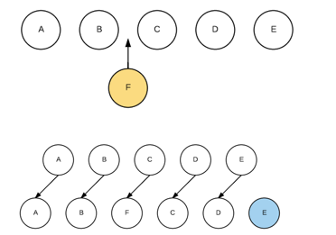

## 1.创建一个Vue应用

```js
var app = new Vue({
  el: '#app',
  data: {
    message: 'Hello Vue!'
  }
})
```

## 2. 基础语法

### 2.1Mustache

mustache语法中不仅仅可以直接写变量，也可以写简单的表达式

```vue
<body>
    <div id="app">
        <h2>{{message+name}}</h2>
        <h2>{{message}}{{name}}</h2>
        <h2>{{num*2}}</h2>
    </div>
</body>
<script>
const app = new Vue({
    el:"#app",
    data:{
        message:"你好",
        name:"小老弟",
        num:100
    }        
})
</script>
```

数据是响应式的

### 2.2 v-once

只渲染元素和组件**一次**。随后的重新渲染，元素/组件及其所有的子节点将被视为静态内容并跳过。这可以用于优化更新性能。

**就是说当数据变化时，组件不再重新渲染**

```vue
<!-- 单个元素 -->
<span v-once>This will never change: {{msg}}</span>
<!-- 有子元素 -->
<div v-once>
  <h1>comment</h1>
  <p>{{msg}}</p>
</div>
<!-- 组件 -->
<my-component v-once :comment="msg"></my-component>
<!-- `v-for` 指令-->
<ul>
  <li v-for="i in list" v-once>{{i}}</li>
</ul>
```

### 2.3 **v-html **和 v-text

**使用v-text会覆盖原有的内容，且不会解析HTML代码**

v-text作用和Mustache比较相似：都是用于将数据显示在界面中

如下输出的结果只有Hello

```vue
 <h2 v-text="message">,小老弟</h2> 
 
  data:{
        message:"Hello"
    }        
```

**使用v-html会覆盖原来的内容，可以解析HTML代码**

如下显示的是一个a链接

```vue
<h2 v-html = "url"></h2> 
data:{
	url:"<a href='http://www.baidu.com'>百度一下</a>"
}        	
```

**使用v-html 插入的内容 - 不会作为 Vue 模板进行编译**。

**例如下面的代码页面显示的结果是{{num}}而不是12，说明的v-html插入的内容不会作为 Vue 模板进行编译**

```vue
<div v-html="message"></div>

data() {
	return {
		message:"<h2>{{num}}</h2>",
		num:12
	}
},
```

### 2.4 **v-pre**

**v-pre用于跳过这个元素和它子元素的编译过程**

```vue
  <!-- 使用v-pre 不解析里面的东西  -->
  <h2 v-pre>{{message}}</h2>
```

### 2.5 **v-cloak**

   **在某些情况下我们浏览器可能会直接显示出未编译的Mustache标签**

   **v-cloak是为了防止页面js代码加载卡顿，或vue解析完成之前时显示{{message}}这个内容**

   **在vue解析之前div中有一个属性 v-cloak**

   **在vue解析之后，div中去掉v -cloak这个属性**

```css
[v-cloak] {
  display: none;
}
```

```html
<div v-cloak>
  {{ message }}
</div>
```

### 2.6 v-bind

#### 2.6.1 v-bind绑定class

**可以使用v-bind指令，动态绑定属性**

可以动态的绑定图片的链接src、网站的链接href、动态绑定一些类、样式等等

`v-bind:class` 指令也可以与普通的 class attribute 共存

```vue

<h2><a :href="url">百度</a></h2>
```

**对象语法**

对象语法的含义是:class后面跟的是一个对象。

```vue
用法一：直接通过{}绑定一个类
<h2 :class="{'active': isActive}">Hello World</h2>

用法二：也可以通过判断，传入多个值
<h2 :class="{'active': isActive, 'line': isLine}">Hello World</h2>

用法三：和普通的类同时存在，并不冲突
注：如果isActive和isLine都为true，那么会有title/active/line三个类
<h2 class="title" :class="{'active': isActive, 'line': isLine}">Hello World</h2>

用法四：如果过于复杂，可以放在一个methods或者computed中
注：classes是一个计算属性
<h2 class="title" :class="classes">Hello World</h2>

```

**数组语法**

我们可以把一个数组传给 `v-bind:class`，以应用一个 class 列表：

```vue
用法一：直接通过[]绑定一个类
<h2 :class="['active']">Hello World</h2>

用法二：也可以传入多个值
<h2 :class=“[‘active’, 'line']">Hello World</h2>

用法三：和普通的类同时存在，并不冲突
注：会有title/active/line三个类                             
<h2 class="title" :class=“[‘active’, 'line']">Hello World</h2>

```

**用在组件上**

**当在一个自定义组件上使用 v-bind 绑定class 时，这些 class 将被添加到该组件的根元素上面。这个元素上已经存在的 class 不会被覆盖。**

例如，如果你声明了这个组件：

```vue
Vue.component('my-component', {
  template: '<p class="foo bar">Hi</p>'
})
```

然后在使用它的时候添加一些 class：

```vue
<my-component class="baz boo"></my-component>
```

HTML 将被渲染为：

```
<p class="foo bar baz boo">Hi</p>
```

#### 2.6.2 v-bind绑定style

可以利用v-bind:style来绑定一些CSS内联样式。

CSS property 名可以用驼峰式 (fontSize) 或短横线分隔 (‘font-size’，记得用引号括起来) 来命名：

```vue
 <div :style="{'font-size': '50px'}">666</div>
效果一样
 <div :style="{fontSize: '50px'}">666</div>
```

**和绑定class一样也有对象绑定和数组绑定**

### 2.7 v-on

绑定事件监听器。事件类型由参数指定。表达式可以是一个方法的名字或一个内联语句，如果没有修饰符也可以省略。

用在普通元素上时，只能监听[**原生 DOM 事件**](https://developer.mozilla.org/zh-CN/docs/Web/Events)。用在自定义元素组件上时，也可以监听子组件触发的**自定义事件**。

#### 2.7.1 v-on参数

当通过methods中定义方法，以供@click调用时，需要**注意参数问题**：

**情况一：如果该方法不需要额外参数，那么方法后的()可以不添加。**

**但是注意：如果方法本身中有一个参数，那么会默认将原生事件event参数传递进去**

```vue
 <button @click="btn">点击</button>
```

```vue
 methods: {
            btn(event){
                console.log(event);
            }
        },
```

此时就会打印event


**情况二：如果需要同时传入某个参数，同时需要event时，可以通过$event传入事件。**

```vue
  <button @click="btn(20,$event)">点击</button>
```

#### 2.7.2 v-on的修饰符

- `.stop` - 调用 `event.stopPropagation()`。也就是阻止冒泡
- `.prevent` - 调用 `event.preventDefault()`。也就是阻止默认行为，表单中的提交
- `.capture` - 添加事件侦听器时使用 capture 模式。
- `.self` - 只当事件是从侦听器绑定的元素本身触发时才触发回调。
- `.{keyCode | keyAlias}` - 只当事件是从特定键触发时才触发回调。
- `.native` - **监听组件根元素的原生事件  ，重点**。
- `.once` - 只触发一次回调。
- `.left` - (2.2.0) 只当点击鼠标左键时触发。
- `.right` - (2.2.0) 只当点击鼠标右键时触发。
- `.middle` - (2.2.0) 只当点击鼠标中键时触发。
- `.passive` - (2.3.0) 以 `{ passive: true }` 模式添加侦听器

### 2.8 v-if、v-else-if、v-else

这三个指令与JavaScript的条件语句if、else、else if类似。

**Vue的条件指令可以根据表达式的值在DOM中渲染或销毁元素或组件**

```vue
  		<h2 v-if="num>90">优秀</h2>
        <h2 v-else-if="num>=80">良好</h2>
        <h2 v-else-if="num>=60">及格</h2>
        <h2 v-else>废物</h2>
```

v-if的原理：

​	v-if后面的条件为false时，对应的元素以及其子元素不会渲染。

​	也就是根本没有不会有对应的标签出现在DOM中。


当制作一个这个小案例时候，有一个问题

**如果我们在有输入内容的情况下，切换了类型，我们会发现文字依然显示之前的输入的内容。**

**问题解答：**

​	**这是因为Vue在进行DOM渲染时，出于性能考虑，会尽可能的复用已经存在的元素，而不是重新创建新的元素。在上面的案例中，Vue内部会发现原来的input元素不再使用，直接作为else中的input来使用了**。

**解决方法：**

​	**给每一个input添加对应的key，且保证key不同**

### **2.9 v-show和v-if的区别**

v-show用法和v-if的用法一致。

**两者的区别：**

**1.当v-show为false时候，相当于添加了display：none，而v-if为false时，不会有对应的元素在dom中**

**2.所以当显示隐藏很频繁时使用v-show，不频繁时可以使用v-if**

### 2.10 v-for

当我们有一组数据需要进行渲染时，我们就可以使用v-for来完成。

```vue
<li v-for="(item, index) in items">
```

其中的index就代表了取出的item在原数组的索引值。

**v-for也可以遍历对象**

可以提供第二个的参数为 property 名称 (也就是键名)：

```vue
<div v-for="(value, name) in object">
  {{ name }}: {{ value }}
</div>
```

```vue
new Vue({
  el: '#v-for-object',
  data: {
    object: {
      title: 'How to do lists in Vue',
      author: 'Jane Doe',
      publishedAt: '2016-04-10'
    }
  }
})
```

输出的结果为下图


还可以用第三个参数作为索引：

```vue
<div v-for="(value, name, index) in object">
  {{ index }}. {{ name }}: {{ value }}
</div>
```

输出结果为下图


### 2.11 v-for绑定和非绑定key的区别

先引入一个概念：diff算法。

> vue会先把元素放到虚拟dom里，等代码段执行完（比如一个for循环执行完），vue会对比虚拟dom和真实dom的差别，然后只把不同的地方渲染到页面，这样就提高了性能。

我们希望可以在B和C之间加一个F，Diff算法默认执行起来是这样的。

即**把C更新成F，D更新成C，E更新成D，最后再插入E**，是不是很没有效率？



如果不使用 key，Vue 会使用一种最大限度减少动态元素并且尽可能的尝试就地修改/复用相同类型元素的算法。而使用 key 时，它会基于 key 的变化重新排列元素顺序，并且会移除 key 不存在的元素。

所以我们需要使用key来给每个节点做一个唯一标识

Diff算法就可以正确的识别此节点

所以一句话，**key的作用主要是为了高效的更新虚拟DOM。**


### 2.12 数组更新检测

Vue 将被侦听的数组的变更方法进行了包裹，所以它们也将会触发视图更新。这些被包裹过的方法包括：

- `push()` 在数组末尾添加元素
- `pop()` 删除数组最后一个元素
- `shift()`删除数组中第一个元素
- `unshift()`在数组头部添加元素
- `splice()` 可以删除，添加，替换数组
- `sort()` 用于对数组的元素进行排序。<a href="https://www.w3school.com.cn/jsref/jsref_sort.asp">具体用法</a>
- `reverse()` 翻转数组

[替换数组](https://cn.vuejs.org/v2/guide/list.html#替换数组)

变更方法，顾名思义，会变更调用了这些方法的原始数组。相比之下，也有非变更方法，例如 `filter()`、`concat()` 和 `slice()`。它们不会变更原始数组，而**总是返回一个新数组**。当使用非变更方法时，可以用新数组替换旧数组：

你可能认为这将导致 Vue 丢弃现有 DOM 并重新渲染整个列表。幸运的是，事实并非如此。Vue 为了使得 DOM 元素得到最大范围的重用而实现了一些智能的启发式方法，所以用一个含有相同元素的数组去替换原来的数组是非常高效的操作。

### 2.13 [检测变化的注意事项](https://cn.vuejs.org/v2/guide/reactivity.html#检测变化的注意事项)

由于 JavaScript 的限制，Vue **不能检测**数组和对象的变化。尽管如此我们还是有一些办法来回避这些限制并保证它们的响应性。

对于对象：

```js
var vm = new Vue({
  data:{
    a:1
  }
})
// `vm.a` 是响应式的
vm.b = 2
// `vm.b` 是非响应式的
```

对于已经创建的实例，Vue 不允许动态添加根级别的响应式 property。但是，可以使用 `Vue.set(object, propertyName, value)` 方法向嵌套对象添加响应式 property

对于数组：

**vue.set(要修改的数组,要修改元素的索引值,修改为什么)**

对于对象：

**vue.set(要修改对象,要修改属性名,修改为什么)一下两种写法**

```js
Vue.set(this.obj, 'b', 2)
```

```
this.$set(this.obj,'b',2)
```

### 2.14 [v-model](https://cn.vuejs.org/v2/guide/forms.html)

**Vue中使用v-model指令来实现表单元素和数据的双向绑定。**

```vue
<input type="text" v-model = "message">
<h2>{{message}}</h2>
```

**v-model其实是一个语法糖，它的背后本质上是包含两个操作：**

1. 使用v-bind绑定一个value属性
2. 使用v-on给当前元素绑定input事件

```html
 <input type="text" :value="message" @input="change">
 <!-- input事件用来监听事件有没有输入东西的，用户在input输入时侯触发 -->
 <h2>{{message}}</h2>
```

```js
const app = new Vue({
        el:"#app",
        data:{
            message:"9999"
        },
        methods: {
            change(event){
                this.message=event.target.value
                console.log(event);
            }
        }
    })
```

#### v-model结合radio

```html
<div id="app">
        <!-- 当v-model绑定同一个变量他们也可以互斥，可以不要name属性 -->
        <label for="man">
            <input type="radio" id="man" value="男" v-model="sex">男
        </label>
        <label for="women">
            <input type="radio" id="women" value="女" v-model="sex">女
        </label>
        <h2>你的性别是：{{sex}}</h2>
    </div>
```

```js
  const app = new Vue({
        el:"#app",
        data:{
            sex:'男' // 这里写男默认值就是男
        },
        
    })
```

#### v-model结合checkbox

单个勾选框

```html
<label for="argee">
	<input type="checkbox" name="" id="argee" v-model="isArgee">同意协议
</label>
```

```js
const app = new Vue({
        el:"#app",
        data:{
            isArgee:false
        },        
    })
```

多个勾选框

```html
<input type="checkbox" name="favorite" value="前端" v-model="arr">前端
<input type="checkbox" name="favorite" value="后端" v-model="arr">后端
<input type="checkbox" name="favorite" value="项目经理" v-model="arr">项目经理
<h2 v-for="item in arr">{{item}}</h2>
```

```js
const app = new Vue({
        el:"#app",
        data:{
            arr:[],
        }, 
    })
```

#### v-model结合select

单选：

```html
 <select name="abc" id=""v-model="color">
            <option value="pink" >pink</option>
            <option value="black" >black</option>
            <option value="white" >white</option>
            <option value="green" >green</option>
 </select>
<h1>{{color}}</h1>
```

```js
const app = new Vue({
        el:"#app",
        data:{
            color:"pink",
        },        
    })
```

多选：

```html
 <select name="abc" id=""v-model="colors" multiple>
            <option value="pink" >pink</option>
            <option value="black" >black</option>
            <option value="white" >white</option>
            <option value="green" >green</option>
        </select>
        <h1>{{colors}}</h1>
```

```js
const app = new Vue({
        el:"#app",
        data:{
            colors:[]
        },      
    })
```

#### 修饰符

`.lazy`

默认情况下，v-model默认是在input事件中同步输入框的数据的。也就是说，一旦有数据发生改变对应的data中的数据就会自动发生改变。**lazy修饰符可以让数据在失去焦点或者回车时才会更新**

`.number`

默认情况下，在输入框中无论我们输入的是字母还是数字，都会被当做字符串类型进行处理。**number修饰符可以让在输入框中输入的内容自动转成数字类型**

`.trim`

如果输入的内容首尾有很多空格，通常我们希望将其去除,**trim修饰符可以过滤内容左右两边的空格**

### 2.15 v-if和v-for不能一起混用

**永远不要把 `v-if` 和 `v-for` 同时用在同一个元素上。因为当 Vue 处理指令时，`v-for` 比 `v-if` 具有更高的优先级：**

有如下需求：在一个列表中渲染出所有`user`属性`isActive`为`true`的名字

这是数据

```json
     users: [{
                        name: "张三",
                        isActive: true,
                        id: 1
                    },
                    {
                        name: "张二",
                        isActive: false,
                        id: 2
                    },
                    {
                        name: "张一",
                        isActive: true,
                        id: 3
                    },
                ],
```

为了过滤一个列表中的项目 (比如 `v-for="user in users" v-if="user.isActive"`)。在这种情形下，请将 `users` 替换为一个计算属性 ，让其返回过滤后的列表。

```js
     computed: {
            activeUsers(){
                const newUsers = this.users.filter( 
                    (user)=>{
                        return user.isActive == true
                    }
                )
                return newUsers
            }
        },
```

```html
  		<ul>
            <li v-for="item in activeUsers" :key="item.id">
                {{ item.name }}
            </li>
        </ul>
```


## 3.组件开发

### 3.1注册组件的基本步骤

**创建组件构造器**

```vue
<template>
  <div>
      我是组件
  </div>
</template>

<script>
export default {
    name:"组件"
}
</script>
<style>
</style>
```

**引用注册组件**

```js
import 组件名  from '组件路径'
export default {
    components:{组件名}
}
```

**使用组件**

```vue
<template>
  <组件名></组件名>
</template>
```


**1.Vue.extend()：**

- 调用Vue.extend()创建的是一个组件构造器。 

- 通常在创建组件构造器时，传入template代表我们自定义组件的模板。

- 该模板就是在使用到组件的地方，要显示的HTML代码。

**2.Vue.component()：**

- 调用Vue.component()是将刚才的组件构造器注册为一个组件，并且给它起一个组件的标签名称。

- 所以需要传递两个参数：1、注册组件的标签名 2、组件构造器

**3.组件必须挂载在某个Vue实例下，否则它不会生效**

- 我们来看下面我使用了三次 < my-cpn>< /my-cpn>

- 而第三次其实并没有生效：


### 3.2 为什么data在组件中必须是一个函数呢?

**原因是在于Vue让每个组件对象都返回一个新的对象，因为如果是同一个对象的，组件在多次使用后会相互影响。**

如果没有返回新的对象，所有组件公用的一个对象，会互相影响。

### 3.3 父级向子级传递数据

#### 3.3.1props 的基本用法

在父组件中

```vue
<template>
  <son :number="number"></son>
</template>
```

在子组件中

```vue
 props: {
    formItem: {
      type: Number, //对传入数据的类型进行验证
      default: ""， //没传数据时候的默认值
    },
  }
```

#### 3.3.2[单向数据流](https://cn.vuejs.org/v2/guide/components-props.html#单向数据流)

所有的 prop 都使得其父子 prop 之间形成了一个**单向下行绑定**：父级 prop 的更新会向下流动到子组件中，但是反过来则不行。这样会防止从子组件意外变更父级组件的状态，从而导致你的应用的数据流向难以理解。

#### 3.3.3validator 自定义验证函数

```js
  propF: {
      validator: function (value) {
        // 这个值必须匹配下列字符串中的一个
        return ['success', 'warning', 'danger'].indexOf(value) !== -1
      }
    }
```

#### 3.3.4 provide和 inject

`provide` 和 `inject` 主要在开发高阶插件/组件库时使用。并不推荐用于普通应用程序代码中。

提示：`provide` 和 `inject` 绑定并不是可响应的。这是刻意为之的。然而，如果你传入了一个可监听的对象，那么其对象的 property 还是可响应的。

```
// 父组件中
provide:{
	message:'你好'
}
// 子组件中
inject:['message']
```


### 3.4**子级向父级传递**

**子级向父级传递通过自定义事件**

自定义事件的流程：

在子组件中，通过$emit()来触发事件。

```js
this.$emit("事件名"，传递的参数)
```

在父组件中，通过v-on来监听子组件事件。

```
<son @"事件名"="函数名"></son>
```

```
 methods: {
      函数名(value){
      	处理的代码 可将数据存储起来
      }  
    },
```

#### 3.4.1 [`.sync` 修饰符](https://cn.vuejs.org/v2/guide/components-custom-events.html#sync-修饰符)

vue 修饰符sync的功能是：当一个子组件改变了一个 prop 的值时，这个变化也会同步到父组件中所绑定。

下面这代码是为了修改父组件中，doc.title中的值。

```vue
// 父组件
<text-document :title.sync="doc.title"></text-document>

//子组件
this.$emit('update:title', newTitle)
```

### 3.5 **父子组件的访问方式：** **$children**

`this.$children`是一个数组类型，它包含所有子组件对象。

$children的缺陷：

通过$children访问子组件时，是一个数组类型，访问其中的子组件必须通过索引值。

但是当子组件过多，我们需要拿到其中一个时，往往不能确定它的索引值，甚至还可能会发生变化。

### 3.6 **父子组件的访问方式：** **$refs**

$refs的使用：

- $refs和ref指令通常是一起使用的。

- 首先，我们通过ref给某一个子组件绑定一个特定的ID。

- 其次，通过this.$refs.ID就可以访问到该组件了。

```vue
 <son ref="son"></son>
```

```js
this.$refs.son
```

可以访问到对应的子组件，也可以调用他的方法，但是要保证子组件已经被加载完成

### 3.7 **父子组件的访问方式：** **$parent**

如果我们想在子组件中直接访问父组件，可以通过$parent

**注意：**

**节制地使用 `$parent` 和 `$children` - 它们的主要目的是作为访问组件的应急方法。更推荐用 props 和 events 实现父子组件通信**

### **3.8 非父子组件通信**

1.**中央事件总线**

2.**使用vuex**

### 3.9 插槽 slot

< slot>中的内容表示，如果没有在该组件中插入任何其他内容，就默认显示该内容


#### 3.9.1**具名插槽**slot

有时我们需要多个插槽。

```vue
<div class="container">
  <header>
    <!-- 我们希望把页头放这里 -->
  </header>
  <main>
    <!-- 我们希望把主要内容放这里 -->
  </main>
  <footer>
    <!-- 我们希望把页脚放这里 -->
  </footer>
</div>
```


```vue
<div class="container">
  <header>
    <slot name="header"></slot>
  </header>
  <main>
    <slot></slot>
  </main>
  <footer>
    <slot name="footer"></slot>
  </footer>
</div>
```

在向具名插槽提供内容的时候，我们可以在一个 `<template>` 元素上使用 `v-slot` 指令，并以 `v-slot` 的参数的形式提供其名称：

```vue
<base-layout>
  <template v-slot:header>
    <h1>Here might be a page title</h1>
  </template>

  <p>A paragraph for the main content.</p>
  <p>And another one.</p>

  <template v-slot:footer>
    <p>Here's some contact info</p>
  </template>
</base-layout>
```

现在 `<template>` 元素中的所有内容都将会被传入相应的插槽。任何没有被包裹在带有 `v-slot` 的 `<template>` 中的内容都会被视为默认插槽的内容。

#### 3.9.2 作用域插槽

父组件替换插槽的标签，但是内容由子组件来提供。就是要能获取子组件中的数据

子组件中

```html
 <slot :name="name" :data="data"></slot>
//这行代码的意思是，把data数据传出去给父组件接收
```

父组件中

```html
   <div v-slot:name="slotData"></div>
// sloatData.data就是接收子组件中的data属性的
```

## 4.计算属性computed

```js
computed: {
	totalPrice(){
		return .....
	}
}
```

### 4.1[计算属性缓存 vs 方法](https://cn.vuejs.org/v2/guide/computed.html#计算属性缓存-vs-方法)

**方法和计算属性都能达成同样的效果，但是我们为何要使用计算属性呢？**

两种方式的最终结果确实是完全相同的。然而，不同的是**计算属性是基于它们的响应式依赖进行缓存的**。只在相关响应式依赖发生改变时它们才会重新求值。这就意味着只要 `message` 还没有发生改变，多次访问 `reversedMessage` 计算属性会立即返回之前的计算结果，而不必再次执行函数。

用人话来说，如果用方法每次访问都会执行一遍方法，用计算属性则会将结果缓存起来，只有当值变了的时候才会重新计算。

### 4.2 **计算属性的**setter和getter

每个计算属性都包含一个getter和一个setter，但是一般情况下计算属性不使用set方法，他是一个**只读**属性

## 5.Vue CLI 脚手架

### 5.1目录结构


### 5.2 自定义配置--起别名

首先找到`vue-config.js`文件，没有就创建一个，在里面配置。

```js
module.exports = {
	 configureWebpack: (config) => {
    config.resolve = { // 配置解析别名
      extensions: ['.js', '.json', '.vue'],  // 自动添加文件名后缀
      alias: {
        '@': path.resolve(__dirname, './src'),
        'components' : path.resolve(__dirname, './src/components')
      }
    }
  },
}
```


## 6.watch [侦听器](https://cn.vuejs.org/v2/guide/computed.html#侦听器)

**watch的作用可以监控一个值的变换，并调用因为变化需要执行的方法。可以通过watch动态改变关联的状态**

用法：

```js
watch:{
	a:{
		handler(newValue,oldValue){
			// 监听到a变化后需要做的操作
		}
         immediate: true //该回调在侦听开始之前被调用
         deep: true //开启深度检测，能监听到数组，和对象的变化
	}
}
```

`immediate`,表示该回调在侦听开始之前是否被调用，为布尔值。

## 7.Vue事件总线（EventBus）

在main.js文件中

```js
//添加事件总线对象
Vue.prototype.$bus = new Vue()
```

**发送的数据可以是函数**

```js
$bus.$emit("aMsg", '来自A页面的消息');
```

**接收数据**

```js
  this.$bus.$on("aMsg", (msg) => {
      // A发送来的消息
      this.msg = msg;
    });    
```

大家都知道vue是单页应用，如果你在某一个页面刷新了之后，与之相关的`EventBus`会被移除，这样就导致业务走不下去。还要就是如果业务有反复操作的页面，`EventBus` 在监听的时候就会触发很多次，也是一个非常大的隐患

**想移除事件的监听，可以像下面这样操作：**

```js
import { 
  eventBus 
} from './event-bus.js'
$bus.$off('aMsg', {})
```

在这个特定的总线中使用两个方法 `$on` 和 `$emit` 。一个用于创建发出的事件，它就是 `$emit` ；另一个用于订阅 `$on` 

## 8.混入 (mixin) 

混入 (mixin) 提供了一种非常灵活的方式，来分发 Vue 组件中的可复用功能。一个混入对象可以包含任意组件选项。当组件使用混入对象时，所有混入对象的选项将被“混合”进入该组件本身的选项。

```js
// 定义一个混入对象
var myMixin = {
  created: function () {
    this.hello()
  },
  methods: {
    hello: function () {
      console.log('hello from mixin!')
    }
  }
}

// 定义一个使用混入对象的组件
var Component = Vue.extend({
  mixins: [myMixin]
})

var component = new Component() // => "hello from mixin!"
```

同名钩子函数将合并为一个数组，因此都将被调用。另外，混入对象的钩子将在组件自身钩子**之前**调用。

## 9. 前端渲染和后端渲染

### 9.1后端渲染

**页面直接在后端渲染，并且直接给前端的。**

后端渲染是通过后端语言（Java） +HTML+CSS ,java代码的作用是读取数据库的数据，并将他动态的放在页面中，然后直接将后端渲染好的网页传给浏览器。传入的只有HTML+CSS。当有多个URL，就会有多个jsp页面与之对应，就形成了路由。

引出`后端路由`这一概念.

后端路由：后端处理URL和页面之间的关系。

**后端路由的缺点：**

- 一种情况是整个页面的模块由后端人员来编写和维护
- 前端人员要开发页面，需要通过PHP和Java等语言来编写页面代码
- HTML代码和数据以及对应的逻辑会混在一起，编写维护都很糟糕。

### 9.2 前端渲染

前后端分离阶段：

后端只负责提供数据，不负责任何阶段的内容。前端通过Ajax获取数据, 并且可以通过JavaScript将数据渲染到页面中.

这样做最大的优点就是前后端责任的清晰, 后端专注于数据上, 前端专注于交互和可视化上.


静态资源服务器中存放好几套HTML+css+js,对应不同的url。

**前端渲染：**

浏览器中显示的网页的大部分内容，都是由前端写的js代码在浏览器中执行，最后渲染出来的网页。

### 9.3 spa单页面富应用阶段

其实SPA最主要的特点就是在前后端分离的基础上加了一层前端路由.

也就是前端来维护一套路由规则.

**整个网站只有一个html页面**

相当于在静态资源服务器中，只存有一套html+css+js,当url变化时候，加载当前url需要的html+css+js，从静态资源服务器中抽离出来。这个操作就需要前端路由来进行支持了。

**前端路由：**

用来映射浏览器的url和那一套html+css+js资源里面，要渲染的哪个组件。

**前端路由的和核心改变URL，但是页面不进行整体的刷新。**


## 10**vue-router**

### 10.1 hash模式和history模式

这两个模式改变url页面都不会刷新。

hash 的传参是基于 url 的，如果要传递复杂的数据，会有体积的限制，而 history 模式不仅可以在url里放参数，还可以将数据存放在一个特定的对象中。

#### 10.1.1URL的hash

URL的hash也就是锚点(#), 本质上是改变window.location的href属性.

我们可以通过直接赋值location.hash来改变href, 但是页面不发生刷新

#### 10.1.2 history模式

history接口是HTML5新增的, 它有五种模式改变URL而不刷新页面

- history.pushState() 相当于把这些url压入到一个栈结构里面的。
- history.replaceState() 这是直接替换所以不能返回。
- history.go()
- history.back() 等价于 history.go(-1)  ，history.forward() 则等价于 history.go(1)

### 10.2 使用vue-router的步骤

第一步: 创建路由组件

第二步: 配置路由映射: 组件和路径映射关系

第三步: 使用路由: 通过<router-link>和<router-view>


在main.js文件中引入router


配置组件和路径的映射关系

```js
const router = new VueRouter({
  routes: [
    {
      path: '/user/:userId',
      name: 'user',
      component: User
    }
  ]
})
```


### 10.3 路由使用HTML5的history模式。

```js
const router = new VueRouter({
  routes,
  mode:history  
});
```

### 10.4 路由的重定向 redirect

重定向也是通过 `routes` 配置来完成，下面例子是从 `/a` 重定向到 `/b`：

```js
const router = new VueRouter({
  routes: [
    { path: '/a', redirect: '/b' }
  ]
})
```

#### 10.5别名 alias

**`/a` 的别名是 `/b`，意味着，当用户访问 `/b` 时，URL 会保持为 `/b`，但是路由匹配则为 `/a`，就像用户访问 `/a` 一样。**

```js
const router = new VueRouter({
  routes: [
    { path: '/a', component: A, alias: '/b' }
  ]
})
```

### 10.6 **router-link**

`<router-link>`中的属性: 

- to, 用于指定跳转的路径.
- tag可以指定`<router-link>`之后渲染成什么组件, 比如下面的代码会被渲染成一个`<li>`元素, 而不是`<a>`

```html
<router-link to='/home' tag='li'>
```

- active-class: 当`<router-link>`对应的路由匹配成功时, 会自动给当前元素设置一个router-link-active的class, 设置active-class可以修改默认的名称.例如可完成如下需求，点击哪个，就让哪个字体变色。

### 10.7 通过代码进行路由跳转

```js
this.$router.push('/home') //push->pushState
this.$router.replace('/home') //replace->replaceState
```

### 10.8 动态路由

在某些情况下，一个页面的path路径可能是不确定的，比如我们进入用户界面时，希望是如下的路径：

/user/aaaa或/user/bbbb

除了有前面的/user之外，后面还跟上了用户的ID

这种path和Component的匹配关系，我们称之为动态路由(也是路由传递数据的一种方式)。

```js
routes: [
    // 动态路径参数 以冒号开头
    { path: '/user/:id', component: User }
  ]
```

```js
<router-link to="/user/123">用户</router-link>
```

```html
<div>
	<h2>{{$route.prams.id}}</h2>
</div>
```


### 10.9路由的懒加载

**官方给的解释:**

当打包构建应用时，Javascript 包会变得非常大，影响页面加载。

如果我们能把不同路由对应的组件分割成不同的代码块，然后当路由被访问的时候才加载对应组件，这样就更加高效了

**官方在说什么呢?**

首先, 我们知道路由中通常会定义很多不同的页面.

这个页面最后被打包在哪里呢? 一般情况下, 是放在一个js文件中.

但是, 页面这么多放在一个js文件中, 必然会造成这个页面非常的大.

如果我们一次性从服务器请求下来这个页面, 可能需要花费一定的时间, 甚至用户的电脑上还出现了短暂空白的情况.

**如何避免这种情况呢? 使用路由懒加载就可以了.**

**路由懒加载做了什么?**

路由懒加载的主要作用就是将路由对应的组件打包成一个个的js代码块.

只有在这个路由被访问到的时候, 才加载对应的组件。

**路由懒加载和没使用路由懒加载的区别：**


没使用懒加载，所有的业务逻辑打包在一个js文件中。

### 10.10路由嵌套

嵌套路由是一个很常见的功能

比如在home页面中, 我们希望通过/home/news和/home/message访问一些内容.

一个路径映射一个组件, 访问这两个路径也会分别渲染两个组件.

**实现嵌套路由有两个步骤:**

创建对应的子组件, 并且在路由映射中配置对应的子路由.

在组件内部使用`<router-view>`标签.

```js
 routes: [
    { path: '/user/:id', component: User,
      children: [
        {
          // 当 /user/:id/profile 匹配成功，
          // UserProfile 会被渲染在 User 的 <router-view> 中
          path: 'profile',
          component: UserProfile
        },
        {
          // 当 /user/:id/posts 匹配成功
          // UserPosts 会被渲染在 User 的 <router-view> 中
          path: 'posts',
          component: UserPosts
        }
      ]
```

### 10.11参数传递

传递参数主要有两种类型: `params`和`query`

**params的类型:**

配置路由格式: /router/:id

传递的方式: 在path后面跟上对应的值

传递后形成的路径: /router/123, /router/abc

**query的类型:**

配置路由格式: /router, 也就是普通配置

传递的方式: 对象中使用query的key作为传递方式

传递后形成的路径: /router?id=123, /router?id=abc

**传递参数的方式一：**


**传递参数的方式二：**


#### 10.11.1获取参数

获取参数通过$route对象获取的.

在使用了 vue-router 的应用中，路由对象会被注入每个组件中，赋值为 this.$route ，并且当路由切换时，路由对象会被更新。

通过$route获取传递的信息如下:


### 10.12 $route和$router是有区别的

**$route和$router是有区别的**

$router为VueRouter实例，想要导航到不同URL，则使用$router.push方法

$route为当前router跳转对象里面可以获取name、path、query、params等 

### 10.13导航守卫

每个守卫方法接收三个参数：

- **`to: Route`**: 即将要进入的目标 [路由对象](https://router.vuejs.org/zh/api/#路由对象)
- **`from: Route`**: 当前导航正要离开的路由
- **`next: Function`**: 一定要调用该方法来 **resolve** 这个钩子。执行效果依赖 `next` 方法的调用参数。
  - **`next()`**: 进行管道中的下一个钩子。如果全部钩子执行完了，则导航的状态就是 **confirmed** (确认的)。

```js
router.beforeEach((to,from,next)=>{
	next()
  })
```

`router.beforeEach`是一个前置钩子，在路由跳转之前进行回调。

`router.afterEach`是一个后置钩子，在路由跳转后进行回调

```
router.afterEach((to, from) => {
  // ...
})
```

## 11 vuex

Vuex 是一个专为 Vue.js 应用程序开发的**状态管理模式**。

它采用 集中式存储管理 应用的所有组件的状态，并以相应的规则保证状态以一种可预测的方式发生变化。

**就是可以理解为多个组件要共享变量，需要一个地方来存储这些变量，这时候就需要使用Vuex来对这些变量进行管理。**

### 11.1vuex的创建

```js
import Vue from 'vue'
import Vuex from 'vuex'
// 1.安装插件
Vue.use(Vuex)
// 2.创建对象
const store = new Vuex.Store({
  state: {},
  mutations: {},
    actions:{},
    getters:{},
    modules:{},
})
// 3.导出store共享
export default store
```


分析上图，在vuex中，不能在组件内直接修改state的数据，**只能mutations里面修改state**。按照这个流程修改能在Devtools插件中跟踪到是谁该了这个数据。

可以直接通过Mutations修改state，当有异步操作的时候一定要在Actions里面操作，否则Devtools插件也跟踪不到。（例如需要发送网络请求）

### 11.2通过mutations修改state数据

```js
const store = new Vuex.Store({
  state: {
    count: 0
  },
  mutations: {
    increment (state) {
      state.count++
    }
  }
})
```

通过 `store.commit` 方法触发状态变更：

```js
store.commit('increment')
```

### 11.2单一状态树

意思就是将所有数据放到一个store对象里面。

### 11.3 getters的使用

比如有如下场景需要使用`getters`

在`state`中有个一个数据`conter`,我们在组件中想要使用`conter`的平方，这时候我们就需要使用`getters`了

```js
const store = new Vuex.Store({
  state: {
  	counter:1000
  },
    getters:{
    	powerCounter(state) {
    		return state.counter*state.counter
    	}
    },
})
```

使用时：

```
<h2>{{$store.getters.powerCounter}}</h2>
```

### 11.4 Mutation状态更新

Vuex的store状态的更新唯一方式：**提交Mutation**

#### 11.4.1 普通的提交风格

```js
const store = new Vuex.Store({
  state: {
    count: 0
  },
  mutations: {
    increment (state，count) {
      state.count+=count
    }
  }
})
```

```js
this.store.commit('increment',5)
```

#### 11.4.2 特殊的提交风格 

```js
this.store.commit({
	type:'incrementCount',
	count:5
})
```

```js
const store = new Vuex.Store({
  state: {
    count: 0
  },
  mutations: {
    increment (state，payload) {
      state.count+=payload.count
    }
  }
})
```

### 11.5 Mutation响应规则

Vuex的store中的state是响应式的, 当state中的数据发生改变时, Vue组件会自动更新.

这就要求我们必须遵守一些Vuex对应的规则:

**提前在store中初始化好所需的属性.**

**当给state中的对象添加新属性时, 使用下面的方式:**

方式一: 使用Vue.set(obj, 'newProp', 123)

方式二: 用新对象给旧对象重新赋值

**一开始就定义好的属性**都会被加入到`vue`的响应式系统里面，响应式系统则会监听属性的变化，当属性发生变化时，就会通知界面中所有用到该属性的地方，让界面发生刷新。

例如有state中有一个对象

```js
info:{
	name:"zhangsan",
	age:15,
}
```

当我们通过`Mutation`修改`age`或`name`时是响应式的。

但是我们想给info添加一个address为洛杉矶

```js
info:{
	name:"zhangsan",
	age:15,
	address:"洛杉矶"
}
```

这个address不会加入到响应式系统中，界面不会刷新，因为他不是已经在store里面定义的了。

下面有一个解决方法：

```js
Vue.set(state.info,'address','洛杉矶')
```

如果想做到响应式的删除某个属性

```js
Vue.delete(state.info,'age')
```

### 11.6 Action

**当有异步操作时候，就需要用到`Action`,最简单的异步操作就是加一个定时器，当直接在`Mutation`中进行操作时候，会出现`devtools`跟踪不到数据变化的情况**。

使用实例：想要异步修改`state`中的`count`

```js
const store = new Vuex.Store({
  state: {
    count: 0
  },
  actions:{
  	aUpdate(context,payload) {
  		setTimeout(()=>{
  		context.commit('update')
  		},1000)
  	}
  }
  mutations: {
    update (state) {
      state.count++
    }
  }
})
```

```js
this.$store.dispatch('aUpdate','携带的信息')
```

通过promise，当里面完成时候向外面发送信息。

```js
const store = new Vuex.Store({
  state: {
    count: 0
  },
  actions:{
  	aUpdate(context,payload) {
  	return new Promise((resolve,reject)=>{
  			setTimeout(()=>{
  		context.commit('update')
  		resolve('完成了')
  		},1000)
  	}
  	})
  }
  mutations: {
    update (state) {
      state.count++
    }
  }
})
```

```js
this.$store.dispatch('aUpdate','携带的信息').then(res=>{
	console.log(res)  //完成了
}) 
```

### 11.7Module


```js
const moduleA = {
  state: () => ({ ... }),
  mutations: { ... },
  actions: { ... },
  getters: { ... }
}

const moduleB = {
  state: () => ({ ... }),
  mutations: { ... },
  actions: { ... }
}

const store = new Vuex.Store({
  modules: {
    a: moduleA,
    b: moduleB
  }
})

store.state.a // -> moduleA 的状态
store.state.b // -> moduleB 的状态
store.commit('方法名')
```

为什么调用数据的时候是`store.state.a`,因为实际上`module`被放到了`state`里面了。

**但是调用mutations方法时候还是直接store.commit('方法名')**，和直接在外面定义的没有区别。

#### 11.7.1 在模块中使用getters

```js
getters(state,getters,rootState){
	// state 是模块中的state
    // getters 是模块中的getters
    // rootState 是根下的state
}
```

### 11.7.2 在模块中使用commit

```js
actions:{
	aUpdate(context) {
		context.commit('') //只能提交模块中的mutations
	}
}
```

模块中`actions`中的`context`包含这些东西：

