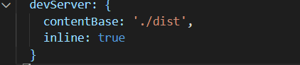

## webpack安装

**本地安装，在项目里面安装**

现在一般是webpack 4+ 版本，所以还需要安装下面那个脚手架

```bash
npm install --save-dev webpack
```

```bash
npm install --save-dev webpack-cli
```

**全局安装**

```bash
npm install --global webpack
```

## webpack打包的命令

开发环境下的打包

```
 webpack ./src/main.js -o ./dist/bundle.js --mode=development
```

生产环境下的打包

```
 webpack ./src/main.js -o ./dist/bundle_production.js --mode=production
```

 webpack默认下可以处理js文件。json文件

 **生产环境比开发环境多了压缩代码和代码混淆**

## 建一个webpack.config.js


**可以直接命令行输入webpack打包**


可以在package.json的scripts中定义自己的执行脚本。

```
npm run build
```

## **loader**

### **css-loader**

https://www.webpackjs.com/loaders/css-loader/

使用css-loader还需要一个style-loader帮助我们处理。

### style-loader

https://www.webpackjs.com/loaders/style-loader/


在module 的rules下面配置

### **less**-loader

https://www.webpackjs.com/loaders/less-loader/

```js
 rules: [{
            test: /\.less$/,
            use: [{
                loader: "style-loader"
            }, {
                loader: "css-loader"
            }, {
                loader: "less-loader", options: {
                    strictMath: true,
                    noIeCompat: true
                }
            }]
```

### **小图片文件处理** **–** **url-loader**

```
 {
        test: /\.(png|jpg|gif|jpeg)$/,
        use: [
          {
            loader: 'url-loader',
            options: {
              // 当加载的图片, 小于limit时, 会将图片编译成base64字符串形式.
              // 当加载的图片, 大于limit时, 需要使用file-loader模块进行加载.
              limit: 13000,
              name: 'img/[name].[hash:8].[ext]'
            },
```

图片处理，我们使用url-loader来处理，依然先安装url-loader

https://www.webpackjs.com/loaders/url-loader/

### **大图片文件处理** **–** **file-loader**

https://www.webpackjs.com/loaders/file-loader/

直接安装file-loader就行了

打包之后不显示图片的原因是：

默认情况下，webpack会将生成的路径直接返回给使用者

但是，我们整个程序是打包在dist文件夹下的，所以这里我们需要在路径下再添加一个dist/


### ES6语法处理

npm install --save-dev babel-loader@7 babel-core babel-preset-es2015

```js
  {
        test: /\.js$/,
        // exclude: 排除
        // include: 包含
        exclude: /(node_modules|bower_components)/,
        use: {
          loader: 'babel-loader',
          options: {
            presets: ['es2015']
          }
        }
      },
```


https://www.webpackjs.com/loaders/babel-loader/

### .vue文件封装处理

安装vue-loader和vue-template-compiler

```
npm install vue-loader vue-template-compiler --save-dev
```

修改webpack.config.js的配置文件：

```js
{
        test: /\.vue$/,
        use: ['vue-loader']
      }
```

报错：webpack vue-loader was used without the corresponding plugin. Make sure to include VueLoaderPlugin

Vue Loader v15现在需要随附的webpack插件才能正常运行：

https://vue-loader.vuejs.org/migrating.html#a-plugin-is-now-required


## **plugin**插件

### 打包html的plugin

我们需要将index.html文件打包到dist文件夹中，这个时候就可以使用HtmlWebpackPlugin插件

https://www.webpackjs.com/plugins/html-webpack-plugin/

使用插件，修改webpack.config.js文件中plugins部分的内容如下：


**这里的template表示根据什么模板来生成index.html**

**另外，我们需要删除之前在output中添加的publicPath属性**

**否则插入的script标签中的src可能会有问题**

### **搭建本地服务器**

https://github.com/webpack/webpack-dev-server

```npm
npm install --save-dev webpack-dev-server@2.9.1
```

ndevserver也是作为webpack中的一个选项，选项本身可以设置如下属性：

contentBase：为哪一个文件夹提供本地服务，默认是根文件夹，我们这里要填写./dist

port：端口号

inline：页面实时刷新

historyApiFallback：在SPA页面中，依赖HTML5的history模式

webpack.config.js文件配置修改如下：



我们可以再配置另外一个scripts：在package.json文件中

--open参数表示直接打开浏览器:


## webpack 配置文件分离


分为三个js：一个是公共的，一个是生产时配置的，一个开发时的配置

最终编译需要base.config.js+prod.config

开发需要base.config.js+dev.config.js

需要安装merge进行合并

```
npm install webpack-merge --save-dev
```


导入公共样式和webpack-merge

最后导出：

这是没导出时的样子


这是导出后的样子


出现这个问题去package.json指定要用那个配置文件

指定前的样子：

指定后的样子：

这是整个目录的结构：


修改一下要不然生成的dist文件就在build目录下了

这是没修改前的：生成的dist文件在build的目录下：