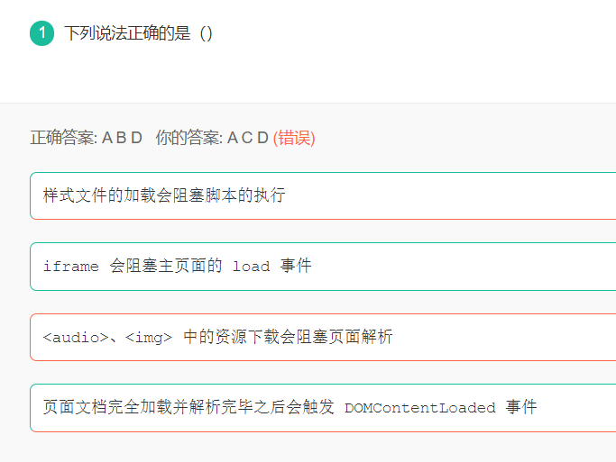
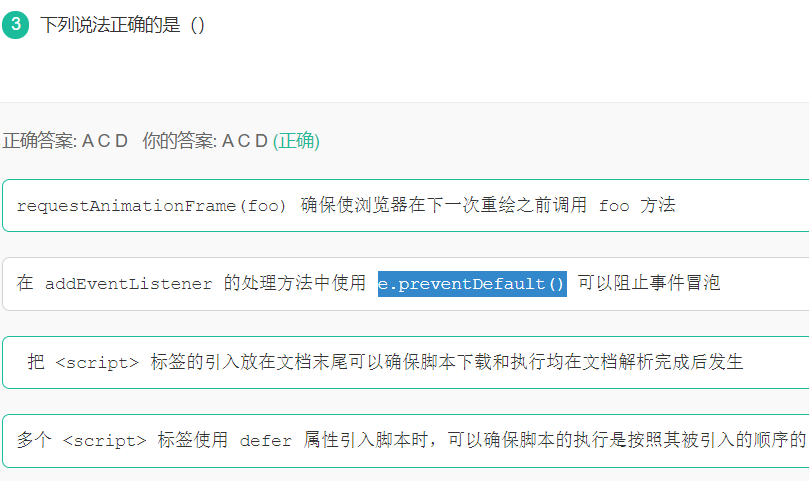
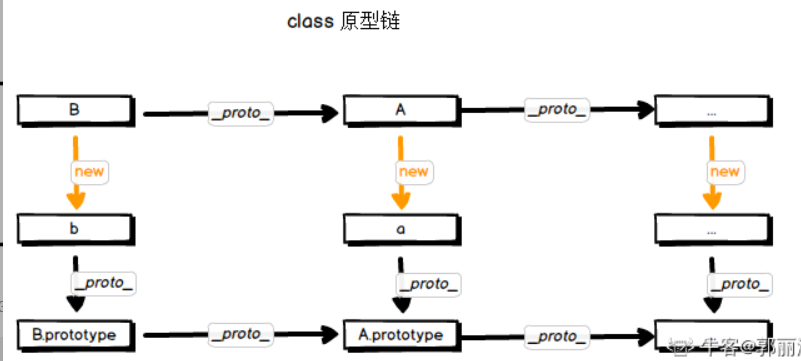
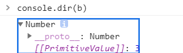
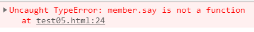
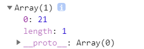
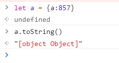

# 1.




```
<audio>、 中的资源下载不会阻塞页面解析
```

# 2.




`e.preventDefault()`阻止事件捕获

`e.stopPropagation()`阻止事件冒泡

# 3.请根据下面的示例描述原型链与继承的关系并解释原因：

****

```js
class A {}
class B extends A {}
const a = new A()
const b = new B()
a.proto ===
b.proto ===
B.proto ===
B.prototype.proto ===
b.proto.proto ===
```



# 4**输出是什么？**

```js
var obj = {
  a: 1,
  b: [1,2,3]
}
var a = obj.a
var b = obj.b
a = 2
b.push(4)
console.log(obj, a, b) //obj{a:1,a:[1,2,3,4]},2,[1,2,3,4]
```

虽然`obj`本身是个引用类型的变量（对象），但是内部的`a`和`b`一个是值类型一个是引用类型，`a`的赋值不会改变`obj.a`，但是`b`的操作却会反映到`obj`对象上。

# 5**输出是什么？**

```js
+true; //1
!"Lydia";//false
```

一元操作符加号尝试将 bool 转为 number。`true` 转换为 number 的话为 `1`，`false` 为 `0`。

字符串 `'Lydia'` 是一个真值，真值取反那么就返回 `false`。

# 6.输出是什么

```javascript
let a = 3
let b = new Number(3)
let c = 3

console.log(a == b) //true
console.log(a === b) //false
console.log(b === c) // false
```

`new Number()` 是一个内建的函数构造器。虽然它看着像是一个 number，但它实际上并不是一个真实的 number：它有一堆额外的功能并且它是一个对象。



# 7.输出是什么？

```javascript
class Chameleon {
  static colorChange(newColor) {
    this.newColor = newColor
    return this.newColor
  }

  constructor({ newColor = 'green' } = {}) {
    this.newColor = newColor
  }
}

const freddie = new Chameleon({ newColor: 'purple' })
freddie.colorChange('orange')
```


`colorChange` 是一个静态方法。静态方法被设计为只能被创建它们的构造器使用（也就是 `Chameleon`），并且不能传递给实例。因为 `freddie` 是一个实例，静态方法不能被实例使用，因此抛出了 `TypeError` 错误。

# 8.输出是什么？

```javascript
function Person(firstName, lastName) {
  this.firstName = firstName;
  this.lastName = lastName;
}

const member = new Person("Lydia", "Hallie");
Person.getFullName = function () {
  return `${this.firstName} ${this.lastName}`;
}

console.log(member.getFullName());
```



你不能像常规对象那样，给构造函数添加属性。如果你想一次性给所有实例添加特性，你应该使用原型。因此本例中，使用如下方式：

```js
Person.prototype.getFullName = function () {
  return `${this.firstName} ${this.lastName}`;
}
```

这才会使 `member.getFullName()` 起作用。为什么这么做有益的？假设我们将这个方法添加到构造函数本身里。也许不是每个 `Person` 实例都需要这个方法。这将浪费大量内存空间，因为它们仍然具有该属性，这将占用每个实例的内存空间。相反，如果我们只将它添加到原型中，那么它只存在于内存中的一个位置，但是所有实例都可以访问它！

# 9.输出什么

```js
function Person(firstName, lastName) {
  this.firstName = firstName
  this.lastName = lastName
}
const lydia = new Person('Lydia', 'Hallie')
const sarah = Person('Sarah', 'Smith')
console.log(lydia) //Person {firstName: "Lydia", lastName: "Hallie"}
console.log(sarah) //undefined
console.log(window.firstName); //Sarah
```

当使用 `new` 时，`this` 引用我们创建的空对象。当未使用 `new` 时，`this` 引用的是**全局对象**（global object）也就是window。

# 10 .输出什么

```javascript
function checkAge(data) {
  if (data === { age: 18 }) {
    console.log('You are an adult!')
  } else if (data == { age: 18 }) {
    console.log('You are still an adult.')
  } else {
    console.log(`Hmm.. You don't have an age I guess`)
  }
}

checkAge({ age: 18 })
```

`Hmm.. You don't have an age I guess`

分析：

在测试相等性时，基本类型通过它们的值（value）进行比较，而对象通过它们的引用（reference）进行比较。JavaScript **检查对象是否具有对内存中相同位置的引用。**

题目中我们正在比较的两个对象不是同一个引用：作为参数传递的对象引用的内存位置，与用于判断相等的对象所引用的内存位置并不同。

这也是 `{ age: 18 } === { age: 18 }` 和 `{ age: 18 } == { age: 18 }` 都返回 `false` 的原因。

# 11.输出什么

```javascript
function getAge(...args) {
  console.log(typeof args) //"object"
}

getAge(21)
```

扩展运算符（`...args`）会返回实参组成的数组。而数组是对象，因此 `typeof args` 返回 `"object"`。



# 12.输出什么

```javascript
const sum = eval('10*10+5')//数字105
```

代码以字符串形式传递进来，`eval` 对其求值。如果它是一个表达式，就像本例中那样，它对表达式求值。表达式是 `10 * 10 + 5`。这将返回数字 `105`。

# 13.输出什么

```javascript
const obj = { 1: 'a', 2: 'b', 3: 'c' }
const set = new Set([1, 2, 3, 4, 5])

obj.hasOwnProperty('1') //true
obj.hasOwnProperty(1) //true
set.has('1') //false
set.has(1) //true
```

所有对象的键（不包括 Symbol）在底层都是字符串，即使你自己没有将其作为字符串输入。这就是为什么 `obj.hasOwnProperty('1')` 也返回 `true`。

对于集合，它不是这样工作的。在我们的集合中没有 `'1'`：`set.has('1')` 返回 `false`。它有数字类型为 `1`，`set.has(1)` 返回 `true`。

# 14.输出什么（重点）

```js
const a = {}
const b = { key: 'b' }
const c = { key: 'c' }
a[b] = 123
a[c] = 456
console.log(a[b]) //456
```

我们试图将一个对象 `b` 设置为对象 `a` 的键，且相应的值为 `123`。而对象的键会通过`toString`方法来转为字符，然而，当字符串化一个对象时，它会变成 `"[object Object]"`



所以a对象里的键只有一个`"[object Object]"`，而且后面的会覆盖前面的所以输出456.

# 15.当点击按钮时，event.target是什么？

```html
<div onclick="console.log('first div')">
  <div onclick="console.log('second div')">
    <button onclick="console.log('button')">
      Click!
    </button>
  </div>
</div>
```

答案：`button`

导致事件的最深嵌套的元素是事件的 target。你可以通过`event.stopPropagation` 来停止冒泡

# 16.输出什么

```javascript
(() => {
  let x, y
  try {
    throw new Error()
  } catch (x) {
    (x = 1), (y = 2)
    console.log(x) //1
  }
  console.log(x) //undefined
  console.log(y) // 2
})()
```

`catch` 代码块接收参数 `x`。当我们传递参数时，这与之前定义的变量 `x` 不同 。这个 `x` 是属于 `catch` 块级作用域的。

然后，我们将块级作用域中的变量赋值为 `1`，同时也设置了变量 `y` 的值。现在，我们打印块级作用域中的变量 `x`，值为 `1`。

`catch` 块之外的变量 `x` 的值仍为 `undefined`， `y` 的值为 `2`。当我们在 `catch` 块之外执行 `console.log(x)` 时，返回 `undefined`，`y` 返回 `2`。