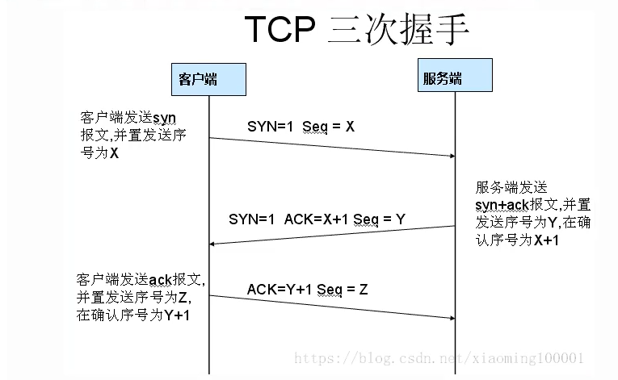

#  Vue 的双向数据绑定原理是什么（响应式原理）

​	vue.js 是采用数据劫持结合发布者-订阅者模式的方式，通过 **Object.defineProperty()**来劫持各个属性的 setter，getter，在数据变动时发布者发布消息给订阅者，触发相应的监听回调。 

具体步骤：

 第一步：需要 observe 的数据对象进行递归遍历，包括对象的子属性，都加上 setter 和 getter，这样的 话，给这个对象的某个值赋值，就会触发 setter，那么就能监听到了数据变化。 

第二步：compile 解析模板指令，将模板中的变量替换成数据，然后初始化渲染页面视图，并将每个指令对 应的节点绑定更新函数，添加监听数据的订阅者，一旦数据有变动，收到通知，更新视图。

第三步：Watcher 订阅者是 Observer 和 Compile 之间通信的桥梁，主要做的事情是:1、在自身实例化时往属 性订阅器(dep)里面添加自己 2、自身必须有一个 update()方法 3、待属性变动 dep.notice()通知时，能调用自身的 update()方法，并触发 Compile 中绑定的回调，则功成身退。 

第四步：MVVM 作为数据绑定的入口，整合 Observer、Compile 和 Watcher 三者，通过 Observer 来监听自 己的 model 数据变化，通过 Compile 来解析编译模板指令，最终利用 Watcher 搭起 Observer 和 Compile 之间的 通信桥梁，达到数据变化 -> 视图更新；视图交互变化(input) -> 数据 model 变更的双向绑定效果

# 说说从输入URL到看到页面发生的全过程，越详细越好

**基础版本：**

- 浏览器根据请求的`URL`交给`DNS`域名解析，找到真实`IP`，向服务器发起请求；
- 服务器交给后台处理完成后返回数据，浏览器接收文件（`HTML、JS、CSS`、图象等）；
- 浏览器对加载到的资源（`HTML、JS、CSS`等）进行语法解析，建立相应的内部数据结构（如`HTML`的`DOM`）；
- 载入解析到的资源文件，渲染页面，完成。

**进阶版本：**

- 首先浏览器主进程接管，开了一个下载线程。
- 然后进行HTTP请求（DNS查询、IP寻址等等），中间会有三次握手，等待响应，开始下载响应报文。
- 将下载完的内容转交给Renderer进程管理。
- Renderer进程开始解析css rule tree和dom tree，这两个过程是并行的，所以一般我会把link标签放在页面顶部。
- 解析绘制过程中，当浏览器遇到link标签或者script、img等标签，浏览器会去下载这些内容，遇到时候缓存的使用缓存，不适用缓存的重新下载资源。
- css rule tree和dom tree生成完了之后，开始合成render tree，这个时候浏览器会进行layout，开始计算每一个节点的位置，然后进行绘制。
- 绘制结束后，关闭TCP连接，过程有四次挥手

# TCP三次握手

1. 客户端发送一个TCP的**SYN=1，Seq=X**的包到服务器端口
2. 服务器发回**SYN=1， ACK=X+1， Seq=Y**的响应包
3. 客户端发送**ACK=Y+1， Seq=Z**

# http 和 https 的区别是什么

1. HTTP 无法加密，通信使用明文请求响应不会向通信方确认，而HTTPS 对传输的数据进行加密。通过证书认证客户端访问的是自己的服务器。
2. HTTP无需证书，而HTTPS 需要CA机构wosign的颁发的SSL证书

