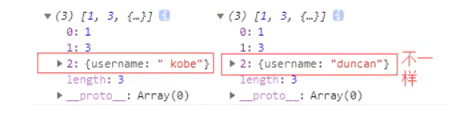

# vue中生产环境和开发环境

在vue项目中分为生产环境和开发环境，可以在跟目录下创建两个文件.env.development（开发环境下使用），和.env.production（生产环境下使用）可以为设置开发环境变量和生产环境变量变量名以`VUE_APP_`开头，分别在.env.development和.env.production下面配置。例如：

在.env.development下设置VUE_APP_ABC=111111，在.env.production下设置VUE_APP_ABC=222222，意味着在开发时调用VUE_APP_ABC得到的结果时111111，在生产时调用得到的结果是222222。**每次改变文件里面的值都需要重启才能生效**

# v-for和v-if

v-for和v-if同时使用时候v-if不能进行判断，因为v-for的优先级更高

# element ui父组件清空子组件的表单验证

在父组件上给应用的子组件绑定一个ref如下：sign为拥有表单的子组件

```js
 <sign :currentIndex="currentIndex" ref="newForm"/>
```

给按钮绑定方法：

```html
<li @click="check(index)"  </li>  
```

```js
 check(index) {
     this.$refs.newForm.$refs['ruleForm'].resetFields() 
    },  
```

或者这个

```js
this.$refs.newForm.$refs.refForm.clearValidate()
```

方法二：

在子组件通过watch检测，某个父组件传过来的值的变化，然后进行清除表单

# 父子组件通信之单向数据流

父组件往子组件传数据是一个单向数据流，父组件的值改变时，子组件接受的值能随着变化，但是子组件不能直接改变父组件中的值

**1、父级 prop 的更新会向下流动到子组件中，但是反过来则不行。这样会防止从子组件意外改变父级组件的状态。**

**2、每次父级组件发生更新时，子组件中所有的 prop 都将会刷新为最新的值。这意味着你不应该在一个子组件内部改变 prop**

所以在子组件中创建一个变量来接受父组件传过来的值，不能直接在子组件中改父组件的值。想要改父组件的值通过$emit,发送事件在父组件中接受然后修改。

# Watch

监听某个值的变化，可以获取新的值和旧的值。

```js
  watch: {
    要监听的值(新的值,旧的值){
      需要做的操作
    }
  },
```

# element ui级联器获取label值

```vue
 <el-cascader
      v-model="value"
      :options="cascader_options"
      :props="cascader_props"
      @change="changeValue"
      @expand-change = "expand_change"
      ref="cascaderAddr"
    ></el-cascader>
```

```js
 methods: {
    changeValue(value) {
      this.address = this.$refs['cascaderAddr'].getCheckedNodes()[0].pathLabels
    },
```

# JSON.parse(JSON.stringify())****

这是一个深拷贝的实现方法

**深拷贝和浅拷贝的区别：**

- 浅拷贝是创建一个新对象，这个对象有着原始对象属性值的一份精确拷贝。如果属性是基本类型，拷贝的就是基本类型的值，如果属性是引用类型，拷贝的就是内存地址 ，所以**如果其中一个对象改变了这个地址，就会影响到另一个对象**。

- 深拷贝是将一个对象从内存中完整的拷贝一份出来,从堆内存中开辟一个新的区域存放新对象,且**修改新对象不会影响原对象**。

```js
let arr = [1, 3, {
    username: ' kobe'
}];
let arr4 = JSON.parse(JSON.stringify(arr));
arr4[2].username = 'duncan'; 
console.log(arr, arr4)
```



这也是利用JSON.stringify将对象转成JSON字符串，再用JSON.parse把字符串解析成对象，一去一来，新的对象产生了，而且对象会开辟新的栈，实现深拷贝。**这种方法虽然可以实现数组或对象深拷贝,但不能处理函数和正则**，因为这两者基于JSON.stringify和JSON.parse处理后，得到的正则就不再是正则（变为空对象），得到的函数就不再是函数（变为null）了。

# element在谷歌浏览器下表头不对齐

```css
body .el-table th.gutter{
    display: table-cell!important;
  }
```

